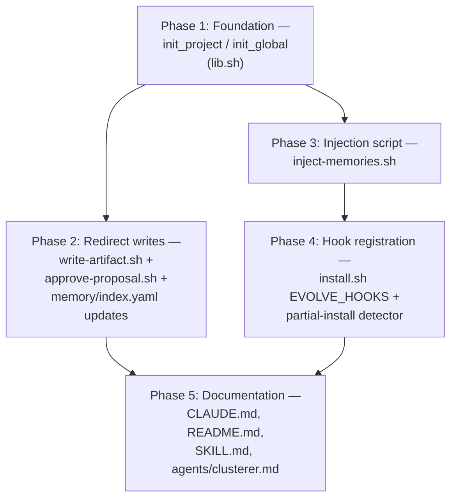

# Repo-resident memory storage with always-on injection — Implementation Plan

**Created:** 2026-05-06
**Depends on:** None

---

## Context

claude-evolve has a `memory` artifact type that the clusterer agent can propose from project instincts. Today, when a user approves a `type=memory` proposal via `/evolve`, `scripts/write-artifact.sh` writes the file to `~/.claude/projects/{sanitized-cwd}/memory/evolve-{NAME}.md` — i.e. into Claude Code's *native* per-project auto-memory directory — and appends a bullet to a `MEMORY.md` index there. The path is hard-coded in two places (`write-artifact.sh:31-37`, `approve-proposal.sh:115-120`). No memory artifacts have ever been produced by the live system; the code path exists but is unexercised.

This design is incidental rather than intentional, and it has three problems: (1) memories live outside the repo, so they aren't visible alongside instincts/proposals or git-synced cross-machine the way other evolve state is; (2) memory contents are not currently injected into Claude's session context by anything in evolve — instinct injection happens via `inject-instincts.sh` on `SessionStart` but no equivalent exists for memory; (3) the storage layout doesn't mirror the instinct/proposal layout (per-entry YAML files + `index.yaml` + atomic-write/lock/git-sync conventions in `lib.sh`), making the system internally inconsistent. The redesign moves memory into `data/global/memory/` and `data/projects/{project_id}/memory/`, wires up an `inject-memories.sh` SessionStart hook that injects ALL memories on every session start (no top-N filter, no confidence threshold, no decay), and treats memories as first-class peers of instincts.

**Out of scope:** This PR does not change Claude Code's *native* auto-memory feature. That feature continues to write user-typed memories to `~/.claude/projects/{cwd}/memory/` exactly as before — those are a separate system. This redesign only relocates the evolve-managed `type=memory` artifacts (and provides injection for them).

## Requirements

1. **Storage location.** Approved `type=memory` proposals write to `$EVOLVE_DIR/projects/{project_id}/memory/{name}.md` (project memories) or `$EVOLVE_DIR/global/memory/global-{name}.md` (global memories). The legacy `~/.claude/projects/{cwd}/memory/evolve-{NAME}.md` path is no longer used by evolve.
2. **Filename convention.** Project memories use `{name}.md` (no `evolve-` prefix). Global memories use `global-{name}.md` (mirroring the `global-` prefix on global instinct files); this is a directory convention only — there is no global memory creation code path in this PR (see Design Decisions below). The legacy `MEMORY.md` markdown index is no longer written by evolve (replaced by structured `index.yaml`). Memory `.md` file content remains markdown; the file's own YAML frontmatter (`name`, `description`, etc.) is dropped by the clusterer (those fields now live in `index.yaml` only) — see Phase 5 step 5.
3. **Index format.** Each memory directory contains an `index.yaml` mirroring the instinct/proposal index pattern. Schema: `version: 1`, `memories: [{id, file, title, description, source_proposal, created}]`. ~~`type` field per entry~~ — dropped per plan-reviewer feedback (the directory itself disambiguates project vs global; no per-entry `type` is needed, mirroring the instinct index which has no per-entry scope field). Global index has the same schema (no `last_promote_run` analogue since there is no global memory promotion flow yet).
4. **Archival mirror.** Each memory directory has an `archived/` subdir with its own `index.yaml`, mirroring `instincts/archived/`. Memories are not auto-archived by the current PR (no decay), but the structure exists for parity and future use.
5. **Project init.** `init_project` creates `memory/` and `memory/archived/` with empty index files. `init_global` creates `memory/` and `memory/archived/` with empty index files. Both are idempotent (only create when absent).
6. **Atomic + locked writes.** Every write to `memory/index.yaml` follows the existing `mktemp → yq → mv` atomic pattern. Memory index writes during `approve-proposal.sh` execution are covered by the existing per-project `evolve.lock` already held by that script.
7. **Injection on SessionStart.** A new script `scripts/inject-memories.sh` reads ALL memory files (project + global) and emits their full content to stdout as `additionalContext`. Wired to `SessionStart` with no matcher, so it fires on `startup`, `resume`, and `compact` (matching the existing `inject-instincts.sh` registration).
8. **No filter, no decay.** Unlike instincts, memory injection is unconditional: every memory file gets injected, regardless of count or any threshold. There is no decay logic for memory.
9. **Output format.** Injected memories are emitted under section headers `[claude-evolve] Active memories for this project:` and `[claude-evolve] Active global memories:` (paralleling the instinct headers). Each memory's full file content is included verbatim, separated by a delimiter so the agent can distinguish entries.
10. **Hook registration.** `install.sh`'s `EVOLVE_HOOKS` JSON includes `inject-memories.sh` under the existing no-matcher `SessionStart` block. The merge filter is idempotent — re-running `install.sh` does not duplicate the entry. The partial-install warning detector is updated to expect `inject-memories.sh`. `uninstall.sh` requires no change because its filter `contains("evolve/scripts/")` already removes any evolve hook command.
11. **Recovery (R16) preserved.** `approve-proposal.sh`'s recovery path for memory proposals is updated to compute the new destination and detect existing files there (just like the legacy code path detected existing files at the legacy location). Re-running `approve-proposal.sh` with the same proposal_id remains idempotent.
12. **Git sync untouched.** `evolve_git_push` already commits `data/projects/` and `data/global/`, so memory subdirectories under those paths are git-synced automatically with no `lib.sh` change.
13. **Bash 3.2 compatibility.** All new and modified shell code runs on macOS default bash (3.2): no associative arrays, no `${!array[@]}`, no bash 4+ features. All modified scripts pass `bash -n`.
14. **Documentation accuracy.** `CLAUDE.md`'s Hook Flow section is updated to match install.sh's actual wiring (inject-instincts.sh fires on `SessionStart`, not `UserPromptSubmit` — fixing a pre-existing staleness) and to document `inject-memories.sh`. `README.md`'s memory references are clarified. `skills/evolve/SKILL.md`'s "Destination path" wording is updated for the new memory path.

## Dependency Diagram



P2 and P3 can run in parallel after P1. P4 depends on P3 (the script must exist before being registered). P5 depends on both P2 and P4 because the docs describe the complete state.

---

## Phase 1: Foundation — extend init_project / init_global

**Goal:** After this phase, every freshly-initialized project and the global directory have a `memory/` subdirectory with `index.yaml` and an `archived/` mirror, ready to receive writes.

**Recommended model — implement:** sonnet — Idiomatic but non-trivial: must respect bash 3.2, idempotent heredocs, and parallel exact patterns from existing init code; one wrong character in the YAML seed breaks downstream `yq` calls.
**Recommended model — verify:** sonnet — Verification needs to exercise idempotency on re-init, correct YAML seed format, and that no existing data is overwritten — this is observable but requires testing the right edges.
**Recommended model — review:** sonnet — Reviewer should sanity-check bash 3.2 compatibility and that the new paths follow the same atomic-write/lock conventions as the rest of the codebase.

### Steps

1. In `scripts/lib.sh`, extend `init_project` (currently lines 193-233) to additionally:
   - Add `"$project_dir/memory"` and `"$project_dir/memory/archived"` to the `mkdir -p` block.
   - Add two `if [[ ! -f ]]` blocks that write `version: 1\nmemories: []\n` heredocs to `memory/index.yaml` and `memory/archived/index.yaml` respectively, mirroring the existing instinct/proposal pattern exactly.
2. In `scripts/lib.sh`, extend `init_global` (currently lines 240-283) to additionally:
   - Add `"$GLOBAL_DIR/memory"` and `"$GLOBAL_DIR/memory/archived"` to the `mkdir -p` block.
   - Add two `if [[ ! -f ]]` blocks that write `version: 1\nmemories: []\n` heredocs to `$GLOBAL_DIR/memory/index.yaml` and `$GLOBAL_DIR/memory/archived/index.yaml`. The global memory index does NOT include a `last_promote_run` field (no global memory promotion in this PR).
3. Run `bash -n scripts/lib.sh` and `/bin/bash -n scripts/lib.sh` to confirm syntax.
4. Write a temporary test script under `/tmp/` that sources lib.sh, calls `init_project test_proj_id` and `init_global` against a `tmp` `EVOLVE_DIR`, and asserts:
   - `memory/index.yaml`, `memory/archived/index.yaml` exist with valid YAML and `memories: []`.
   - Re-calling `init_project` and `init_global` does not overwrite or duplicate.
   - Existing instinct/proposal init still works unchanged.
   Run the script and confirm PASS output before declaring this phase complete.

### Files

| File | Action | Changes |
|------|--------|---------|
| `scripts/lib.sh` | Modify | Extend `init_project` to create `memory/` + `memory/archived/` + seed index.yaml files; same for `init_global`. |

### Verification

- After calling `init_project foo`, the directory `$EVOLVE_DIR/projects/foo/memory/` exists, contains `index.yaml` with content `version: 1\nmemories: []`, and contains `archived/index.yaml` with the same shape.
- After calling `init_global`, `$GLOBAL_DIR/memory/index.yaml` and `$GLOBAL_DIR/memory/archived/index.yaml` exist with the same shape (no `last_promote_run` field).
- Both functions remain idempotent: a second invocation does not modify existing files (verified by mtime/checksum check).
- `yq '.memories | length' memory/index.yaml` returns `0` immediately after init.
- `bash -n` passes on the modified `lib.sh`.

---

## Phase 2: Redirect memory artifact writes + index integration

**Goal:** After this phase, approving a `type=memory` proposal writes the artifact to the new repo path and adds an entry to `memory/index.yaml` atomically under the existing project lock; the legacy `~/.claude/projects/{cwd}/memory/evolve-*.md` path is no longer used by evolve.

**Recommended model — implement:** sonnet — Multi-script edits with subtle invariants: atomic mktemp+mv, lock semantics already held by the caller, R16 recovery path that must still detect existing files, and fully-typed yq writes to a new index.
**Recommended model — verify:** sonnet — Must exercise the happy path, the recovery path (existing artifact at new location), error paths, and confirm the legacy-path code is fully removed (no fallback writes to `$HOME/.claude/projects/...`).
**Recommended model — review:** sonnet — Review the security/quality of new yq queries (escaping of agent-emitted strings via `yaml_escape_dq`), atomicity of index writes, and that no skills/rules behavior is collaterally affected.

### Steps

1. **`scripts/write-artifact.sh`** — Replace the `memory)` branch (lines 31-37) so that:
   - ~~It uses `$EVOLVE_DIR` rather than `$HOME/.claude/projects/...` and resolves the project_id via `resolve_project "$PROJECT_ROOT"` (PROJECT_ROOT is already an arg).~~ → Add an explicit fifth positional argument `PROJECT_ID` to `write-artifact.sh` (per plan-reviewer feedback: avoids redundant `resolve_project` calls and ensures `approve-proposal.sh` and `write-artifact.sh` cannot disagree on the destination). The new signature is `write-artifact.sh PROJECT_ROOT TYPE NAME CONTENT_FILE PROJECT_ID`. PROJECT_ID is required for `memory` type; it is accepted-but-ignored for `skill`/`rule` (callers always pass it for uniformity). The destination becomes `$EVOLVE_DIR/projects/${PROJECT_ID}/memory/${NAME}.md`.
   - The `evolve-` filename prefix is dropped.
   - Remove the `MEMORY.md` append block (lines 59-63) — replaced by `index.yaml` integration in `approve-proposal.sh`.
   - Atomicity note: write-artifact.sh's existing artifact-write line is `cp "$CONTENT_FILE" "$DEST"`, which is **not atomic** for files larger than one filesystem block. This is a pre-existing issue affecting all artifact types (skill/rule/memory) and is **out of scope for this PR**; logged in the Risks table for a follow-up. Do not change it here.
2. **`scripts/approve-proposal.sh`** — Update the destination computation (lines 115-120) to mirror the new `write-artifact.sh` path:
   - Compute `DEST="$EVOLVE_DIR/projects/${PROJECT_ID}/memory/${PROP_NAME}.md"`. Note that `PROJECT_ID` is already in scope from `$1` — no need to re-derive from PROJECT_ROOT.
   - Update the error message at line 123 to keep listing valid types (no functional change to error string but ensure it's accurate).
   - Update the `write-artifact.sh` invocation at line 132 to pass `"$PROJECT_ID"` as the new fifth argument.
   - Add a `validate_id "$PROP_NAME" || { echo "ERROR: invalid PROP_NAME"; exit 1; }` guard immediately after `PROP_NAME` is set at line 95. Defensive against malformed proposal `id` fields. (This is also good practice for the existing skill/rule branches but is a pre-existing gap; we add it now because the new memory branch motivates it.)
3. **`scripts/approve-proposal.sh`** — After the artifact write step (after line 133's closing `fi`), and **at the top level — NOT inside the `if [[ $IS_RECOVERY -eq 0 ]]` block at line 136** — append an entry to the project memory index. Placement is critical: this block must run on BOTH normal and recovery runs so that a crash that wrote the file but failed before the index write can be repaired by a re-run. Idempotency is achieved by an explicit existence check on the index entry id:
   ```bash
   if [[ "$PROP_TYPE" == "memory" ]]; then
     MEMORY_INDEX="$EVOLVE_DIR/projects/$PROJECT_ID/memory/index.yaml"
     # MEMORY_INDEX is guaranteed to exist because init_project (called at line 31) created it.
     EXISTING_ENTRY=$(yq ".memories[] | select(.id == \"${PROPOSAL_ID}\") | .id" "$MEMORY_INDEX" 2>/dev/null || true)
     if [[ -z "$EXISTING_ENTRY" ]]; then
       PROP_TITLE_ESC=$(yaml_escape_dq "$(yq '.title // ""' "$SOURCE_PROPOSAL_PATH")")
       PROP_DESC_ESC=$(yaml_escape_dq "$(yq '.description // ""' "$SOURCE_PROPOSAL_PATH")")
       tmp_midx=$(mktemp)
       yq ".memories += [{
         \"id\": \"${PROPOSAL_ID}\",
         \"file\": \"${PROP_NAME}.md\",
         \"title\": \"${PROP_TITLE_ESC}\",
         \"description\": \"${PROP_DESC_ESC}\",
         \"source_proposal\": \"${PROPOSAL_ID}\",
         \"created\": \"${NOW}\"
       }]" "$MEMORY_INDEX" > "$tmp_midx"
       mv "$tmp_midx" "$MEMORY_INDEX"
     fi
   fi
   ```
   ~~Use `yq ".memories[] | select(.id == \"$PROP_NAME\") | .id"`~~ → use `PROPOSAL_ID` (not `PROP_NAME`) as the index `id` field, per plan-reviewer feedback: two proposals can share the same `name` if they differ only in date suffix, and using the full `PROPOSAL_ID` avoids the collision while still being a unique stable identifier. The `file:` field uses `PROP_NAME` (since the on-disk filename is `${PROP_NAME}.md`).

   The index append runs inside the existing project lock (acquired at approve-proposal.sh line 45, released at line 257) — no new lock acquisition needed.

   ~~`type` field~~ — dropped per plan-reviewer feedback. The directory disambiguates project vs global; mirroring the instinct index keeps the schema minimal.
4. **R16 recovery semantics.** The check at line 128 (`if [[ $IS_RECOVERY -eq 1 && -f "$DEST" ]]`) automatically picks up the new path because `DEST` was recomputed in step 2. The index-append block in step 3 has its own idempotency guard. **Caveat (pre-existing, out of scope):** there is a partial-failure window between `write-artifact.sh` succeeding (current line 132) and the proposal being archived (current line 145). If the process dies in that window, a re-run finds the proposal still in the LIVE index (`IS_RECOVERY=0`), calls `write-artifact.sh`, which hard-errors at lines 45-51 because DEST exists. The user must then either delete the orphan DEST or delete the proposal from the LIVE index. This affects all artifact types (skill/rule/memory) and predates this PR; recorded in the Risks table.
5. **Verify.** Run `bash -n` AND `/bin/bash -n` on both modified scripts (per the bash 3.2 macOS compatibility instinct — `bash` may resolve to a Homebrew-installed bash 5.x, while `/bin/bash` is the system bash 3.2). Then write a `/tmp/` test script that:
   - Constructs a fake project structure with a fake `type=memory` proposal YAML.
   - Invokes `approve-proposal.sh PROJECT_ID PROPOSAL_ID PROJECT_ROOT CONTENT_FILE` against a mocked `EVOLVE_DIR`.
   - Asserts: file written at the new path; legacy path NOT touched; memory/index.yaml contains exactly one entry with the right id and file fields.
   - Re-runs `approve-proposal.sh` with the same arguments and asserts: no error, no duplicate index entry, no double write.
   - Run with PASS output before declaring done.

### Files

| File | Action | Changes |
|------|--------|---------|
| `scripts/write-artifact.sh` | Modify | Add 5th `PROJECT_ID` arg; replace `memory)` case branch: use `$EVOLVE_DIR/projects/$PROJECT_ID/memory/{name}.md`; drop `evolve-` prefix; drop `MEMORY.md` append. |
| `scripts/approve-proposal.sh` | Modify | Replace `memory)` destination block with new `$EVOLVE_DIR/projects/$PROJECT_ID/memory/{name}.md` path; pass `$PROJECT_ID` as 5th arg to `write-artifact.sh`; add `validate_id` guard on `PROP_NAME`; at top-level after the artifact write, append to `memory/index.yaml` under existing lock with idempotent check (skip if `id == $PROPOSAL_ID` already present). |

### Verification

- Approving a `type=memory` proposal with `id=proposal-foo-2026-05-06`, `name=foo`, in project `proj_id` writes the file to `$EVOLVE_DIR/projects/proj_id/memory/foo.md` (NOT to `$HOME/.claude/projects/...`).
- The new memory file's content matches `CONTENT_FILE` byte-for-byte (`cmp` verification).
- After approval, `$EVOLVE_DIR/projects/proj_id/memory/index.yaml` contains an entry with `id: proposal-foo-2026-05-06`, `file: foo.md`, `title`, `description`, `source_proposal: proposal-foo-2026-05-06`, `created` timestamp. (No `type` field on the entry.)
- Legacy path `$HOME/.claude/projects/{sanitized}/memory/evolve-foo.md` is NOT created and `MEMORY.md` is NOT appended to. The integration test asserts this with `[[ ! -e "$HOME/.claude/projects/.../memory/evolve-foo.md" ]]`.
- Re-running `approve-proposal.sh` with the same arguments (recovery R16) does not error, does not duplicate the index entry, and does not re-write the file.
- A `type=skill` and a `type=rule` proposal still write to their existing paths (`$PROJECT_ROOT/.claude/skills/evolve-{name}.md` and `$PROJECT_ROOT/.claude/rules/evolve-{name}.md`); those branches are not touched. The new 5th `PROJECT_ID` arg is accepted but ignored for those types.
- A proposal with a malformed `name` (fails `validate_id`) causes approve-proposal.sh to exit non-zero with an explicit error message (defense added in step 2).
- `bash -n` AND `/bin/bash -n` both pass on the modified scripts.

---

## Phase 3: Injection — `scripts/inject-memories.sh`

**Goal:** After this phase, a new script reads ALL memory files (project + global) and emits their full content to stdout as additionalContext, structured under `[claude-evolve] Active memories ...` headers. The script never blocks Claude (traps errors → exit 0) and has no side effects beyond stdout.

**Recommended model — implement:** sonnet — Mirrors `inject-instincts.sh` idioms but has different read semantics (all files, no threshold), fresh path computation, and must handle the case where memory dirs don't exist yet (early returns).
**Recommended model — verify:** sonnet — Verification must run the script with: empty index, populated index, missing file referenced by index, malformed YAML, and confirm correct stdout in each case.
**Recommended model — review:** sonnet — Reviewer focuses on: trap-and-exit-0 contract preserved, no filesystem mutation, bash 3.2, recursive-hook prevention via `evolve_is_subprocess`, correct stdin/cwd handling.

### Steps

1. Create `scripts/inject-memories.sh` modeled on `scripts/inject-instincts.sh`:
   - Shebang `#!/usr/bin/env bash` + `set -euo pipefail`.
   - `INPUT=$(cat)` to read hook input JSON.
   - `source "$HOME/.claude/evolve/scripts/lib.sh"` — note: this matches the bootstrap pattern of `inject-instincts.sh:8` and `on-session-start.sh:8`. If `lib.sh` is missing or fails to source, `set -e` will exit non-zero before the trap is installed; this is an accepted limitation inherited from the existing scripts and is not addressed in this PR.
   - Install `trap 'evolve_trap $LINENO $?' ERR` immediately after the source.
   - Early-exit if `evolve_is_subprocess` or `! evolve_enabled`.
   - Extract `CWD` from `$INPUT` via `jq -r '.cwd'`.
   - Resolve `PROJECT_ID=$(resolve_project "$CWD")`. No guard against empty PROJECT_ID — `resolve_project` always returns a value (path-derived as ultimate fallback per lib.sh:184-187), matching `inject-instincts.sh`.
2. **Pre-initialize accumulators.** Declare `PROJECT_OUTPUT=""` and `GLOBAL_OUTPUT=""` at top level **before any conditional blocks**. This is required because `set -u` will fail on the final `[[ -z "$PROJECT_OUTPUT" ]]` check if a conditional block was skipped without first initializing the variable. Mirror `inject-instincts.sh` lines 40 and 84.
3. **Project section.** Use `[[ -s "$INDEX_FILE" ]]` to guard the entire block (this also handles the case where `memory/index.yaml` does not exist — when a project has not yet been initialized, the `-s` check fails and the section is skipped silently. **Do not call `init_project` here** — that responsibility lives in `on-session-start.sh` and `record-observation.sh`).
   - Use a single tab-separated `yq` extraction call (mirroring `inject-instincts.sh:49`):
     ```bash
     ALL_MEMORIES=$(yq ".memories[] | .id + \"${TAB}\" + .file" "$INDEX_FILE" 2>/dev/null || true)
     ```
   - Iterate the result via `while IFS=$'\t' read -r MEM_ID MEM_FILE`:
     ```bash
     while IFS=$'\t' read -r MEM_ID MEM_FILE; do
       [[ -z "$MEM_ID" ]] && continue
       MEM_PATH="$MEM_DIR/$MEM_FILE"
       if [[ ! -f "$MEM_PATH" ]]; then
         evolve_log "inject-memories.sh: index references missing file $MEM_PATH (project $PROJECT_ID); skipping"
         continue
       fi
       PROJECT_OUTPUT+="=== ${MEM_ID} ==="$'\n'
       PROJECT_OUTPUT+="$(cat "$MEM_PATH")"$'\n\n'
     done <<< "$ALL_MEMORIES"
     ```
   - Each entry begins with a `=== <id> ===` delimiter line (delimiter precedes every entry, including the first). Each entry ends with a blank line for visual separation. The "single yq call" applies to index parsing only; per-file content is read via one `cat` per entry.
   - Edge case: if a memory `.md` file body itself contains a literal `=== something ===` line, the agent cannot tell that from an entry boundary. Acceptable — the delimiter is unusual enough; documented as a known limitation.
4. **Global section.** Same pattern for `$GLOBAL_DIR/memory/index.yaml` (`MEM_DIR="$GLOBAL_DIR/memory"`). Use `$GLOBAL_DIR` from `lib.sh` (not `$EVOLVE_DIR/global`) for consistency with `inject-instincts.sh:85`.
5. **Output.** If both `PROJECT_OUTPUT` and `GLOBAL_OUTPUT` are empty, exit 0 silently. Otherwise emit each section conditionally (mirror `inject-instincts.sh:124-137`):
   ```bash
   if [[ -z "$PROJECT_OUTPUT" ]] && [[ -z "$GLOBAL_OUTPUT" ]]; then
     exit 0
   fi
   if [[ -n "$PROJECT_OUTPUT" ]]; then
     echo "[claude-evolve] Active memories for this project:"
     echo -n "$PROJECT_OUTPUT"
   fi
   if [[ -n "$GLOBAL_OUTPUT" ]]; then
     echo "[claude-evolve] Active global memories:"
     echo -n "$GLOBAL_OUTPUT"
   fi
   ```
   Headers are emitted only when their corresponding section has content (e.g., a project with memories but no global memories → only the project header appears).
6. `chmod +x scripts/inject-memories.sh`.
7. Run `bash -n scripts/inject-memories.sh` AND `/bin/bash -n scripts/inject-memories.sh` to confirm syntax under macOS bash 3.2.
8. Write a `/tmp/` integration test that creates a fake `EVOLVE_DIR` with project + global memory entries, runs the script with a mock hook input JSON via stdin, and asserts:
   - stdout contains both headers and full file contents in the correct order.
   - stdout-empty case (no memory dirs at all) → silent.
   - missing-file case (index entry references non-existent file) → entry skipped, other entries injected, `evolve_log` line present.
   - malformed-YAML index → script exits 0 silently (trap-and-exit-0).
   Confirm PASS.

### Files

| File | Action | Changes |
|------|--------|---------|
| `scripts/inject-memories.sh` | New | Reads ALL memories from project + global, prints formatted context to stdout, exits 0. |

### Verification

- Running `echo '{"cwd":"/path/to/repo"}' | scripts/inject-memories.sh` with no memory files produces no stdout and exit 0.
- With one project memory and zero global memories, stdout contains `[claude-evolve] Active memories for this project:` followed by the memory's full content; no global header is emitted.
- With one of each, both headers are emitted in order: project, then global.
- Number of memory entries injected equals total count in both index files **minus any whose referenced file is missing on disk** (those are logged via `evolve_log` and skipped).
- Script exits 0 even when `index.yaml` exists but is malformed (errors trapped, logged via `evolve_log`, no stdout).
- `evolve_is_subprocess` early-exit works (set `EVOLVE_SUBPROCESS=1`, run, expect no stdout).
- `bash -n` AND `/bin/bash -n` both pass.

---

## Phase 4: Hook registration

**Goal:** After this phase, running `install.sh` adds the new `inject-memories.sh` to `SessionStart` (no matcher = startup/resume/compact) idempotently, and the partial-install warning detector recognizes the new script.

**Recommended model — implement:** sonnet — Modifies the EVOLVE_HOOKS JSON literal AND the partial-install jq filter; both must remain idempotent and the JSON merge logic at lines 213-241 must continue to work.
**Recommended model — verify:** sonnet — Test idempotency (running install.sh twice doesn't duplicate), verify the new entry appears in `~/.claude/settings.json`, and verify the partial-install detector flags an artificial partial state.
**Recommended model — review:** sonnet — Reviewer focuses on JSON correctness, jq filter syntax, that `uninstall.sh`'s removal filter still cleanly removes the new entry, and that no other hook registrations are inadvertently changed.

### Steps

1. **`install.sh`** — In the `EVOLVE_HOOKS` JSON literal (lines 187-209), add `inject-memories.sh` as a second command in the same no-matcher SessionStart row that already contains `inject-instincts.sh`:
   ```json
   "SessionStart": [
     {"matcher": "startup", "hooks": [
       {"type": "command", "command": "~/.claude/evolve/scripts/on-session-start.sh"}
     ]},
     {"hooks": [
       {"type": "command", "command": "~/.claude/evolve/scripts/inject-instincts.sh"},
       {"type": "command", "command": "~/.claude/evolve/scripts/inject-memories.sh"}
     ]}
   ]
   ```
   The merge filter at install.sh:213-241 already handles append-only addition for new commands within an existing matcher row, so re-running install.sh is idempotent.
2. **`install.sh`** — Update the partial-install warning detector at lines 281-296 so the `SessionStart` expected list includes `inject-memories.sh`:
   ```jq
   elif $event == "SessionStart" then ["on-session-start.sh", "inject-instincts.sh", "inject-memories.sh"]
   ```
3. **`uninstall.sh`** — No code change required. The cleanup filter at line 37 (`map(.hooks |= map(select((.command // "") | contains("evolve/scripts/") | not)))`) already removes any command whose path contains `evolve/scripts/`, including `inject-memories.sh`. Confirm during verification.
4. Run `bash -n install.sh`, `/bin/bash -n install.sh`, `bash -n uninstall.sh`, and `/bin/bash -n uninstall.sh`. (Both interpreters required per the macOS bash 3.2 compatibility instinct.)
5. Write a `/tmp/` test that exercises three sub-tests:
   - **Sub-test A — Fresh install:** invoke the install.sh JSON merge logic against a fresh `{}` settings.json. Assert the resulting settings has both `inject-instincts.sh` and `inject-memories.sh` registered under the no-matcher SessionStart row, and `on-session-start.sh` under the matcher="startup" row.
   - **Sub-test B — Migration scenario (the realistic upgrade case):** start from a settings.json that already has `inject-instincts.sh` and `on-session-start.sh` registered (i.e., the pre-PR state). Apply the merge. Assert: `inject-memories.sh` was added to the existing no-matcher row, `inject-instincts.sh` appears exactly once (no duplicate), and `on-session-start.sh` is unchanged.
   - **Sub-test C — Idempotent re-run:** re-apply the merge against the result of sub-test A. Assert no duplicate entries.
   - **Sub-test D — Uninstall:** run uninstall.sh's filter against the merged settings from sub-test A, and assert all three evolve scripts are removed. Also assert that any user-custom non-evolve commands in the same matcher row survive.
   Confirm PASS before declaring done.

### Files

| File | Action | Changes |
|------|--------|---------|
| `install.sh` | Modify | Add `inject-memories.sh` to `EVOLVE_HOOKS` SessionStart no-matcher row; update partial-install detector's expected list. |
| `uninstall.sh` | (no change) | The contains-filter already handles the new script; verify only. |

### Verification

- After running `install.sh` against a fresh `settings.json`, the `SessionStart` array contains TWO matcher rows: one with `matcher: "startup"` and command `on-session-start.sh`, and one with no matcher and TWO commands (`inject-instincts.sh` and `inject-memories.sh` in that order or as a set).
- Re-running `install.sh` does not create duplicate entries (idempotent).
- ~~The partial-install warning correctly flags a settings.json that has only `inject-instincts.sh` but not `inject-memories.sh` under SessionStart.~~ → The partial-install warning correctly flags a settings.json **where inject-memories.sh was previously removed manually** (i.e., out-of-band edits leave both `on-session-start.sh` and `inject-instincts.sh` present but `inject-memories.sh` absent). The warning does NOT fire on the upgrade path itself, because the merge filter automatically adds `inject-memories.sh` when present in `EVOLVE_HOOKS` but absent in user settings — the merge's idempotent-add IS the upgrade safety net; the partial-install detector is a backstop for manual edits, per plan-reviewer feedback.
- After running `uninstall.sh` on a fully-installed system, all three evolve commands under SessionStart (`on-session-start.sh`, `inject-instincts.sh`, `inject-memories.sh`) are removed; the SessionStart key itself is removed if it becomes empty. User-custom non-evolve commands in the same matcher row survive (verified in sub-test D).
- `bash -n` AND `/bin/bash -n` pass on `install.sh` and `uninstall.sh`.

---

## Phase 5: Documentation

**Goal:** After this phase, `CLAUDE.md`, `README.md`, `skills/evolve/SKILL.md`, and `agents/clusterer.md` accurately describe the new memory storage location, the SessionStart memory-injection hook, the no-decay/all-injected semantics, and the obsolete `MEMORY.md` index reference is removed. The pre-existing staleness in `CLAUDE.md`'s Hook Flow (which says `UserPromptSubmit -> inject-instincts.sh` despite install.sh actually wiring it to `SessionStart`) is also corrected.

**Recommended model — implement:** haiku — Mechanical text edits in well-known doc files; no design decisions, no shell logic.
**Recommended model — verify:** haiku — Doc verification is "did the file say X? does it now say Y?" — observable factual checks, no judgment depth needed.
**Recommended model — review:** haiku — Light review for clarity and completeness; the substantive review happened in earlier phases.

### Steps

1. **`CLAUDE.md`** — In the "Hook Flow" section (lines 39-50):
   - Correct the `inject-instincts.sh` line to be under `SessionStart` (matcher: null), not under `UserPromptSubmit`.
   - Add `inject-memories.sh` (also under `SessionStart`, no matcher).
   - Update the `SessionStart` arrow block to list `on-session-start.sh` (matcher: startup), `inject-instincts.sh` (no matcher), and `inject-memories.sh` (no matcher).
2. **`CLAUDE.md`** — In the "Data Model" section (lines 59-63), add a "Memories" bullet:
   - "Memories: Individual markdown files (with frontmatter) in `memory/`, tracked by `memory/index.yaml`. Created by approving `type=memory` proposals. Injected verbatim on every SessionStart (no decay, no top-N)."
3. **`README.md`** — Update the existing memory references (lines around 5, 28, 42-46, 62-63, 154-155 per the research):
   - In the "what it does" section, clarify that approved memory proposals write to `data/projects/{project}/memory/` in the repo (replacing the vague `~/.claude/projects/...` description).
   - Add a sentence noting that memories are auto-injected on every session start (not just project memories — global memories from `data/global/memory/` are also injected).
4. **`skills/evolve/SKILL.md`** — In the project-proposal presentation section (around line 108), update the "Destination path" wording for `type=memory` to reflect `data/projects/{project_id}/memory/{name}.md`.
5. **`agents/clusterer.md`** — In the artifact type guidelines (lines 50-52) and the output schema example (lines 24-38):
   - ~~Keep the existing "memory frontmatter (name, description, type fields)" guidance~~ → **Drop** the per-file frontmatter requirement for memory `proposed_content`. With the new `index.yaml` schema, the index entry tracks `id`/`title`/`description`/`source_proposal`/`created` separately, so re-emitting that information in YAML frontmatter inside the `.md` file is redundant noise during injection. Memory `proposed_content` should be plain markdown body — no leading `---\n...\n---` block.
   - Add a note that ALL memories are injected on every session, so memory `proposed_content` should be self-contained context (do not assume prior session knowledge).
   - Update the line 37 hint accordingly: change `{for memory: write as factual statements with context}` to keep the spirit but remove any mention of frontmatter.
6. Run `bash -n` and `/bin/bash -n` on all shell scripts modified across all phases (defensive — should already have been run in earlier phases).

### Files

| File | Action | Changes |
|------|--------|---------|
| `CLAUDE.md` | Modify | Fix stale Hook Flow (`inject-instincts.sh` is on SessionStart, not UserPromptSubmit); add `inject-memories.sh`; add Memories bullet under Data Model; add `global-` prefix note for global memory files. |
| `README.md` | Modify | Clarify memory storage location (`data/projects/{X}/memory/`); note auto-injection on session start; clarify legacy `MEMORY.md` files at `~/.claude/projects/...` are user-typed Claude-native memories, untouched by evolve. |
| `skills/evolve/SKILL.md` | Modify | Update Destination path text for `type=memory` to the new repo-relative path. |
| `agents/clusterer.md` | Modify | Drop per-file memory frontmatter requirement; add always-injected semantics note; update output schema example. |

### Verification

- `CLAUDE.md` Hook Flow section accurately describes install.sh's actual hook wiring (verified by cross-reference).
- `README.md` no longer contains references implying memory lives outside the repo.
- `skills/evolve/SKILL.md` `Destination path` for memory types matches the implemented path.
- A reviewer reading the docs alone can correctly predict where evolve writes memory artifacts and when memory injection fires.

---

## File Inventory

### New Files

| File | Purpose |
|------|---------|
| `scripts/inject-memories.sh` | SessionStart hook that reads ALL memory files (project + global) and emits them as additionalContext. |
| `.claude/feature-implementation-workflow/INDEX.md` | Index of all feature-implementation-workflow design directories. |
| `.claude/feature-implementation-workflow/20260506_repo_memory_storage/PLAN.md` | This plan. |
| `.claude/feature-implementation-workflow/20260506_repo_memory_storage/SUMMARY.md` | Created during Step 5 of the workflow. |

### Modified Files

| File | Key Changes |
|------|-------------|
| `scripts/lib.sh` | `init_project` and `init_global` create `memory/` and `memory/archived/` with seed `index.yaml`. |
| `scripts/write-artifact.sh` | `memory)` branch redirects to `$EVOLVE_DIR/projects/{project_id}/memory/{name}.md`; drops `evolve-` prefix and MEMORY.md append. |
| `scripts/approve-proposal.sh` | `memory)` branch uses new path (no longer touches `~/.claude/projects/`); after write, appends entry to `memory/index.yaml` under the existing project lock with idempotent re-run handling. |
| `install.sh` | `EVOLVE_HOOKS` adds `inject-memories.sh` under SessionStart no-matcher row; partial-install detector expects new script. |
| `CLAUDE.md` | Corrects stale Hook Flow (inject-instincts.sh is SessionStart, not UserPromptSubmit); adds inject-memories.sh; adds Memories bullet to Data Model. |
| `README.md` | Memory references updated to point at `data/.../memory/`; notes auto-injection on session start. |
| `skills/evolve/SKILL.md` | Destination path text for `type=memory` updated. |
| `agents/clusterer.md` | Memory guidance notes always-injected semantics and new file location. |

## End-to-End Verification

1. From a clean checkout, run `./install.sh` and confirm it succeeds with no errors and no partial-install warning.
2. Inspect `~/.claude/settings.json` — confirm `SessionStart` has the expected matcher rows including both `inject-instincts.sh` and `inject-memories.sh`.
3. Open a new Claude Code session in the repo. Confirm via the SessionStart context (visible in the system reminders / hook output) that `[claude-evolve] Active memories ...` headers appear (or do not appear at all if no memories exist yet — that is the correct empty case).
4. ~~Manually create a fake project memory under `data/projects/{some_proj_id}/memory/test.md`...~~ → **Dropped** per plan-reviewer feedback (redundant with step 5; the end-to-end approval flow exercises the same injection path).
5. Manually approve a `type=memory` proposal end-to-end (via `/evolve` against a synthesized proposal):
   - The synthesized proposal YAML must include the fields the implementation reads: `id` (e.g. `proposal-test-memory-2026-05-06`), `type: memory`, `name`, `title`, `description`, `domain`, `source_instincts: [...]`, `proposed_content` (the markdown body, no leading frontmatter per the new convention), `status: pending`. Place it under `$EVOLVE_DIR/projects/$PROJECT_ID/proposals/<file>.yaml` and add the corresponding entry to that project's `proposals/index.yaml`.
   - Approve via `/evolve`. Confirm the file lands at `data/projects/{project_id}/memory/{name}.md` (NOT in `~/.claude/projects/...`).
   - Confirm `data/projects/{project_id}/memory/index.yaml` has the new entry with `id == proposal-test-memory-2026-05-06`, `file: <name>.md`, `title`, `description`, `source_proposal`, `created`.
   - Open a new session and confirm the memory file content is injected verbatim under `[claude-evolve] Active memories for this project:`, preceded by a `=== <id> ===` delimiter.
   - Confirm git push runs (per existing `evolve_git_push` flow) and the new files are tracked.
6. Run `./uninstall.sh`, choose to keep project data. Confirm the inject-memories.sh hook is removed from settings.json but `data/projects/{X}/memory/` files survive.
7. Re-run `./install.sh` and confirm the hook re-appears idempotently.
8. Confirm `/evolve` skill correctly displays the new destination path for any pending memory proposal.

## Risks and Mitigations

| Risk | Mitigation |
|------|------------|
| Existing in-flight memory proposals (if any) reference legacy file paths in their archived state. | Research confirms zero `evolve-*.md` files exist anywhere on disk currently — no in-flight memory artifacts to migrate. The change is forward-only; legacy code paths are deleted. |
| Existing projects (already initialized before this PR) lack the new `memory/` and `memory/archived/` directories. | **No migration script needed.** `init_project` is called by `on-session-start.sh`, `record-observation.sh`, `approve-proposal.sh`, and `init-project.sh` — all entry points lazily create the new dirs on first invocation. Existing projects acquire `memory/` on their next session start. Same applies to `init_global` (called by `on-session-start.sh`). |
| Legacy `MEMORY.md` files at `~/.claude/projects/{cwd}/memory/` cause user confusion (those files exist on some machines from Claude-native auto-memory). | These files are user-typed Claude-native memories, not evolve artifacts; evolve never owned them and won't touch them. README.md update in Phase 5 clarifies this distinction. |
| `bash -n` passes but runtime fails on macOS bash 3.2 (e.g. `${!array[@]}` slipping in). | Each phase explicitly runs both `bash -n` and `/bin/bash -n` (the macOS system bash 3.2) and writes a `/tmp/` integration test that exercises real shell execution before the phase is declared complete (per CLAUDE.md shell constraints + the active project instinct on shell testing). |
| `install.sh` jq merge filter fails to add `inject-memories.sh` cleanly to an existing matcher row that already contains `inject-instincts.sh`. | The merge filter at install.sh:213-241 explicitly handles "matcher equality (including both-null) collapses rows" semantics, appending only NEW commands (dedup by exact command match). Phase 4 sub-test B (migration scenario) directly asserts this. |
| `inject-memories.sh` crashes on malformed memory file or index. | Standard evolve trap-and-exit-0 contract: all errors logged to `evolve.log`, hook never blocks Claude. Verified in Phase 3 step 8. |
| `inject-memories.sh` references a missing memory file from a stale index (file deleted manually). | Phase 3 step 3 adds an explicit `[[ -f $MEM_PATH ]]` guard; missing files are logged via `evolve_log` and the entry is skipped — other entries continue to inject. |
| Dumping all memory contents verbatim could grow context size unboundedly if many memories accumulate, especially across resume/compact (which fire SessionStart). | Acceptable per requirements ("ALL memories always injected"). The schema design supports a future `memory.max_total_bytes` config knob (truncation behavior, alphabetical priority) without breaking the data model — no change to file layout would be needed if a cap is later added. |
| Concurrent `approve-proposal.sh` writes to `memory/index.yaml` while `inject-memories.sh` is reading. | The index write uses atomic `mktemp → mv` (rename is atomic on POSIX), so the reader sees either the pre- or post-write state, never a torn write. The reader does not need a lock. |
| `write-artifact.sh:57` uses non-atomic `cp "$CONTENT_FILE" "$DEST"` for the artifact body. If injection runs while approval is mid-cp on a multi-block memory file, the reader could see a truncated `.md`. | **Pre-existing issue affecting all artifact types (skill/rule/memory); out of scope for this PR.** Mitigation belongs in a separate cleanup that converts the cp to mktemp+mv. Logged here for visibility. |
| Partial-failure recovery window: if approve-proposal.sh crashes between `write-artifact.sh` succeeding (line 132) and proposal archiving (line 145), a re-run sees the proposal in the LIVE index (`IS_RECOVERY=0`), calls write-artifact.sh, which hard-errors at lines 45-51 because DEST exists. | **Pre-existing issue affecting all artifact types; out of scope for this PR.** User remediation: delete the orphan DEST file or delete the proposal entry from the LIVE index, then re-run. The new memory branch inherits the same behavior; no regression. |
| Memory name collision: clusterer emits a memory proposal with the same `name` as an existing memory artifact. | Same behavior as for skills/rules — `write-artifact.sh:45-51` errors with `already exists`. The clusterer is responsible for picking unique names. No regression. |
| Documentation drift between CLAUDE.md and install.sh recurs. | Phase 5 explicitly fixes the existing drift (inject-instincts.sh wiring) at the same time as adding inject-memories.sh, and the file inventory table makes the canonical source clear. |

## Design Decisions

- **Reuse the existing project lock for memory index writes (no new lock file).** All memory index writes happen inside `approve-proposal.sh` while it already holds `evolve.lock` for the project. Adding a separate `memory.lock` would require new lock-acquisition code paths and is unnecessary given that approval is the only writer.
- **Drop the `evolve-` filename prefix.** The prefix was meaningful when memory artifacts mingled with native Claude memory files in `~/.claude/projects/{cwd}/memory/`. In the new repo-resident location, evolve is the sole writer, so the prefix is redundant. Mirrors instincts (no prefix on project files; `global-` prefix on global files).
- **Keep `archived/` subdirectories even though memory has no decay.** Mirrors instincts/proposals layout exactly. Future archival flows (e.g., user-initiated retire-this-memory) can use the existing pattern without a structural change.
- **Inject full file contents, not just titles.** Memories are factual context; their value depends on the body, not the headline. `inject-instincts.sh` injects only `trigger`/`action`/`confidence` because instincts are guidance triggers; memories are different.
- **Single delimiter format `=== <id> ===` between memory entries.** Simple, parseable, distinguishes entries without imposing markdown structure that could conflict with the agent's reading. Mirrors the `[claude-evolve] Active ...` header style.
- **No automated global memory creation flow in this PR.** Per user decision (Q1 "Structure only"). The directory exists for symmetry and future expansion (e.g., a memory-promoter analogous to instinct-promoter).
- **Fix the stale `CLAUDE.md` hook-flow description while we're here.** Pre-existing inaccuracy: CLAUDE.md says `UserPromptSubmit -> inject-instincts.sh` but install.sh wires it to `SessionStart`. Phase 5 corrects this. Doing it now (vs in a separate PR) is appropriate because the same section needs editing to add memory injection — touching it twice for two PRs would double the doc churn.
- ~~**Compute project_id from PROJECT_ROOT inside `write-artifact.sh` rather than expanding its argument list.**~~ → **Add a 5th `PROJECT_ID` argument to `write-artifact.sh`.** Plan-reviewer pushed back: the only caller is `approve-proposal.sh` (verified by grep), so signature stability has no real value. Passing `PROJECT_ID` explicitly avoids redundant `resolve_project` calls (each one spawns multiple subprocesses) and removes the possibility of `approve-proposal.sh` and `write-artifact.sh` disagreeing on the destination if `PROJECT_ROOT` ever differs from the git root (e.g., in a worktree edge case). PROJECT_ID is required for `memory`; ignored-but-required for `skill`/`rule` (uniform signature).
- **Use `PROPOSAL_ID` (not `PROP_NAME`) as the `id` field in `memory/index.yaml`.** `PROP_NAME` strips the date suffix from `PROPOSAL_ID`, so two proposals with the same name on different dates would collide on the index `id`. Using the full `PROPOSAL_ID` keeps the index entry uniquely identifiable. The on-disk filename still uses `${PROP_NAME}.md`.
- **Drop the `type` field from memory index entries.** The directory itself (`projects/{X}/memory/` vs `global/memory/`) disambiguates project from global. Adding a per-entry `type` field is redundant. Mirrors the instinct index, which has no per-entry scope field.
- **Drop the YAML frontmatter requirement on memory `.md` files** (clusterer.md update in Phase 5). The index entry already captures `name`/`title`/`description`/`source_proposal`/`created`. Re-emitting that information inside each `.md` file's frontmatter is redundant noise that gets re-injected verbatim on every SessionStart.
- **Lazy initialization for existing projects (no migration script).** Existing projects gain `memory/` and `memory/archived/` on their next SessionStart (via `init_project` invoked by `on-session-start.sh` and `record-observation.sh`). Same for the global directory via `on-session-start.sh`. This is the same pattern instincts/proposals use; no special migration code is needed.
- **Memory `archived/` exists despite no decay flow.** Mirrors instincts/proposals layout for symmetry and future use (e.g., a future user-initiated retire-this-memory feature). Cost is 4 extra lines in `init_project`/`init_global`.
- **Inherited bootstrap limitation: `source lib.sh` runs before the ERR trap is installed.** If `lib.sh` is missing/corrupt, the script will exit non-zero before the trap converts the error to exit 0. This is the same pattern used by all existing evolve hook scripts (`inject-instincts.sh`, `on-session-start.sh`, etc.) and is not addressed in this PR.

---

## Changelog

- **2026-05-06 (Step 3 review revisions):**
  - Phase 2 step 1: changed `write-artifact.sh` signature — added 5th `PROJECT_ID` argument (replaces the in-script `resolve_project` re-derivation; per plan-reviewer feedback). Updated File Inventory and Verification accordingly.
  - Phase 2 step 2: added `validate_id` guard on `PROP_NAME`.
  - Phase 2 step 3: rewrote the code snippet to (a) explicitly show the `EXISTING_ENTRY` idempotency guard before the yq append (was prose-only previously), (b) place the block at top level rather than inside the `IS_RECOVERY=0` guard (with explicit comment to that effect), (c) use `PROPOSAL_ID` rather than `PROP_NAME` as the index `id` field (avoids name collision), (d) drop the `type` field from the schema.
  - Phase 2 step 4: explicitly documented the partial-failure recovery window as a pre-existing, out-of-scope issue.
  - Phase 2 step 5: added `/bin/bash -n` to the syntax check.
  - Phase 2 verification: added missing-legacy-path assertion, dropped `type` field from expected entry, added `validate_id` failure case.
  - Phase 3 step 1: explicit note about `source lib.sh` bootstrap limitation (inherited from existing scripts).
  - Phase 3 step 2: added pre-initialization of `PROJECT_OUTPUT` and `GLOBAL_OUTPUT` (was implicit; `set -u` would have tripped).
  - Phase 3 step 3: replaced contradictory yq guidance with concrete extraction (single tab-separated yq call + while loop). Added explicit handling for: missing memory dir (`-s` check), missing per-entry file (`[[ -f ]]` guard with `evolve_log`), and the no-init_project rule. Clarified the delimiter format (precedes every entry including first; documented edge case).
  - Phase 3 step 4: explicit reminder to use `$GLOBAL_DIR` (consistent with `inject-instincts.sh`).
  - Phase 3 step 5: explicit conditional emission of section headers (mirroring `inject-instincts.sh`).
  - Phase 3 step 8: added negative test cases (missing-file, malformed YAML).
  - Phase 3 verification: added the missing-file caveat.
  - Phase 4 step 4: added `/bin/bash -n`.
  - Phase 4 step 5: expanded test plan from one sub-test to four (fresh install, migration, idempotent re-run, uninstall).
  - Phase 4 verification: reworded the partial-install warning bullet to describe the manual-edit scenario rather than the (impossible) upgrade scenario.
  - Phase 5 step 5: dropped the per-file YAML frontmatter requirement on memory `.md` files (redundant with `index.yaml`).
  - Risks table: added rows for lazy-init migration story, legacy `MEMORY.md` user files, missing-file guard, concurrent-read race (no lock needed), non-atomic `cp` in `write-artifact.sh` (pre-existing), partial-failure recovery window (pre-existing), memory name collision behavior.
  - Design Decisions: added 6 new bullets covering the design-clarification edits above; struck through the original write-artifact.sh project_id rationale.
  - End-to-End verification: dropped redundant step 4 (manual fake-memory test); expanded step 5 to specify the synthesized proposal YAML fields and added an injection-verification sub-step.
  - Requirements 2 and 3: clarified `type` field drop and frontmatter drop.
