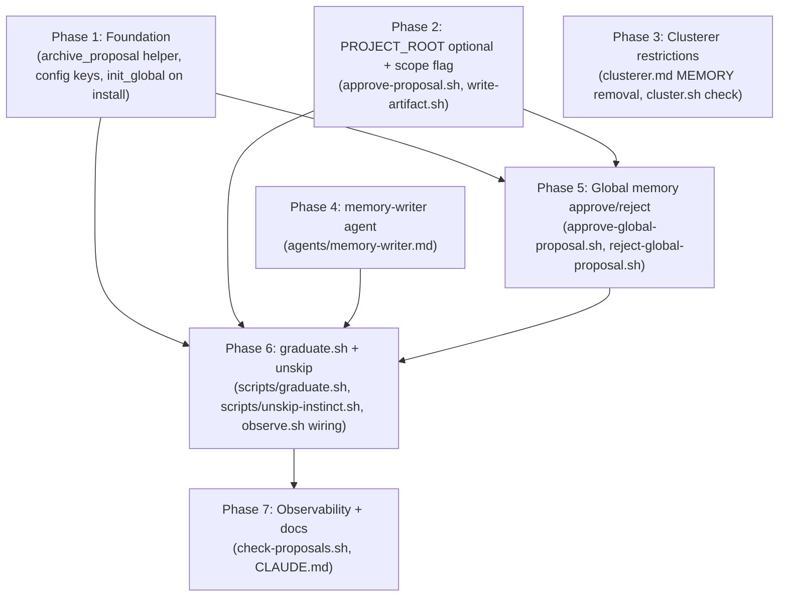

# Memory auto-creation from high-confidence instincts -- Implementation Plan

**Created:** 2026-05-07
**Depends on:** `.claude/brainstorm/20260507_memory_auto_creation.md` (spec v3, APPROVED). Prior repo-memory-storage work (`.claude/feature-implementation-workflow/20260506_repo_memory_storage/`) already provides the project memory write path and the `data/global/memory/` directory placeholder.

---

## Context

Today's claude-evolve produces `type=memory` artifacts only via the clusterer agent grouping multiple related instincts. Single high-confidence instincts that don't naturally cluster never graduate — confidence accumulates indefinitely on a strong individual signal with no path to permanent memory. This plan adds `graduate.sh`, a new SessionStart-frequency script that takes individual instincts above tunable thresholds and turns them into memory proposals (or auto-approves them above a higher threshold). It also builds out the missing **global** memory infrastructure (the existing `approve-global-proposal.sh` is hardcoded to `type=promotion`), refactors the clusterer to stop emitting `type=memory` (single-instinct shape doesn't fit the clusterer's grouping intent), and extracts a `archive_proposal()` helper from `reject-proposal.sh` for reuse.

The work spans 8 scripts, 2 agent files, `lib.sh`, `install.sh`, `config.yaml`, and `CLAUDE.md`. It is gated by an explicit user approval flow for the propose-tier and a config-tunable auto-tier; first-run drainage is bounded to 10 promotions per scope per run.

## Requirements

These are the verifiable contract. The plan-reviewer must confirm coverage, and the feature-verifier extracts them as a checklist.

1. **graduate.sh exists at `scripts/graduate.sh`** and is invoked from `observe.sh` after `promote.sh`, before `observe.sh`'s final `evolve_git_push`. It takes one argument: `PROJECT_ID`.
2. **Tiered approval gate.** graduate.sh creates pending memory proposals for instincts above `propose_memory_threshold` and additionally auto-approves proposals for instincts above `auto_memory_threshold`. Both tiers go through the same proposal artifact and the corresponding approve script.
3. **Both project and global passes.** graduate.sh runs a project pass under `evolve.lock` and a global pass under `global.lock`. Each pass acquires its own lock independently; lock contention on either side skips that pass cleanly without aborting the run.
4. **Clusterer no longer emits `type=memory`.** `agents/clusterer.md` drops the MEMORY artifact section and removes `memory` from its `type` enumeration. `cluster.sh`'s `process_document` rejects any `type=memory` document the agent might still produce (defense-in-depth, with a WARN log).
5. **Strict single-instinct rejection match.** Once a memory proposal with `source_instincts == [X]` has been rejected (regular or permanently rejected), graduate.sh blocks any future memory proposal for instinct X. Multi-instinct rejected proposals do not block single-instinct memory proposals for any subset.
6. **Crash-recoverable auto-tier.** graduate.sh writes `auto_approve_target: true` and `auto_approve_attempts: 0` on auto-tier proposals before invoking the approve script. On startup, it scans both project and global pending proposal indexes AND `$PROPOSALS_DIR/*.yaml` directories (for unindexed orphans from crash window (b)) for `auto_approve_target: true` proposals; bumps `auto_approve_attempts` and re-invokes the matching approve script; aborts re-invocation at `auto_approve_attempts >= 3` with a WARN log (manual `/evolve` required to clear poison-pill proposals).
7. **Global memory infrastructure.** `approve-global-proposal.sh` and `reject-global-proposal.sh` dispatch on the proposal `type` field. The `type=memory` branch of `approve-global-proposal.sh` writes to `$GLOBAL_DIR/memory/global-{name}.md`, appends to `$GLOBAL_DIR/memory/index.yaml`, and archives the source global instinct(s). The `reject-global-proposal.sh` archived index entry uses the actual `type` field (not hardcoded `promotion`).
8. **`archive_proposal()` helper in `lib.sh`.** A reusable function that moves a pending proposal to its archived directory, removes it from the live index, appends to the archived index with the 8-field shape `{id, type, domain, status, resolved_at, source_instincts, source_instinct_count, file}`, all atomic. `reject-proposal.sh` is refactored to use it.
9. **`PROJECT_ROOT` is optional in `approve-proposal.sh` and `write-artifact.sh` when `type=memory`.** Memory destinations live under `$EVOLVE_DIR`, not `PROJECT_ROOT`. Empty-string `PROJECT_ROOT` is accepted for memory; non-memory paths still require it.
10. **`write-artifact.sh --scope global` flag** routes memory writes to `$GLOBAL_DIR/memory/global-{name}.md` instead of the per-project memory path. Existing skill/rule callers are unaffected.
11. **Skip-state sidecar.** `INSUFFICIENT_CONTEXT` responses from the memory-writer agent are recorded in `instincts/.graduate-state.yaml` (one per scope: project and global). The sidecar is added by `evolve_git_push` automatically. A revival condition (current confidence ≥ skipped_at_confidence + 0.1) re-attempts; an admin command `unskip-instinct.sh` provides manual revival.
12. **Config additions.** `config.yaml` adds `propose_memory_threshold` and `auto_memory_threshold` under both `instincts:` and `global_instincts:`, plus a top-level `graduation:` block with `max_per_run_per_scope: 10` and `agent_model: claude-haiku-4-5-20251001`. `auto_memory_threshold >= propose_memory_threshold` is enforced; violation logs a WARN and skips the affected scope.
13. **`memory-writer` agent at `agents/memory-writer.md`.** Takes a single instinct YAML on stdin, emits a strict YAML output (`name`, `title`, `description`, `proposed_content`) with behavioral framing (`**Why:**`/`**How to apply:**` lines) on success, or the literal string `INSUFFICIENT_CONTEXT` on its own line on failure.
14. **Notification surface.** `check-proposals.sh` shows graduation pending counts, drops the hardcoded "promotion" word from the global proposals label, and surfaces unreachable-threshold warnings (e.g. `auto > max_confidence`).
15. **Backwards compatibility.** Existing pending memory proposals from the old clusterer can still be approved via `approve-proposal.sh`. Existing memory artifacts at `data/projects/{project_id}/memory/` and `data/global/memory/` are untouched.
16. **macOS bash 3.2 compatibility.** All shell code passes `bash -n` and uses no bash 4+ features (no `declare -A`, no `${!array[@]}`).
17. **Hook scripts never block Claude.** `graduate.sh` traps errors via `evolve_trap` and exits 0 from any failure path. `observe.sh`'s wiring respects existing trap-and-exit-0 invariants. Admin scripts (`unskip-instinct.sh`) do NOT use `evolve_trap` (which exits 0); they use the `reject-proposal.sh` ERR-trap pattern with `set -euo pipefail` to surface failures.
18. **Idempotent helper extensions.** `archive_proposal()` is idempotent under partial-state crashes (recovery branch detects already-moved files; index updates are self-healing on re-run). `acquire_lock_blocking()` uses fd 9 with timeout (default 30s); admin scripts use this. `invoke_agent` accepts `EVOLVE_AGENT_MODEL_OVERRIDE` env var as a per-call model override; existing callers see no change.
19. **Filename prefix discipline.** `write-artifact.sh --scope global` prepends `global-` exactly once; the memory-writer agent prompt forbids `name` starting with `global-`; graduate.sh validates this constraint as defense-in-depth.

## Dependency Diagram



Parallelism: Phases 1, 2, 3, 4 have no inter-dependencies and can be implemented concurrently. Phase 5 depends on Phases 1 and 2 (uses both `archive_proposal()` and `--scope global`). Phase 6 depends on 1, 2, 4, 5. Phase 7 depends on 6.

---

## Phase 1: Foundation (helper, lib enhancements, config, install)

**Goal:** Land the cross-cutting plumbing — `archive_proposal()` helper in `lib.sh` (with idempotent recovery), `acquire_lock_blocking()` for admin scripts, an env-var model override in `invoke_agent`, refactor `reject-proposal.sh` to use the helper, add the new config keys, and call `init_global` from `install.sh`.

**Recommended model — implement:** sonnet — multi-file edit including a careful library-function extraction with idempotent recovery semantics, an env-var-driven enhancement to `invoke_agent`, and a refactor that must preserve `reject-proposal.sh`'s archived-index field set verbatim (parallel arrays of source instincts encoded as YAML), plus bash 3.2-safe yq construction.
**Recommended model — verify:** sonnet — verifier must confirm `archive_proposal()` produces field-equivalent output to the pre-refactor `reject-proposal.sh` (so cluster.sh's overlap scan still matches), test idempotency under partial-state crashes including a "second call after partial archival" case, and confirm `init_global` is invoked at install time.
**Recommended model — review:** sonnet — review the helper's atomicity guarantees, the recovery semantics, the env-var override correctness, ordering of writes, error handling, and whether the refactor preserves user-facing semantics.

### Steps

1. **Add `archive_proposal()` to `scripts/lib.sh`** with this signature:
   ```
   archive_proposal <proposal_file_path> <archive_dir> <archived_index_path> <live_index_path> <new_status>
   ```
   Behavior, in order, **with explicit recovery semantics**:
   - Compute `archived_path = $archive_dir/$(basename $proposal_file_path)`.
   - **Recovery branch**: if `$proposal_file_path` does NOT exist AND `$archived_path` DOES exist, treat as recovery from a partial-failure run. Skip the read+write+mv (the file is already archived). Proceed directly to source_instincts read from `$archived_path` and the index updates.
   - **Normal branch**: if `$proposal_file_path` exists, `yq` write a temp file setting `.status = <new_status>` and `.resolved_at = <ISO 8601 UTC>`. `mv` temp file to `$archived_path`. `rm -f` the original proposal file.
   - **Missing-everywhere**: if neither path has the file, log ERROR and return 1.
   - Read `source_instincts` (array) from the **archived** copy of the proposal at `$archived_path`.
   - Read `type` (default `""` empty string, matching `reject-proposal.sh:95` exactly) and `domain` (default `"unknown"`) from the archived copy.
   - Atomic-rewrite the live index removing the proposal entry by id (write to temp, `mv` to live index path). Idempotent: if the entry is already absent, the rewrite still succeeds (yq `select(.id != X)` over a list missing X produces the same list).
   - Atomic-append to the archived index entry IF the id is not already present there (idempotency guard via `yq '.proposals[] | select(.id == X)'` count check), with this exact 8-field shape:
     ```yaml
     - id: "<id>"
       type: "<type>"           # default empty string when absent on proposal
       domain: "<domain>"       # default "unknown" when absent
       status: "<new_status>"
       resolved_at: "<resolved_at>"
       source_instincts: [<id1>, <id2>, ...]
       source_instinct_count: <N>
       file: "<basename>"
     ```
   - Returns 0 on success. Returns 1 only on the missing-everywhere case. Partial failures of the index updates after the file move log ERROR via `evolve_log` and return 0 with a WARN — the next call will repair via the idempotent recovery branch (file is already at archived path, indexes self-heal on re-run).
   - Caller is responsible for holding the appropriate lock (`evolve.lock` for project proposals, `global.lock` for global proposals); helper does not acquire locks.

2. **Add `acquire_lock_blocking()` to `scripts/lib.sh`** for use by admin scripts (`unskip-instinct.sh`). Signature: `acquire_lock_blocking <lock_file> [timeout_seconds]` (default 30). Implementation:
   ```bash
   acquire_lock_blocking() {
     local lock_file="$1"
     local timeout="${2:-30}"
     exec 9>"$lock_file"
     flock -w "$timeout" 9 || return 1
     echo $$ >&9
   }
   ```
   Uses fd 9 (same slot as `acquire_lock`); `release_lock` works for both.

3. **Add env-var model override to `invoke_agent()`** in `scripts/lib.sh`. Replace the current line that reads model from frontmatter:
   ```bash
   local model; model="$(echo "$frontmatter" | yq '.model // "claude-haiku-4-5"' | head -1)"
   ```
   With:
   ```bash
   local model
   if [[ -n "${EVOLVE_AGENT_MODEL_OVERRIDE:-}" ]]; then
     model="$EVOLVE_AGENT_MODEL_OVERRIDE"
   else
     model="$(echo "$frontmatter" | yq '.model // "claude-haiku-4-5"' | head -1)"
   fi
   ```
   Callers can now `EVOLVE_AGENT_MODEL_OVERRIDE="claude-X" invoke_agent foo.md` for per-call overrides without sed-substitute gymnastics. Existing callers (`cluster.sh`, `promote.sh`, `reinforce-worker.sh`) that don't set the env var see no change.

4. **Refactor `scripts/reject-proposal.sh` to call `archive_proposal()`**. Replace the current lines 70-110 (status update, mv to archived, index rewrites) with a single call:
   ```bash
   archive_proposal "$PROPOSAL_PATH" "$PROPOSAL_ARCHIVED_DIR" "$PROPOSAL_ARCHIVED_INDEX" "$PROPOSAL_INDEX" "$STATUS"
   ```
   Keep the lock acquisition, the proposal-file resolution, the lock release before `evolve_git_push`, and the trailing log/echo unchanged.

5. **Edit `config.yaml`** to add:
   - Under `instincts:`, two keys: `propose_memory_threshold: 0.85`, `auto_memory_threshold: 0.95`.
   - Under `global_instincts:`, the same two keys with the same defaults.
   - A new top-level `graduation:` block with `max_per_run_per_scope: 10` and `agent_model: claude-haiku-4-5-20251001`.

6. **Edit `install.sh` (repo root)** to call `init_global` after the global-symlink block. **install.sh does NOT currently source `lib.sh`** (verified — `grep -c source.*lib install.sh` returns 0). Two changes are required:
   - Source `lib.sh` immediately after the symlink for `scripts/` is established (so `$EVOLVE_DIR/scripts/lib.sh` exists). Locate the line `symlink_item "$REPO_DIR/scripts" "$EVOLVE_DIR/scripts"`. After this line, before the global-symlink block, add:
     ```bash
     source "$REPO_DIR/scripts/lib.sh"
     ```
   - After the global-symlink block (the line `symlink_item "$DATA_GLOBAL" "$EVOLVE_DIR/global"`), add:
     ```bash
     # Initialize global directory structure (idempotent)
     init_global
     ```
   `init_global` is idempotent (every dir/file create is guarded), so re-running install is safe.

### Files

| File | Action | Changes |
|------|--------|---------|
| `scripts/lib.sh` | Modify | Add `archive_proposal()` (with recovery), `acquire_lock_blocking()`, and env-var override in `invoke_agent`. |
| `scripts/reject-proposal.sh` | Modify | Replace inline status-update/move/index-rewrite block with a call to `archive_proposal()`. |
| `config.yaml` | Modify | Add 4 threshold keys (2 per scope) and a top-level `graduation:` block. |
| `install.sh` | Modify | Add an `init_global` call after the global-symlink block. |

### Verification

- `bash -n scripts/lib.sh && bash -n scripts/reject-proposal.sh && bash -n install.sh` passes.
- Unit-test `archive_proposal()`: write a temp test script under `/tmp/` that creates a fake proposal yaml, calls the helper, and asserts (a) the proposal file exists in the archive dir, (b) the live index no longer contains the id, (c) the archived index has an entry with all 8 fields in the correct shape (compared to a known-good fixture from a `reject-proposal.sh` run before the refactor).
- **Recovery test**: pre-stage a proposal already at `$archived_path` (no live file). Call `archive_proposal()`. Assert (a) no overwrite of the archived file, (b) live index is rewritten correctly, (c) archived index entry is appended (or skipped if already present). Repeat the call again to confirm full idempotency.
- **Field-equivalent test**: capture a fixture archived index entry from a pre-refactor `reject-proposal.sh` run, then run `reject-proposal.sh` post-refactor on the same input. Compare entries field-by-field with `yq '.proposals[-1]' archived/index.yaml`. All 8 fields must match exactly.
- Confirm `cluster.sh`'s rejection-overlap scan (cluster.sh:190-208) successfully iterates the archived index after a `reject-proposal.sh` round-trip (no missing fields, no parse errors).
- Verify `acquire_lock_blocking()`: in a test script, hold `acquire_lock` in a background process for 5s, then call `acquire_lock_blocking lockfile 10` from foreground; confirm it succeeds after the background releases.
- Verify `invoke_agent` env override: set `EVOLVE_AGENT_MODEL_OVERRIDE=test-model`, call `invoke_agent` against a fixture agent file, and grep the `claude -p` invocation logs for `--model test-model`. Unset the var; confirm fallback to frontmatter model.
- `yq '.graduation.max_per_run_per_scope' config.yaml` returns `10`; same for `agent_model`. `yq '.instincts.propose_memory_threshold' config.yaml` returns `0.85`; same for `auto_memory_threshold` and the global counterparts.
- Run `./install.sh` against a clean test directory and confirm `data/global/instincts/index.yaml`, `data/global/proposals/index.yaml`, `data/global/proposals/archived/index.yaml`, `data/global/memory/index.yaml`, `data/global/memory/archived/index.yaml`, `data/global/instincts/archived/index.yaml` all exist after install with the expected initial shapes (per `init_global` body in lib.sh:265-314).
- Re-run `./install.sh` (idempotency check) — no errors, no overwrites of existing index content.
- **Gitignore confirmation** (referenced from Phase 6's sidecar verification): `grep -E '\.yaml|\.graduate-state' .gitignore` returns no matches. The sidecar `.graduate-state.yaml` files under `data/projects/{...}/instincts/` and `data/global/instincts/` must be tracked by git.

---

## Phase 2: PROJECT_ROOT optional + write-artifact `--scope global` + auto-resume support

**Goal:** Make `PROJECT_ROOT` optional in `approve-proposal.sh` and `write-artifact.sh` when the proposal type is `memory`, add a `--scope global` flag to `write-artifact.sh` that always prepends `global-` to the destination filename (caller passes the bare name), extend `approve-proposal.sh` to treat `auto_approve_target: true` as an additional `IS_RECOVERY` signal so resume re-runs are idempotent against a pre-existing artifact, and add a mid-archival recovery branch for crashes that move the proposal file before rewriting the live index.

**Recommended model — implement:** sonnet — argument-parsing changes that must preserve full backwards compatibility with the existing caller (`approve-proposal.sh:141`); plus surgical recovery-flag extensions in `approve-proposal.sh` that interact with its existing `IS_RECOVERY` flow.
**Recommended model — verify:** sonnet — verifier must test all five call shapes (project skill with PROJECT_ROOT, project rule, project memory with empty PROJECT_ROOT, global memory with `--scope global`, error cases for missing PROJECT_ROOT or `--scope global` with skill/rule) and confirm idempotent resume of a partially-completed auto-tier proposal.
**Recommended model — review:** sonnet — review for argument-parsing footguns (positional vs flag interaction), backwards-compat preservation, recovery-flag interaction with the existing IS_RECOVERY flow, and clarity of the new `--scope` semantics.

### Steps

1. **Edit `scripts/approve-proposal.sh`** (locate code by structural anchor — search for the patterns described):
   - **Argument count is unchanged.** Keep the existing `$# -ne 4` check. Callers always pass exactly 4 positional args; `PROJECT_ROOT` may be `""` for memory. Update the `Usage:` line to: `Usage: approve-proposal.sh PROJECT_ID PROPOSAL_ID PROJECT_ROOT CONTENT_FILE  (PROJECT_ROOT may be "" when proposal type is memory)`.
   - **There is no `validate_path` call to gate today.** `PROJECT_ROOT` is used directly in the `case "$PROP_TYPE" in skill) ... rule) ... memory) ... esac` block (search for `case "$PROP_TYPE"`). The change: in the `skill)` branch and `rule)` branch, add `[[ -n "$PROJECT_ROOT" ]] || { echo "ERROR: PROJECT_ROOT required for type=$PROP_TYPE" >&2; exit 1; }` BEFORE the `DEST=...` assignment. The `memory)` branch already does not reference `PROJECT_ROOT` — leave it alone.
   - **Mid-archival recovery branch** (fixes a pre-existing race amplified by graduate.sh's resume scan): locate the live-index-hit block (the `if [[ -n "$PROPOSAL_FILE" ]]` branch that sets `SOURCE_PROPOSAL_PATH="$PROPOSALS_DIR/$PROPOSAL_FILE"`). Replace the hard error when `! -f "$SOURCE_PROPOSAL_PATH"` with a fallback that checks if the file is already at the archived path:
     ```bash
     if [[ ! -f "$SOURCE_PROPOSAL_PATH" ]]; then
       if [[ -f "$PROPOSAL_ARCHIVED_DIR/$PROPOSAL_FILE" ]]; then
         IS_RECOVERY=1
         SOURCE_PROPOSAL_PATH="$PROPOSAL_ARCHIVED_DIR/$PROPOSAL_FILE"
         evolve_log "INFO approve-proposal.sh: mid-archival recovery -- file already in archived dir"
       else
         evolve_log "approve-proposal.sh: live index references missing file $SOURCE_PROPOSAL_PATH"
         echo "ERROR: proposal file $SOURCE_PROPOSAL_PATH does not exist" >&2
         exit 1
       fi
     fi
     ```
   - **Auto-resume idempotency** (fixes write-artifact.sh destination-exists guard tripping on resume): locate the existing artifact-write guard (the `if [[ $IS_RECOVERY -eq 1 && -f "$DEST" ]]` block that conditionally calls `write-artifact.sh`). Replace it with an extended condition. **Important ordering**: read `AUTO_TARGET` AFTER the mid-archival recovery branch above (so `SOURCE_PROPOSAL_PATH` reflects the active path):
     ```bash
     AUTO_TARGET=$(yq '.auto_approve_target // false' "$SOURCE_PROPOSAL_PATH")
     if [[ -f "$DEST" ]] && [[ $IS_RECOVERY -eq 1 || "$AUTO_TARGET" == "true" ]]; then
       evolve_log "INFO approve-proposal.sh: artifact already at $DEST, skipping write (recovery or auto-resume)"
     else
       "$EVOLVE_DIR/scripts/write-artifact.sh" "$PROJECT_ROOT" "$PROP_TYPE" "$PROP_NAME" "$CONTENT_FILE" "$PROJECT_ID" >/dev/null
     fi
     ```
   - The `write-artifact.sh` invocation arguments are unchanged (still 5 positional args, no `--scope` flag — project memory uses the default scope).

2. **Edit `scripts/write-artifact.sh`**:
   - Replace the `${1:?...}` PROJECT_ROOT requirement with `PROJECT_ROOT="${1:-}"` (allow empty). Read remaining positional args.
   - **Argument layout**: support both legacy and new shapes. Legacy: `PROJECT_ROOT TYPE NAME CONTENT_FILE PROJECT_ID` (5 positional). New: `--scope project|global PROJECT_ROOT TYPE NAME CONTENT_FILE PROJECT_ID` (`--scope` flag plus 5 positional). The flag MUST be the first argument if present.
   - **Argument parsing (correct order)**: at the top of the script, check `if [[ "${1:-}" == "--scope" ]]`. If matched, capture `SCOPE="$2"` BEFORE shifting (`SCOPE="$2"; shift 2`). Otherwise default `SCOPE=project`. Then read positional args `PROJECT_ROOT="${1:-}"`, `TYPE="$2"`, etc.
   - Validate `SCOPE` is one of `project|global`; error otherwise.
   - **`--scope global` constraint**: error and exit 1 if `TYPE != memory` ("global skills/rules not yet supported; only memory may be written to global scope").
   - **Filename construction**:
     - For `TYPE=memory` and `SCOPE=global`: `DEST="$GLOBAL_DIR/memory/global-${NAME}.md"`. The `global-` prefix is **always added by write-artifact.sh** — callers pass the bare name. (Memory-writer agent's prompt forbids names starting with `global-` to prevent double-prefix; see Phase 4.)
     - For `TYPE=memory` and `SCOPE=project` (default): keep existing `DEST="$EVOLVE_DIR/projects/${PROJECT_ID}/memory/${NAME}.md"`.
     - For `TYPE=skill`: require non-empty `PROJECT_ROOT` (error and exit 1 if empty); `DEST="$PROJECT_ROOT/.claude/skills/evolve-${NAME}.md"`.
     - For `TYPE=rule`: require non-empty `PROJECT_ROOT` (error and exit 1 if empty); `DEST="$PROJECT_ROOT/.claude/rules/evolve-${NAME}.md"`.
   - **Unchanged for memory**: skip `PROJECT_ROOT` validation (it is unused for memory regardless of scope).
   - Update the `Usage:` line to reflect the new shape.
   - **Backwards compat note in code**: leave a comment explaining that `approve-proposal.sh`'s existing call (line 141) does not pass `--scope` and uses the legacy 5-positional form; this continues to work because `--scope` parsing is opt-in.

### Files

| File | Action | Changes |
|------|--------|---------|
| `scripts/approve-proposal.sh` | Modify | Make `PROJECT_ROOT` validation conditional on type; add mid-archival recovery branch; treat `auto_approve_target: true` as auto-resume signal that skips the artifact write when DEST exists. |
| `scripts/write-artifact.sh` | Modify | Add `--scope project\|global` flag; make `PROJECT_ROOT` optional for `type=memory`; restrict `--scope global` to memory for now; **always prepend `global-` to NAME** in the `--scope global` path. |

### Verification

- `bash -n` passes on both scripts.
- **Default scope, memory**: invoke `write-artifact.sh "" memory test-mem /tmp/content.md proj-id` and confirm it writes to `$EVOLVE_DIR/projects/proj-id/memory/test-mem.md`.
- **Global scope, memory**: invoke `write-artifact.sh --scope global "" memory test-mem /tmp/content.md ""` and confirm it writes to `$GLOBAL_DIR/memory/global-test-mem.md` (single `global-` prefix; the bare name `test-mem` is passed in).
- **Skill backwards compat**: invoke `write-artifact.sh /some/abs/path skill test-skill /tmp/content.md proj-id` (no --scope) and confirm existing skill behavior is unchanged at `/some/abs/path/.claude/skills/evolve-test-skill.md`.
- **Skill missing PROJECT_ROOT**: invoke `write-artifact.sh "" skill test-skill /tmp/content.md proj-id` and confirm it errors out with the new guard.
- **Global skill rejected**: invoke `write-artifact.sh --scope global "" skill foo /tmp/content.md proj-id` and confirm it errors out (TYPE != memory under --scope global).
- **End-to-end memory project**: approve an existing-style memory proposal via `approve-proposal.sh PROJECT_ID PROP_ID "" CONTENT_FILE` and confirm it writes correctly. (Empty PROJECT_ROOT is the new accepted path for memory.)
- **End-to-end skill regression**: approve a skill proposal via `approve-proposal.sh PROJECT_ID PROP_ID /abs/path CONTENT_FILE` and confirm behavior is unchanged.
- **Auto-resume idempotency**: pre-stage a memory artifact at `$DEST` AND a proposal yaml in `$PROPOSALS_DIR` with `auto_approve_target: true` AND a corresponding entry in the live index. Run `approve-proposal.sh ... "" CONTENT_FILE`. Confirm: (a) artifact NOT overwritten, (b) "skipping write (recovery or auto-resume)" log entry present, (c) the rest of the flow (memory index append, proposal archive, source-instinct archive, git push) completes successfully.
- **Mid-archival recovery**: pre-stage a proposal in `$PROPOSAL_ARCHIVED_DIR` (already moved) but still listed in the live index. Run `approve-proposal.sh`. Confirm IS_RECOVERY is set and the flow completes (live index gets cleaned up; archived index entry written).

---

## Phase 3: Clusterer restrictions

**Goal:** Stop the clusterer from emitting `type=memory` artifacts. All future memories will be produced exclusively by `graduate.sh`.

**Recommended model — implement:** sonnet — bumped from haiku because `clusterer.md` is a multi-section file where `memory` appears in multiple places (output format enumeration, dedicated artifact-type section, possibly examples) and the implementer must read the file structurally to identify and remove all references; haiku is less reliable at this kind of multi-reference cleanup.
**Recommended model — verify:** sonnet — step-up over haiku because verification needs careful inspection of remaining clusterer.md content for incidental `memory` references and confirmation the cluster.sh check is at the correct location relative to validate_type / archived-overlap logic.
**Recommended model — review:** sonnet — code-reviewer should confirm the boundary note is clear, that `validate_type` is intentionally left permissive (existing pending proposals still drain), and that no other code paths are affected.

### Steps

1. **Edit `agents/clusterer.md`**. Read the file first to locate the structural anchors (line numbers in the spec/research are guidance only and may have drifted):
   - Add a boundary note at the top of the file (after the YAML frontmatter, before the first `#` H1):
     ```
     **Note:** Memory artifacts are produced by `graduate.sh` from individual high-confidence
     instincts. Do not propose memory artifacts here, even if a grouping seems best expressed as
     a memory — propose it as a skill or rule instead, or omit it.
     ```
   - Delete the entire `**MEMORY**:` artifact-type entry in the "Artifact type guidelines" section. Identify by structural anchor (the `**MEMORY**:` bold-header line and its subsequent paragraph), not by line number.
   - In the output format spec (look for the line containing `type: {skill|rule|memory}`), change to `type: {skill|rule}`.
   - `grep -n -i 'memory' agents/clusterer.md` after edits and confirm only the boundary note and any incidental words (e.g. "remember") remain — no `memory` artifact references.

2. **Edit `scripts/cluster.sh`** in `process_document` to add a defense-in-depth check immediately after the existing `validate_type` block. Locate by structural anchor: find the `if ! validate_type "$type"; then ... return; fi` block in `process_document`; the new check goes immediately after that block's closing `fi`:
   ```bash
   if [[ "$type" == "memory" ]]; then
     evolve_log "WARN cluster.sh: ignoring memory proposal from clusterer (name=$name)"
     return
   fi
   ```
   Do NOT modify `validate_type` in `lib.sh` — `_EVOLVE_TYPES_RE` must continue to accept `memory` so that any pending memory proposals from before this change still drain via `/evolve` -> `approve-proposal.sh`.

### Files

| File | Action | Changes |
|------|--------|---------|
| `agents/clusterer.md` | Modify | Add boundary note; delete the `**MEMORY**:` artifact-type entry in the Artifact type guidelines section (structural anchor, not line numbers); update the `type: {skill|rule|memory}` enumeration to `type: {skill|rule}`. |
| `scripts/cluster.sh` | Modify | Add `if [[ "$type" == "memory" ]]; then return; fi` after `validate_type` in `process_document`. |

### Verification

- `bash -n scripts/cluster.sh` passes.
- `grep -n -i 'memory' agents/clusterer.md` returns only the boundary note (no MEMORY section, no `memory` in the type enumeration).
- Mock-test cluster.sh: feed a synthetic clusterer output with `type: memory` through the document parser and confirm a WARN is logged and the document is skipped (no proposal file is created). Use a `/tmp/` test script that builds a fake `AGENT_OUTPUT` and walks `process_document` directly, OR write a single-doc fixture and stub `invoke_agent`.
- Confirm that `validate_type "memory"` still returns 0 (existing pending proposals can still be approved through the normal flow).
- Confirm the `--archived-overlap` scan still functions for archived `type=memory` proposals (archived entries written before this change must still be visible to the scan).

---

## Phase 4: memory-writer agent

**Goal:** Add the `agents/memory-writer.md` agent that converts a single instinct YAML into a memory artifact YAML or returns `INSUFFICIENT_CONTEXT`.

**Recommended model — implement:** sonnet — writing a system prompt is judgment-based; the prompt must be precise enough that downstream parsing in graduate.sh works deterministically (strict YAML or single-line `INSUFFICIENT_CONTEXT`).
**Recommended model — verify:** sonnet — verifier should test the agent against ~3 example instinct YAMLs (one obvious memory candidate, one borderline, one too-thin) and confirm output structure matches the contract. Inspecting the prompt is also part of verification.
**Recommended model — review:** sonnet — code-reviewer should evaluate prompt clarity, escape-hatch wording, and whether output constraints are unambiguous.

### Steps

1. **Create `agents/memory-writer.md`** with the following structure:

   **Frontmatter:**
   ```yaml
   ---
   model: claude-haiku-4-5-20251001
   description: Rewrites a single high-confidence instinct into a memory artifact.
   ---
   ```

   **Body (system prompt):**

   ```
   # Role

   You convert a single high-confidence instinct into a permanent memory artifact for
   injection into Claude's context on every session start. Your output is parsed strictly by
   `graduate.sh`, so format compliance matters.

   # Input

   You receive the YAML body of a single instinct file on stdin. Typical fields include:

   - `id` — kebab-case identifier
   - `domain` — broad subject area (e.g. `shell-scripting`, `testing`, `git`)
   - `trigger` — the situation in which the instinct fires
   - `action` — the recommended behavior
   - `confidence` — float 0-1 (always high if you're being asked)
   - `created` — ISO timestamp

   Other fields may exist; ignore those that don't aid the rewrite.

   # Output

   ## Success path

   Emit a single YAML document with NO markdown fences and NO commentary outside the YAML.
   Required fields, in this order:

   ```yaml
   name: <kebab-case identifier matching ^[a-z0-9][a-z0-9_-]{0,79}$>
   title: <one-sentence human-readable title>
   description: <one-line summary suitable for the memory index>
   proposed_content: |
     <the rule itself, as a single sentence>

     **Why:** <brief reasoning behind the rule, 1-2 sentences>

     **How to apply:** <when/where this guidance applies, 1-2 sentences>
   ```

   Constraints:
   - `name` MUST match the regex above. Derive from `trigger` or `domain` — keep it short
     and recognisable.
   - `name` MUST be at most **60 characters** in length. (Downstream tooling constructs
     identifiers like `proposal-${name}-YYYY-MM-DD`; a 60-char cap keeps the result under
     the 80-char id limit even with the longest prefix/suffix.)
   - `name` MUST NOT start with the literal prefix `global-`. (The global-memory write path
     prepends this prefix automatically; emitting it yourself produces a doubled `global-global-`
     filename.)
   - `name` MUST NOT end with a `-YYYY-MM-DD` literal date suffix. (Downstream tooling
     strips a trailing date suffix from the proposal id; if your `name` carries one too, the
     stripper double-strips and produces a wrong identifier.)
   - `title` is one sentence ending in a period.
   - `description` is one line, under 120 characters.
   - `proposed_content` is markdown using the **Why** / **How to apply** convention.
   - Do not invent context not supported by the instinct. If the trigger is "when about to
     run rm -rf in a test directory," the **Why** can reference safety, but cannot invent
     a specific past incident.
   - Keep `proposed_content` under 500 words.

   ## Insufficient context

   If the instinct's `trigger` and `action` are too thin to support a structured memory
   (e.g. one or both are vague, generic, or essentially empty), emit exactly the single
   token on its own line, with no other content:

   ```
   INSUFFICIENT_CONTEXT
   ```

   Do not output anything else in this case. No explanation, no YAML, no markdown.

   # Examples

   ## Example 1 — success

   Input:

   ```yaml
   id: bash-syntax-check-after-edit
   domain: shell-scripting
   trigger: when after modifying a shell script in this codebase
   action: run `bash -n` on the modified script before declaring the work done
   confidence: 0.95
   ```

   Output:

   ```yaml
   name: bash-syntax-check-after-edit
   title: Run `bash -n` on every shell script you modify before declaring the work done.
   description: Catches syntax errors in shell-script edits before they ship.
   proposed_content: |
     After modifying any shell script in the codebase, run `bash -n <script>` on it before
     declaring the work done.

     **Why:** Bash syntax errors are easy to introduce during quick edits and trivially
     caught with a syntax-only check; missing this lets broken scripts ship without anyone
     noticing until runtime.

     **How to apply:** Whenever an edit touches a shell script — single-file or multi-file
     change — run `bash -n` on every modified file as part of the pre-commit checklist. On
     macOS, also run `/bin/bash -n` if bash 3.2 compatibility is in scope.
   ```

   ## Example 2 — insufficient context

   Input:

   ```yaml
   id: think-carefully
   domain: general
   trigger: when working on something
   action: be careful
   confidence: 0.95
   ```

   Output:

   ```
   INSUFFICIENT_CONTEXT
   ```
   ```

### Files

| File | Action | Changes |
|------|--------|---------|
| `agents/memory-writer.md` | New | Agent file with frontmatter + system prompt as specified above. |

### Verification

- File exists at `agents/memory-writer.md`.
- `head -1 agents/memory-writer.md` is `---` (frontmatter present).
- Frontmatter parses: `sed -n '/^---$/,/^---$/p' agents/memory-writer.md | yq '.model'` returns a non-empty model string.
- **Smoke-test 1 (success path)**: pipe the Phase 4 Example 1 instinct yaml through `invoke_agent agents/memory-writer.md` and capture stdout. Assert: `yq '.name' <output>` is `bash-syntax-check-after-edit`, matches `_EVOLVE_ID_REGEX`, does NOT start with `global-`, does NOT end with `-YYYY-MM-DD`. Assert `yq '.title'`, `yq '.description'`, `yq '.proposed_content'` are all non-empty. Assert the proposed_content body contains `**Why:**` and `**How to apply:**` substrings.
- **Smoke-test 2 (insufficient-context path)**: pipe the Phase 4 Example 2 thin instinct yaml through `invoke_agent`. Capture stdout, trim whitespace, take first non-empty line. Assert exact match against `INSUFFICIENT_CONTEXT`.
- **Constraint violation negative test**: this is harder to test deterministically against an LLM. Spot-check by inspection that the prompt explicitly states the `global-` prefix and `-YYYY-MM-DD` suffix prohibitions; rely on graduate.sh's defense-in-depth validation (Phase 6) to catch any agent violations at runtime.

---

## Phase 5: Global memory approve/reject (with recovery semantics)

**Goal:** Add `type=memory` support to `approve-global-proposal.sh` and make `reject-global-proposal.sh` type-aware. Add `IS_RECOVERY` semantics to `approve-global-proposal.sh` mirroring `approve-proposal.sh`'s pattern (live → archived fallback, mid-archival recovery, idempotent artifact write). After this phase, the user can manually approve a `type=memory` global proposal, and graduate.sh's resume scan can safely re-invoke a partially-completed approval.

**Recommended model — implement:** sonnet — type discrimination across two scripts, mirroring the project memory flow's structure under a different lock, writing to a different destination, AND adding non-trivial recovery semantics that the existing script lacks.
**Recommended model — verify:** sonnet — verifier must construct fixture global memory proposals (since none exist in the wild yet), exercise both approve and reject paths, exercise the resume-scan path against partial-state fixtures, and confirm the archived index entry shape supports graduate.sh's strict-single-instinct rejection-overlap scan.
**Recommended model — review:** sonnet — review the type-dispatch logic, lock acquisition (must use `global.lock` not `evolve.lock`), the new `IS_RECOVERY` flag, idempotency of the artifact write (write-artifact.sh `--scope global`), and confirm the source-instinct archival path is correct for global instincts.

### Steps

1. **Edit `scripts/approve-global-proposal.sh`** (locate code by structural anchor — search for the patterns described):
   - **Add `IS_RECOVERY` flag** mirroring approve-proposal.sh's recovery pattern (the `IS_RECOVERY=0` initialization, the live-index lookup loop, and the archived-index fallback that sets `IS_RECOVERY=1`). After the existing live-index lookup loop (search for the `for ((i=0; i<PROPOSAL_COUNT; i++))` block over `.proposals[$i].id`), fall through to an archived-index lookup if not found in live; set `IS_RECOVERY=1` on archived hit; error only if missing from both.
   - **Mid-archival recovery branch**: in the live-index-hit path, if `[[ ! -f "$SOURCE_PROPOSAL_PATH" ]]`, fall through to check the archived path (mirroring the same pattern added to approve-proposal.sh in Phase 2).
   - **Move the existing `INST_ID` sed derivation inside the `promotion)` case branch** — its computation produces a wrong value for memory proposals (e.g., `global-proposal-foo-memory-2026-05-07` would yield `foo-memory`). Confining it to the promotion branch removes the readability hazard.
   - After reading the proposal file, **dispatch on `.type`**. Wrap the existing logic in `case "$PROP_TYPE" in promotion) ... ;; memory) ... ;; *) error ;; esac`.
   - The `promotion` branch keeps existing behavior (read `proposed_trigger`/`proposed_action`/`domain`, build instinct YAML, call `promote-instinct.sh --no-lock`). No semantic change to this branch except that source-archival idempotency follows the same pattern as approve-proposal.sh — already true.
   - The `memory` branch:
     - Reads `name`, `title`, `description`, `proposed_content`, `domain`, `source_global_instincts` (a singleton list per the single-instinct path).
     - Compute `DEST="$GLOBAL_DIR/memory/global-${NAME}.md"` (matching what `write-artifact.sh --scope global` produces).
     - **Idempotent artifact write**: if `[[ -f "$DEST" ]] && [[ $IS_RECOVERY -eq 1 || "$AUTO_TARGET" == "true" ]]`, skip the write (recovery-or-resume). Otherwise, write `proposed_content` to a temp file and call `write-artifact.sh --scope global "" memory "$NAME" "$CONTENT_FILE" ""`. (Caller passes the BARE name; write-artifact.sh prepends `global-`.)
     - **Memory index append (idempotent)**: append an entry to `$GLOBAL_DIR/memory/index.yaml` only if no entry with `id == $PROPOSAL_ID` exists yet (yq `select(.id == X)` count check). Schema:
       ```yaml
       - id: <PROPOSAL_ID>
         file: global-<NAME>.md
         title: <title>
         description: <description>
         source_proposal: <PROPOSAL_ID>
         created: <ISO 8601 UTC>
       ```
     - **Source instinct archival (idempotent)**: for each `source_global_instincts` entry, mirror approve-proposal.sh's source-instinct archival loop (locate by the `for INSTINCT_ID in "${SRC_IDS[@]}"` block) but against `$GLOBAL_DIR/instincts/`. Existing-archive detection by `archived_by` field; index repair if file is archived but missing from the archived index; skip if already archived by this proposal.
   - **Common flow** (after the type branch, gated on `IS_RECOVERY -eq 0`): set proposal status to `approved`, move to `proposals/archived/`, rewrite live proposals index, write archived index entry. The hardcoded `"type": "promotion"` in the archived-index `yq ".proposals += [{...}]"` block must be replaced with `\"$PROP_TYPE\"`.
   - **Archived index entry schema for type=memory**: use the following fields (different from the promotion shape, which uses `source_project_*`):
     ```yaml
     - id: "<PROPOSAL_ID>"
       type: "memory"
       domain: "<domain>"
       status: "approved"
       resolved_at: "<NOW>"
       source_global_instincts: ["<global-instinct-id>"]
       source_global_instinct_count: 1
       file: "<basename>"
     ```
     This explicitly diverges from the promotion archived-entry shape. Document the divergence in a code comment. graduate.sh's strict-single-instinct rejection-overlap scan reads `source_global_instincts` from this entry; promote.sh's Jaccard scan reads `source_project_instincts` and silently no-ops on memory entries (no false blocking).
   - Lock: `global.lock` only. Same acquisition/release pattern as today. Release before `evolve_git_push`.

2. **Edit `scripts/reject-global-proposal.sh`**:
   - Read the actual `type` field from the proposal file (default empty string if absent).
   - Replace the hardcoded `\"type\": \"promotion\"` in the archived-index `yq ".proposals += [{...}]"` block (search for the `\"type\": \"promotion\"` literal) with `\"type\": \"$PROP_TYPE\"`.
   - **Type-aware archived-index entry shape**: for `type=memory`, write the same memory shape as approve (`source_global_instincts`, `source_global_instinct_count`); for `type=promotion`, keep the existing `source_project_*` shape. Implement via a `case "$PROP_TYPE"` block around the archived-index append.
   - For memory rejections, default `source_global_instincts` to `[]` and `source_global_instinct_count` to `0` if not present on the live proposal yaml (defensive).

### Files

| File | Action | Changes |
|------|--------|---------|
| `scripts/approve-global-proposal.sh` | Modify | Add `type=memory` dispatch branch; add `IS_RECOVERY` semantics with archived-fallback, mid-archival recovery, and idempotent artifact/index writes; un-hardcode the `type` field in archived index; use `source_global_*` schema for memory entries. |
| `scripts/reject-global-proposal.sh` | Modify | Read `type` from proposal yaml instead of hardcoding `promotion`; type-discriminated archived-index entry shape. |

### Verification

- `bash -n` passes on both scripts.
- **Memory approve, clean**: construct a fixture pending global memory proposal at `$GLOBAL_DIR/proposals/test-mem-proposal.yaml` with `type: memory`, `name: my-mem`, `title:`, `description:`, `proposed_content:`, `domain: testing`, `source_global_instincts: [some-global-instinct-id]`. Add it to the live proposals index. Pre-stage the source global instinct in `$GLOBAL_DIR/instincts/`. Approve via `approve-global-proposal.sh test-mem-proposal` and confirm:
  - `$GLOBAL_DIR/memory/global-my-mem.md` exists with the proposed_content body.
  - `$GLOBAL_DIR/memory/index.yaml` has a new entry with the correct shape.
  - The source global instinct moved from `instincts/` to `instincts/archived/`.
  - The proposal moved to `proposals/archived/` with status approved.
  - The archived index entry has `type: memory`, `source_global_instincts: [some-global-instinct-id]`, `source_global_instinct_count: 1`.
  - `evolve_git_push` was invoked.
- **Memory approve, resume from artifact-already-written**: same fixture, but pre-create the artifact at `$DEST` (simulating crash after write but before archival). Set `auto_approve_target: true` on the proposal. Re-run approve. Confirm artifact is NOT overwritten, "skipping write (recovery or auto-resume)" log present, rest of the flow completes.
- **Memory approve, resume from already-archived**: pre-stage the proposal yaml in `$GLOBAL_DIR/proposals/archived/` (no live entry). Re-run approve via the recovery path. Confirm IS_RECOVERY=1 sets, the flow completes idempotently (no double-archival, no error).
- **Memory reject**: construct another fixture and reject it via `reject-global-proposal.sh test-mem-proposal-2`. Confirm:
  - The proposal moved to `proposals/archived/` with status rejected.
  - The archived index entry has `type: memory`, `source_global_instincts: [...]`, `source_global_instinct_count: 1`.
  - Source global instincts were NOT archived (rejection doesn't archive sources, mirroring `reject-proposal.sh`).
- **Promotion backwards compat**: approve and reject existing-style `type=promotion` global proposals and confirm behavior is unchanged (archived-index entry uses `source_project_*` schema; agent invocation unchanged).
- **promote.sh Jaccard scan compat**: trigger promote.sh against an archived global memory proposal and confirm the Jaccard scan silently iterates without error and produces no false-positive blocks against new promotion candidates.

---

## Phase 6: graduate.sh + unskip-instinct.sh + observe.sh wiring

**Goal:** Implement the core feature — `graduate.sh` orchestrates the project pass and global pass, invokes the memory-writer agent, creates proposals (auto-approving when above the auto threshold), records skip-state for INSUFFICIENT_CONTEXT, and recovers from crashes via `auto_approve_target` resume scan. `unskip-instinct.sh` provides manual revival. `observe.sh` calls `graduate.sh` after `promote.sh` and before its final `evolve_git_push`.

**Recommended model — implement:** opus — the most complex script in the change. Coordinates two passes under different locks, releases-and-reacquires the lock around agent invocations AND approve-script invocations, drives an LLM agent via the new env-var model override (Phase 1), handles INSUFFICIENT_CONTEXT and parse failures, manages a sidecar yaml file, runs a resume scan over both project and global indexes (including a directory-scan for crash window (b) orphan files), enforces threshold validity constraints, respects per-run caps, and bounds retries via an attempt counter. Bash 3.2 array constraints, sort patterns, and yq correctness add further footguns.
**Recommended model — verify:** sonnet — verifier focuses on observable behavior: smoke-tests against a fixture project with stubbed agents (mock by replacing the agent file with a deterministic output stub or by setting `EVOLVE_AGENT_MODEL_OVERRIDE` to a model that doesn't need network), confirms the resume-scan finds and processes orphans (both indexed and unindexed), asserts the per-scope cap is enforced, and confirms threshold misconfiguration produces the documented WARN + check-proposals notification path. Stepping down from opus because verification is mostly checklist-driven once test harnesses exist.
**Recommended model — review:** opus — concurrency review is the highest-value reviewer task. Confirm lock-release-during-approve gap is handled correctly, the new lock-release-during-agent-invocation pattern doesn't leave inconsistent state, lock acquisition for project pass and global pass don't interfere, the auto_approve_target marker semantics are correct (idempotent under repeated resume), the auto_approve_attempts retry-bound prevents infinite loops, and bash 3.2 portability is preserved across the orchestration logic.

### Steps

1. **Create `scripts/graduate.sh`** (executable). Top-of-script setup:
   - `set -euo pipefail`.
   - Source `lib.sh`.
   - Trap errors via `evolve_trap` and exit 0 (never block Claude — this IS a hook script via observe.sh).
   - Exit early if `evolve_is_subprocess` (recursive hook prevention).
   - Argument: `PROJECT_ID` as `$1`. Validate `validate_id "$PROJECT_ID"` or `evolve_log` and exit.
   - Resolve paths: `PROJECT_DIR`, `INSTINCTS_DIR`, `INSTINCTS_INDEX`, `PROPOSALS_DIR`, `PROPOSAL_INDEX`, `PROPOSAL_ARCHIVED_DIR`, `PROPOSAL_ARCHIVED_INDEX`, `LOCK_FILE`, `SIDECAR=$INSTINCTS_DIR/.graduate-state.yaml`, `WARN_FILE=$PROJECT_DIR/.graduation-warning`. Global counterparts: `GLOBAL_INSTINCTS_DIR`, `GLOBAL_PROPOSALS_DIR`, `GLOBAL_LOCK="$GLOBAL_DIR/global.lock"`, `GLOBAL_SIDECAR=$GLOBAL_DIR/instincts/.graduate-state.yaml`, `GLOBAL_WARN_FILE=$GLOBAL_DIR/.graduation-warning`.
   - Initialize counters: `P_propose=0`, `P_auto=0`, `G_propose=0`, `G_auto=0`.
   - **Bash 3.2 array safety**: every array iteration uses the guarded form `for x in ${ARRAY[@]+"${ARRAY[@]}"}; do ...`. Empty-array expansion under `set -u` requires this guard.

2. **Resume-orphans pre-pass**. Two sub-scans run sequentially per scope. Both sub-scans must run UNDER the project/global lock (best-effort acquire) to avoid TOCTOU races against in-flight graduate.sh / cluster.sh / approve-proposal.sh writes (which hold the same lock). If the lock is held by another process, the entire pre-pass for that scope is skipped (the orphan, if real, is still recoverable on the next observe.sh tick when the lock-holder finishes).
   - **Project pre-pass**:
     - `acquire_lock "$LOCK_FILE"` non-blocking. On contention: `evolve_log "graduate.sh: project lock held, skipping project pre-pass"` and skip directly to global pre-pass. Trap release on EXIT.
     - **Index scan**: for each entry in `$PROPOSAL_INDEX`'s `.proposals[]` whose proposal file's `.auto_approve_target == true` and `.status == "pending"`:
       - Check `auto_approve_attempts` field (default 0). If `>= 3`, log WARN `graduate.sh: proposal {id} has reached max auto-approve attempts; skipping (manual /evolve required)` and continue. (Bounds the retry loop on poison-pill proposals.)
       - Bump `auto_approve_attempts` by 1 using the standard atomic temp+mv pattern (NOT `yq -i`, which is non-atomic and risks losing concurrent writes):
         ```bash
         tmp=$(mktemp)
         yq '.auto_approve_attempts = (.auto_approve_attempts // 0) + 1' "$proposal_path" > "$tmp"
         mv "$tmp" "$proposal_path"
         ```
         Safe because we hold the project lock here.
       - Reconstruct `CONTENT_FILE`: `CONTENT_FILE=$(mktemp)`; `yq '.proposed_content' <proposal_path> > "$CONTENT_FILE"`. Trap `rm -f "$CONTENT_FILE"` on exit/return.
       - **Release the project lock** before calling `approve-proposal.sh` (which acquires it itself): `release_lock "$LOCK_FILE"; trap - EXIT`. Then `approve-proposal.sh "$PROJECT_ID" "$PROPOSAL_ID" "" "$CONTENT_FILE"`. If non-zero, log INFO `graduate.sh: resume-approve failed for {id} (will retry next run)`. Then re-acquire the lock for the next iteration: `acquire_lock "$LOCK_FILE"` (best-effort; on failure, break out of the index-scan loop and skip the directory scan; the remaining orphans recover on the next run). Re-set the EXIT trap.
     - **Directory scan** (handles spec crash window (b) — proposal yaml written before index append): only runs after the index scan has completed (or broken out cleanly). With the lock held: for each `.yaml` file in `$PROPOSALS_DIR/` (use `find "$PROPOSALS_DIR" -maxdepth 1 -name '*.yaml' -type f`):
       - Skip if any entry in `$PROPOSAL_INDEX`'s `.proposals[].file` matches the basename.
       - Read `auto_approve_target` and `status` from the orphan file. If `auto_approve_target == true` AND `status == pending`:
         - Check the file is structurally valid (has `id`, `type`, `proposed_content`). On parse failure, log WARN and skip.
         - Repair-by-append: append an entry to `$PROPOSAL_INDEX` with the orphan's metadata (atomic temp+mv). Then release the lock, call `approve-proposal.sh`, reacquire the lock for next iteration (same pattern as the index scan above).
       - Otherwise, leave the file alone (it may be a partial write from a different code path; safer to ignore than delete).
     - End of project pre-pass: `release_lock "$LOCK_FILE"; trap - EXIT`.
   - **Global pre-pass**: same two sub-scans against `$GLOBAL_PROPOSALS_DIR` / `$GLOBAL_DIR/proposals/index.yaml`, under `$GLOBAL_LOCK` (best-effort), calling `approve-global-proposal.sh "$PROPOSAL_ID"` instead.

3. **Project pass** (best-effort lock acquisition):
   - `acquire_lock "$LOCK_FILE"` — non-blocking. If failed: `evolve_log "graduate.sh: project lock held, skipping project pass"` and skip to step 4.
   - `trap 'release_lock "$LOCK_FILE"' EXIT`.
   - Read thresholds from config: `propose_memory_threshold`, `auto_memory_threshold` (under `instincts:`). Also `graduation.max_per_run_per_scope` and `graduation.agent_model`.
   - **Threshold validation + warning file lifecycle**: read `MAX_CONFIDENCE` from `instincts.max_confidence` (default 1) — do NOT hardcode 1.0. On success (auto >= propose AND auto <= MAX_CONFIDENCE AND propose <= MAX_CONFIDENCE), `rm -f "$WARN_FILE"` (clear stale warning). On invalid, write `WARN_FILE` with one line: `[claude-evolve] graduation thresholds invalid in project (auto=$AUTO, propose=$PROPOSE, max_confidence=$MAX_CONFIDENCE); see evolve.log` (overwrites any prior content). Then log WARN, release lock, `trap - EXIT`, skip to step 4.
   - **Numeric comparisons via bc** must be wrapped in arithmetic context: `if (( $(echo "$X < $Y" | bc -l) )); then ...`. This is the same pattern cluster.sh uses (cluster.sh:55). Naked `if (echo ... | bc -l)` always evaluates true because bc prints `1`/`0` to stdout but its exit code is always 0.
   - Read sidecar skip-state: `yq '.skipped // []' "$SIDECAR" 2>/dev/null` (file may not exist; treat as empty).
   - **Build candidate list from `$INSTINCTS_INDEX`**:
     - Emit a tab-separated stream: `yq '.instincts[] | (.id) + "\t" + (.confidence | tostring)' "$INSTINCTS_INDEX"`.
     - In a `while IFS=$'\t' read -r INST_ID CONF` loop, apply skip filters:
       - Skip if `(( $(echo "$CONF < $PROPOSE_THRESHOLD" | bc -l) ))` is true.
       - Skip if instinct id appears in any pending memory proposal in `$PROPOSAL_INDEX` (read once at start of pass into a bash array `PENDING_INST_IDS=()` of `source_instincts[0]` values for `type=memory && source_instinct_count==1`).
       - Skip if instinct id appears in `$PROPOSAL_ARCHIVED_INDEX` with `type=memory`, `source_instinct_count == 1`, `source_instincts[0] == this_id`, and `status` in `{rejected, permanently_rejected}` (strict single-instinct match; `superseded_by_auto` does NOT block — explicitly excluded from the filter).
       - Skip if in sidecar `.skipped[]` AND `(( $(echo "$CONF < ($SKIP_CONF + 0.1)" | bc -l) ))` is true.
     - Append `${CONF}\t${INST_ID}` to a candidates buffer (tab-separated; conf first for sort).
   - **Sort candidates by confidence desc, cap to `max_per_run_per_scope`**. Pattern (bash 3.2 safe):
     ```bash
     SORTED=$(printf '%s' "$CANDIDATES_BUFFER" | sort -t$'\t' -k1 -rn | head -n "$MAX_PER_RUN")
     ```
   - **Build candidate snapshot** (decouple from live state for the lock-release window): write the sorted list and per-instinct yaml-paths into a bash array `CANDS_SNAPSHOT=()`. Each element is a tab-separated tuple `confidence\tinstinct_id\tinstinct_yaml_path\tdomain`.
   - **Release lock for agent calls** (mirrors `promote.sh:210-211`): `release_lock "$LOCK_FILE"; trap - EXIT`.
   - **For each candidate in CANDS_SNAPSHOT** (highest confidence first), invoke memory-writer (no lock held):
     - Tier: `auto` if `confidence >= AUTO_THRESHOLD`, else `propose`.
     - **Invoke memory-writer** with model override (uses Phase 1 env-var enhancement):
       ```bash
       AGENT_OUTPUT=$(EVOLVE_AGENT_MODEL_OVERRIDE="$AGENT_MODEL" \
         invoke_agent "$EVOLVE_DIR/agents/memory-writer.md" \
         < "$INSTINCT_YAML_PATH" 2>/dev/null)
       ```
     - **Parse AGENT_OUTPUT**:
       - Trim leading/trailing whitespace, take first non-empty line via `awk 'NF{print; exit}'`.
       - If first non-empty line is exactly `INSUFFICIENT_CONTEXT`: append entry to a deferred-skip-state buffer (applied under the lock at step 3.f). Note it as `(skipped)` for the candidate; continue.
       - Otherwise parse the entire output as a single YAML document. Validate: `name` matches `_EVOLVE_ID_REGEX`, does NOT start with `global-`, does NOT end with `-YYYY-MM-DD`. `title`/`description`/`proposed_content` all non-empty. On parse/validation failure: log WARN with full agent output captured to evolve.log; continue.
     - Store the parsed result in a per-candidate buffer `RESULTS_BUFFER` (tab-separated tuple: `tier\tinstinct_id\tname\ttitle\tdescription\tproposed_content_path\tdomain` where `proposed_content_path` is a per-candidate temp file).
   - **Re-acquire lock for proposal writes**: `acquire_lock "$LOCK_FILE"`. On failure (reinforce-worker etc. holds it now), log INFO `graduate.sh: lost lock after agent calls; deferring proposal writes to next run` and skip to step 4 (preserves agent results — they will be regenerated next run; the cost is a few wasted LLM calls, the alternative is corruption).
   - `trap 'release_lock "$LOCK_FILE"' EXIT`.
   - **Re-validate filters after lock reacquire** (closes the stale-snapshot window — another process may have rejected or superseded a memory proposal during the agent calls). For each entry in `RESULTS_BUFFER`, re-check the rejection-overlap and pending-proposal-skip filters against the freshly-read indexes. If a candidate is now blocked, drop it from the results buffer with `evolve_log "INFO graduate.sh: instinct {id} now blocked by fresh archived rejection or pending proposal; discarding agent result"`. The cost is a few wasted LLM calls when this race fires; the benefit is requirement R5 holds under concurrency.
   - **Apply deferred skip-state** (atomic temp+mv against `$SIDECAR` once): for each `(skipped)` candidate, append `{ id, skipped_at, skipped_at_confidence }` to `.skipped[]`. Sidecar batched flush happens here, ONCE, at the end of the loop's first lock-held block (before any auto-tier dispatch). If the lock is lost during auto-tier dispatch, the loop breaks and any subsequent skip candidates are NOT flushed — they will be re-attempted next run (acceptable: skip-state is an optimization, not a correctness invariant).
   - **For each successful RESULTS_BUFFER entry** (in original order, after the re-validation):
     - **Auto-tier preempts pending propose**: if a pending memory proposal already exists for this instinct AND tier is `auto`: derive `PENDING_FILE` from the live index's `.proposals[N].file` for the matching instinct, then call:
       ```bash
       archive_proposal "$PROPOSALS_DIR/$PENDING_FILE" \
         "$PROPOSAL_ARCHIVED_DIR" "$PROPOSAL_ARCHIVED_INDEX" \
         "$PROPOSAL_INDEX" "superseded_by_auto"
       ```
       (No lock release/reacquire — graduate.sh holds `evolve.lock` and `archive_proposal` doesn't acquire one.)
     - **Generate proposal id**: `PROPOSAL_ID="proposal-${AGENT_NAME}-${DATE_STR}"` where `DATE_STR=$(date -u +%Y-%m-%d)`. This matches cluster.sh:311's convention so `approve-proposal.sh:104`'s PROP_NAME-derivation sed correctly strips `^proposal-` and `-YYYY-MM-DD$` to yield `${AGENT_NAME}` as the artifact filename base. The `AGENT_NAME` 60-char cap (Phase 4 prompt constraint) ensures the resulting id stays under `validate_id`'s 80-char limit.
     - **Validate** `validate_id "$PROPOSAL_ID"` (defense-in-depth).
     - **Write proposal yaml** to `$PROPOSALS_DIR/${PROPOSAL_ID}.yaml`. Use cluster.sh's heredoc + sed pattern for the block scalar (cluster.sh:348-349):
       ```bash
       cat > "$PROPOSALS_DIR/${PROPOSAL_ID}.yaml" <<YAML
       version: 1
       id: ${PROPOSAL_ID}
       type: memory
       domain: ${DOMAIN:-unknown}
       created: ${NOW}
       title: $(yaml_escape_dq "$AGENT_TITLE")
       description: $(yaml_escape_dq "$AGENT_DESCRIPTION")
       proposed_content: |
       $(echo "$AGENT_PROPOSED_CONTENT" | sed 's/^/  /')
       source_instincts:
         - ${INSTINCT_ID}
       source_instinct_count: 1
       auto_approve_target: $([ "$TIER" = "auto" ] && echo true || echo false)
       auto_approve_attempts: 0
       status: pending
       YAML
       ```
     - **Atomic-append to `$PROPOSAL_INDEX`** with the proposal id and file basename.
     - Update counters: `P_propose=$((P_propose+1))` for propose tier; `P_auto=$((P_auto+1))` for auto tier (counted at write time, before approve dispatch — this counts attempts, not just successes).
     - **Auto-tier dispatch**: if tier is `auto`:
       - Bump `auto_approve_attempts` to 1 (one attempt in progress) using atomic temp+mv (NOT `yq -i`, which is non-atomic). This happens UNDER the lock, BEFORE release:
         ```bash
         tmp=$(mktemp); yq '.auto_approve_attempts = 1' "$PROPOSALS_DIR/${PROPOSAL_ID}.yaml" > "$tmp"; mv "$tmp" "$PROPOSALS_DIR/${PROPOSAL_ID}.yaml"
         ```
       - `release_lock "$LOCK_FILE"; trap - EXIT`.
       - Call `approve-proposal.sh "$PROJECT_ID" "$PROPOSAL_ID" "" "$AGENT_PROPOSED_CONTENT_PATH"`. If exit 0, increment `P_auto_completed` (separate from `P_auto`, which counts attempts). If non-zero, log WARN; the marker remains; resume scan retries on next run.
       - `acquire_lock "$LOCK_FILE"`. On failure, log INFO `graduate.sh: lost lock during auto dispatch; deferring remaining candidates to next run` and break out of the candidate loop. `trap - EXIT`. Skip to step 4.
       - `trap 'release_lock "$LOCK_FILE"' EXIT`.
     - Log INFO: `graduate.sh: instinct {id} (conf={c}, scope=p) -> {tier}`.
   - End of project pass: `release_lock "$LOCK_FILE"; trap - EXIT`. Cleanup per-candidate temp files.

4. **Global pass** (mirrors project pass with global paths and `global.lock`):
   - `acquire_lock "$GLOBAL_LOCK"` non-blocking. If failed: `evolve_log "graduate.sh: global lock held, skipping global pass"` and continue to step 5.
   - Same sequence: read thresholds (under `global_instincts:`), validate (write/clear `$GLOBAL_WARN_FILE`), build candidates, snapshot, release lock for agent calls, invoke memory-writer per candidate, re-acquire lock, write proposals, dispatch auto-tier.
   - Proposal write target: `$GLOBAL_PROPOSALS_DIR/${PROPOSAL_ID}.yaml`. Proposal id format: `global-proposal-${AGENT_NAME}-memory-${DATE_STR}` (mirrors `promote.sh:401` `global-proposal-...` convention; `-memory-` segment discriminates from promotion). Schema includes `domain` for parity with promotion proposals AND `source_global_instincts: [<inst_id>]` (singleton list).
   - Auto-tier release-and-reacquire: release `$GLOBAL_LOCK`, call `approve-global-proposal.sh "$PROPOSAL_ID"`, reacquire `$GLOBAL_LOCK`. Same lost-lock break behavior as project pass.
   - End of global pass: `release_lock "$GLOBAL_LOCK"`.

5. **Final git push**:
   - `evolve_git_push "evolve(graduate): ${P_propose}p+${P_auto_completed}a/${P_auto}a project, ${G_propose}p+${G_auto_completed}a/${G_auto}a global"` — counter format is `<propose>p+<auto_completed>a/<auto_attempted>a` so partial-failure runs are visible in the commit log.
   - Skip the push entirely if all six counters are zero AND no resume-orphan calls happened (the resume-orphan calls themselves trigger their own evolve_git_push via approve-proposal.sh, so the final summary push only matters for new proposals).

6. **Wire `graduate.sh` into `scripts/observe.sh`** between the `promote.sh` invocation and the final `evolve_git_push`. Locate by structural anchor (the line containing `"$EVOLVE_DIR/scripts/promote.sh"` and the immediately following `evolve_git_push` block):
   ```bash
   "$EVOLVE_DIR/scripts/graduate.sh" "$PROJECT_ID"
   ```
   No surrounding lock changes — graduate.sh manages its own locks. **Deployment ordering**: this wiring change must be the LAST commit of Phase 6 — it activates graduate.sh in production. The other phase 6 work (`scripts/graduate.sh`, `scripts/unskip-instinct.sh`) is dormant until this wiring exists. The implementer must verify smoke-tests 1-12 pass against `graduate.sh` invoked directly before committing the wiring change.

7. **Create `scripts/unskip-instinct.sh`** (executable). Argument signature: `unskip-instinct.sh PROJECT_ID INSTINCT_ID [--global]`. Behavior:
   - `set -euo pipefail`. Source `lib.sh`.
   - **Trap (admin pattern, NOT `evolve_trap`)**: `trap 'evolve_log "ERROR ${BASH_SOURCE[0]##*/}:$LINENO (exit $?)"' ERR`. (`evolve_trap` always exits 0; admin scripts must surface failures via `set -euo pipefail`.)
   - Argument validation: `validate_id "$PROJECT_ID"`, `validate_id "$INSTINCT_ID"`. Detect `--global` flag (3rd positional or `$3 == "--global"`).
   - If `--global`, target `$GLOBAL_SIDECAR`, lock = `$GLOBAL_DIR/global.lock`. Else target `$PROJECT_DIR/instincts/.graduate-state.yaml`, lock = `$PROJECT_DIR/evolve.lock`.
   - **Use `acquire_lock_blocking`** (added in Phase 1, with default 30s timeout) with explicit error handling (mirrors approve-proposal.sh:54-58):
     ```bash
     LOCK_ACQUIRED=0
     if ! acquire_lock_blocking "$LOCK_FILE" 30; then
       echo "ERROR: could not acquire lock within 30s; another evolve process may be running" >&2
       exit 1
     fi
     LOCK_ACQUIRED=1
     trap '[[ "$LOCK_ACQUIRED" -eq 1 ]] && release_lock "$LOCK_FILE"' EXIT
     ```
     The `LOCK_ACQUIRED` guard prevents `release_lock` from running against an unacquired fd if the script exits before lock acquisition succeeds.
   - Read sidecar; if absent or no entry for `INSTINCT_ID` exists, `evolve_log "INFO unskip-instinct.sh: no skip entry for ${INSTINCT_ID} in {scope}"`, release lock, exit 0.
   - Atomic-rewrite the sidecar removing the entry: `yq '.skipped = [.skipped[] | select(.id != "...")]' SIDECAR > tmp; mv tmp SIDECAR`.
   - Release lock, `evolve_git_push "evolve(unskip): {scope} ${INSTINCT_ID}"`.

### Sidecar storage and git-sync

- The sidecar files are at `$INSTINCTS_DIR/.graduate-state.yaml` and `$GLOBAL_DIR/instincts/.graduate-state.yaml`.
- Verify `.gitignore` does NOT exclude dot-prefixed yaml files under `data/projects/{...}/instincts/` or `data/global/instincts/`. Current `.gitignore` (read at planning time) excludes only top-level patterns — confirm no exclusion in Phase 1 verification.
- `evolve_git_push`'s existing `git add data/projects/ data/global/` (lib.sh:430) sweeps in dot files automatically.

### Files

| File | Action | Changes |
|------|--------|---------|
| `scripts/graduate.sh` | New | The full orchestration script described above. |
| `scripts/unskip-instinct.sh` | New | Admin script for manual revival from skip-state. |
| `scripts/observe.sh` | Modify | Add `graduate.sh "$PROJECT_ID"` invocation between the `$EVOLVE_DIR/scripts/promote.sh` invocation block and the following final `evolve_git_push` call (locate by structural anchor, not line number). |

### Verification

**Stubbing memory-writer for tests**: every smoke-test stubs the agent to produce deterministic output. Two viable patterns: (a) replace `agents/memory-writer.md` with a stub agent file whose body is a fixed system prompt that the LLM follows trivially (e.g., "always emit this YAML: ..."); or (b) before each test, write a fixture agent file to a temp path and run graduate.sh with `EVOLVE_AGENT_MODEL_OVERRIDE` set to a model that's known-cheap (e.g., haiku). Pattern (a) is safer for offline CI; pattern (b) exercises the real invoke_agent code path. Use (a) for tests 1-9 and (b) for test 12 (full wiring).

- `bash -n scripts/graduate.sh && bash -n scripts/unskip-instinct.sh && bash -n scripts/observe.sh` passes (also `/bin/bash -n` for macOS bash 3.2 verification).
- Smoke-test 1 — propose tier: fixture project, one instinct at confidence 0.86 (above propose, below auto). Run graduate.sh. Confirm exactly one pending memory proposal exists, `auto_approve_target: false`, `auto_approve_attempts: 0`, source_instincts is `[that_instinct_id]`. The instinct file is NOT archived (still in instincts/).
- Smoke-test 2 — auto tier: fixture project, one instinct at confidence 0.96 (above auto). Stub agent to return a known-good YAML. Run graduate.sh. Confirm the instinct's memory artifact exists at the expected path (`data/projects/{id}/memory/{name}.md`), the source instinct is archived, the proposal moved to archived (status approved), the archived index entry has `type: memory` and `source_instincts: [that_instinct_id]`. Confirm `data/projects/{id}/memory/index.yaml` has the new memory entry.
- Smoke-test 3 — auto preempts pending: pre-create a pending memory proposal for instinct X with confidence 0.86 in the live index. Now bump X's confidence to 0.96. Run graduate.sh. Confirm the OLD pending proposal moved to archived with status `superseded_by_auto`, a NEW proposal is created and auto-approved (the new one ends up archived with status `approved`).
- Smoke-test 4 — INSUFFICIENT_CONTEXT: stub agent to return `INSUFFICIENT_CONTEXT` (with leading whitespace and trailing newline to test the trim+exact-match parser). Run graduate.sh against a high-confidence instinct. Confirm: no proposal is created, `instincts/.graduate-state.yaml` has an entry with `id`, `skipped_at`, `skipped_at_confidence`. Re-run graduate.sh (same confidence). Confirm: NO new proposal is created (skip-state honored, no second LLM call).
- Smoke-test 5 — revival: from state of test 4, manually bump the instinct's confidence past skipped_at_confidence + 0.1. Stub agent to return valid YAML. Re-run graduate.sh. Confirm: a new memory-writer call is made and a proposal is created.
- Smoke-test 6 — strict single-instinct rejection block: pre-archive a memory proposal for instinct X with status `rejected`, source_instincts `[X]`, source_instinct_count 1. Bump X's confidence above auto threshold. Run graduate.sh. Confirm: NO new proposal is created (blocked by archived rejection); no LLM call made (skip filter applied before agent invocation).
- Smoke-test 7 — multi-instinct rejection does NOT block: pre-archive a memory proposal with status `rejected`, source_instincts `[X, Y]`, source_instinct_count 2. Bump X's confidence above auto. Run graduate.sh. Confirm: a NEW single-instinct memory proposal for X IS created (different content shape, not blocked).
- Smoke-test 8 — crash recovery (indexed orphan): write a pending proposal with `auto_approve_target: true` AND a corresponding live-index entry directly (simulates crash before approve). Run graduate.sh. Confirm: the index-scan resume picks it up; approve flow completes; final state matches a successful auto-tier.
- Smoke-test 8b — crash recovery (unindexed orphan, window (b)): write a pending proposal `.yaml` file with `auto_approve_target: true` directly to `$PROPOSALS_DIR` WITHOUT adding to the live index (simulates crash after file write but before index append). Run graduate.sh. Confirm: the directory-scan resume detects it, repairs the index, and completes the approve flow.
- Smoke-test 8c — poison pill: write a pending proposal with `auto_approve_target: true`, `auto_approve_attempts: 3`. Run graduate.sh. Confirm: the resume-scan logs WARN about max attempts and skips; the proposal stays in pending state for manual /evolve resolution.
- Smoke-test 9 — per-run cap: fixture project with 15 high-confidence candidates. Run graduate.sh. Confirm: exactly 10 proposals are created (cap enforced); remaining 5 still in instincts/. Re-run graduate.sh. Confirm: the next 5 candidates are processed.
- Smoke-test 10 — invalid threshold config: set `auto_memory_threshold: 1.5` (above max_confidence). Run graduate.sh. Confirm: WARN logged in evolve.log; `$PROJECT_DIR/.graduation-warning` file is written with the documented message; project pass is skipped; global pass still runs if its config is valid. Now FIX the config (`auto: 0.95`) and re-run. Confirm: `.graduation-warning` is REMOVED (lifecycle cleared on next valid pass).
- Smoke-test 11 — lock contention: hold `evolve.lock` in a background process for 60s. During contention, run graduate.sh. Confirm: project pass is skipped (no LLM call), global pass still runs if global lock is free, graduate.sh exits 0.
- Smoke-test 11b — lock-loss-during-agent: this requires injecting a delay; deferred to manual integration test. Specifically: hold the lock, run graduate.sh in foreground, release the lock just before graduate.sh's "release lock for agent calls" step, re-acquire it just after the agent calls return. graduate.sh should fail to re-acquire and log INFO about lost lock; remaining candidates wait for next run. Document as a known scenario; full automation is out of scope.
- Smoke-test 12 — observe.sh wiring (full integration): with the wiring change committed, trigger a SessionStart hook on a fixture project. Confirm graduate.sh is invoked between promote.sh and the final git push (visible in evolve.log timestamps). Confirm graduate.sh's commit (if any new proposals) appears in the git log before observe.sh's final commit.
- `unskip-instinct.sh` removes a sidecar entry; confirm subsequent graduate.sh re-attempts the instinct (assuming current confidence ≥ skipped_at_confidence + 0.1, OR no skip-state entry remains).
- `unskip-instinct.sh` exits non-zero on lock-acquisition failure (acquire_lock_blocking timeout) — verify by holding the lock for 60s in a background process and timing out at default 30s.
- `unskip-instinct.sh` does NOT use `evolve_trap` — verified by `grep -q evolve_trap scripts/unskip-instinct.sh` returning no match.

---

## Phase 7: Observability + docs

**Goal:** Surface graduation activity to the user via `check-proposals.sh` notifications, drop the hardcoded "promotion" word from the global proposals label, and update `CLAUDE.md` to document the new flow.

**Recommended model — implement:** sonnet — concrete edits with judgment about user-facing wording and the docs structure.
**Recommended model — verify:** sonnet — verifier reads `check-proposals.sh` output for various counter combinations and confirms `CLAUDE.md` covers the new commands and edge cases.
**Recommended model — review:** sonnet — review the docs for clarity and completeness; confirm the notification surface produces well-formed messages.

### Steps

1. **Edit `scripts/check-proposals.sh`**:
   - Currently shows project + global proposal counts. The hardcoded "promotion" appears in the global-only branch (line 36) and the combined branch (line 32 per research).
   - Compute `GLOBAL_PROMOTION_COUNT` and `GLOBAL_MEMORY_COUNT` separately by filtering on `.proposals[].type` from `$GLOBAL_INDEX`. Use `yq '[.proposals[] | select(.type == "promotion")] | length'` and the analogous `memory` query.
   - Update the message templates:
     - Combined: "[claude-evolve] $PROJECT_COUNT project proposal(s), $GLOBAL_PROMOTION_COUNT global promotion(s), $GLOBAL_MEMORY_COUNT global memory proposal(s) pending. Run /evolve to review." (Drop zero counts cleanly.)
     - Global only: drop the word "promotion" — emit "[claude-evolve] $GLOBAL_PROMOTION_COUNT global promotion(s), $GLOBAL_MEMORY_COUNT global memory proposal(s) pending. Run /evolve to review." (Skip whichever count is zero.)
   - Add graduation pending counts: same query but against the project proposal index too, computing `PROJECT_MEMORY_COUNT` (proposals with `type=memory`). Add to combined message when nonzero.
   - Add unreachable-threshold warning: scan for `$PROJECT_DIR/.graduation-warning` and `$GLOBAL_DIR/.graduation-warning`. If either exists, emit a separate notification line: "[claude-evolve] Graduation thresholds invalid in {scope}; see evolve.log." Do not gate on count.

2. **Edit `CLAUDE.md`** to reflect new behavior. Locate sections by structural anchor (heading text), not line numbers:
   - **Hook flow diagram update** (locate by the `## Architecture` → `### Hook Flow` heading; the diagram block currently shows `cluster.sh -> clusterer agent -> create proposals` and ends. Extend to include `cluster.sh -> ... -> promote.sh -> graduate.sh -> graduate agent -> create memory proposals (or auto-approve)`).
   - **Confidence Lifecycle update** (locate by the `### Confidence Lifecycle` heading; the existing list contains 6 steps). Add step 7: "7. Eligible for memory graduation when >= `propose_memory_threshold` (0.85, project) or >= the `global_instincts.propose_memory_threshold` (0.85, global) — graduate.sh proposes a memory artifact; above `auto_memory_threshold` (0.95) it auto-approves."
   - Add a section under "Architecture" titled "Memory graduation" describing graduate.sh's role, the propose/auto thresholds, the per-run cap, and where it sits in the observe.sh flow.
   - Add a subsection on rejection-overlap policy for memories: strict single-instinct match (only memory proposals with `source_instinct_count == 1` and matching `source_instincts[0]` block re-graduation); persistence is permanent (both `rejected` and `permanently_rejected` block; `superseded_by_auto` does NOT); manual unblock by editing the archived proposals index.
   - Add a subsection on graduate.sh frequency: graduate.sh runs every observe.sh tick (no 1-hour gate like promote.sh), because each run is cheap when no candidates exist (no LLM calls if the candidate filter is empty).
   - Document the `archive_proposal()` helper signature and intended usage (called from `reject-proposal.sh` and `graduate.sh`).
   - Document `acquire_lock_blocking <lock_file> [timeout_seconds]` and its intended use by admin scripts.
   - Document the `EVOLVE_AGENT_MODEL_OVERRIDE` env var as the per-call model override mechanism.
   - Document `unskip-instinct.sh PROJECT_ID INSTINCT_ID [--global]` as an admin command.
   - Document the new config keys: `instincts.propose_memory_threshold`, `instincts.auto_memory_threshold`, `global_instincts.propose_memory_threshold`, `global_instincts.auto_memory_threshold`, `graduation.max_per_run_per_scope`, `graduation.agent_model`.
   - Update or remove the existing Memory section's "no automated global memory creation flow yet" caveat (locate by `grep -n "no automated global memory creation flow yet" CLAUDE.md`).
   - Add a one-line note on `--scope global` flag for `write-artifact.sh` (always prepends `global-` to the name).
   - Add a one-line note that `approve-proposal.sh` accepts empty `PROJECT_ROOT` for memory proposals.

### Files

| File | Action | Changes |
|------|--------|---------|
| `scripts/check-proposals.sh` | Modify | Compute project + global memory + global promotion counts; show graduation warnings; drop "promotion" hardcode from labels. |
| `CLAUDE.md` | Modify | Document graduate.sh, archive_proposal helper, unskip-instinct.sh, new config keys, write-artifact `--scope global`, approve-proposal empty PROJECT_ROOT. Remove the "no automated global memory creation flow" caveat. |

### Verification

- `bash -n scripts/check-proposals.sh` passes.
- Run `check-proposals.sh` with various counter states: 0/0/0/0, 1 project memory pending, 1 global promotion pending, 1 global memory pending, all four nonzero, plus `.graduation-warning` present. Confirm the output message is well-formed in each case (no extra commas, no zero-count noise, separate warning line when applicable).
- `grep -i 'promotion' scripts/check-proposals.sh | grep -v 'global_promotion_count'` returns no labels containing the word "promotion" outside variable names.
- `CLAUDE.md` contains entries for: `graduate.sh`, `archive_proposal`, `unskip-instinct.sh`, `propose_memory_threshold`, `auto_memory_threshold`, `graduation.max_per_run_per_scope`, `--scope global`. Verified by `grep`.

---

## File Inventory

### New Files

| File | Purpose |
|------|---------|
| `scripts/graduate.sh` | The graduation orchestrator: project + global passes, resume-scan, agent invocation, sidecar skip-state. |
| `scripts/unskip-instinct.sh` | Admin command to manually clear a skip-state entry. |
| `agents/memory-writer.md` | Agent that converts a single instinct YAML into a structured memory artifact YAML or `INSUFFICIENT_CONTEXT`. |

### Modified Files

| File | Key Changes |
|------|-------------|
| `scripts/lib.sh` | Add `archive_proposal()` (with idempotent recovery), `acquire_lock_blocking()`, and `EVOLVE_AGENT_MODEL_OVERRIDE` env-var support in `invoke_agent`. |
| `scripts/reject-proposal.sh` | Refactor to use `archive_proposal()`. |
| `scripts/approve-proposal.sh` | Make `PROJECT_ROOT` validation conditional on type; add mid-archival recovery branch; treat `auto_approve_target: true` as auto-resume signal that skips the artifact write when DEST exists. |
| `scripts/write-artifact.sh` | Add `--scope project\|global` flag (always prepends `global-` to NAME on `--scope global`); make `PROJECT_ROOT` optional for `type=memory`; restrict `--scope global` to memory for now. |
| `scripts/cluster.sh` | Reject `type=memory` documents from clusterer in `process_document` (defense-in-depth). |
| `scripts/approve-global-proposal.sh` | Add `type=memory` dispatch branch; add `IS_RECOVERY` semantics with archived-fallback, mid-archival recovery, idempotent artifact/index writes; un-hardcode the type in archived index; use `source_global_*` schema for memory entries. |
| `scripts/reject-global-proposal.sh` | Read `type` from proposal yaml; type-discriminated archived-index entry shape (`source_global_*` for memory, `source_project_*` for promotion). |
| `scripts/observe.sh` | Insert `graduate.sh "$PROJECT_ID"` between `promote.sh` and final `evolve_git_push`. |
| `scripts/check-proposals.sh` | Compute and surface project + global memory and global promotion counts separately; drop "promotion" hardcode; surface `.graduation-warning`. |
| `agents/clusterer.md` | Delete MEMORY artifact-type section (structurally, by the **MEMORY**: anchor); drop `memory` from type enumeration; add boundary note. |
| `config.yaml` | Add `propose_memory_threshold`, `auto_memory_threshold` under both `instincts:` and `global_instincts:`; add top-level `graduation:` block (`max_per_run_per_scope`, `agent_model`). |
| `install.sh` | Call `init_global` after the global-symlink block. |
| `CLAUDE.md` | Document graduate.sh (incl. hook-flow diagram update, confidence-lifecycle step 7); document `archive_proposal`, `acquire_lock_blocking`, `EVOLVE_AGENT_MODEL_OVERRIDE`, `unskip-instinct.sh`, new config keys, write-artifact `--scope global`, approve-proposal optional PROJECT_ROOT. Remove the obsolete "no automated global memory creation flow" caveat. |

## End-to-End Verification

After all phases pass their per-phase gates, run:

1. **Fresh-install path**: in a clean test directory, run `./install.sh`. Confirm `data/global/{instincts,instincts/archived,proposals,proposals/archived,memory,memory/archived}/index.yaml` are all created. Confirm `.gitignore` does not exclude any of these dot-prefixed yaml files.
2. **Project propose flow**: simulate a project with one instinct at confidence 0.87 (above propose, below auto). Trigger `observe.sh` (or call `graduate.sh PROJECT_ID` directly with stubbed agents). Confirm a pending memory proposal exists with `auto_approve_target: false`. Run `/evolve` (or `approve-proposal.sh`) and confirm the memory artifact is written to `data/projects/{project_id}/memory/{name}.md` and injected on the next session.
3. **Project auto flow**: bump the instinct's confidence to 0.96. Trigger graduate.sh again. Confirm the memory artifact is written automatically, the source instinct is archived, the proposal moves to archived with status `approved`. Confirm the memory is injected on the next session.
4. **Global propose + approve**: simulate a global instinct above the global propose threshold. Trigger `observe.sh` to run promote.sh + graduate.sh. Confirm a pending global memory proposal exists at `$GLOBAL_DIR/proposals/global-proposal-{name}-memory-{date}.yaml`. Run `approve-global-proposal.sh PROPOSAL_ID` and confirm the artifact lands at `data/global/memory/global-{name}.md`, the archived index entry uses `source_global_instincts` (NOT `source_project_instincts`), and the artifact is injected on the next session.
5. **Global auto**: simulate a global instinct above the auto threshold. Trigger observe.sh. Confirm the artifact is written automatically and the source global instinct is archived.
6. **Clusterer no longer emits memory**: feed the clusterer a fixture observation set that previously produced `type=memory` artifacts. Confirm the output now contains `type=skill` or `type=rule` (or omits the document) but never `type=memory`. Confirm any synthetic `type=memory` document the agent might emit is rejected by `cluster.sh`'s defense-in-depth check (WARN logged).
7. **Skip-state**: stub the memory-writer to emit `INSUFFICIENT_CONTEXT` for one instinct. Trigger graduate.sh. Confirm the sidecar entry exists and a re-run does not re-attempt. Run `unskip-instinct.sh PROJECT_ID INSTINCT_ID` and confirm the next graduate.sh re-attempts.
8. **Crash recovery (indexed orphan)**: manually create a `pending` proposal with `auto_approve_target: true` AND a corresponding live-index entry (without invoking graduate.sh's auto-tier). Run graduate.sh. Confirm the index-scan resume finds it and approve-proposal.sh completes the flow.
9. **Crash recovery (unindexed orphan, window (b))**: manually create a `pending` proposal yaml with `auto_approve_target: true` directly in `$PROPOSALS_DIR` WITHOUT adding to the live index. Run graduate.sh. Confirm the directory-scan resume detects it, repairs the index, and completes the flow.
10. **Auto-resume idempotency**: pre-stage a memory artifact at `$DEST` AND a pending proposal with `auto_approve_target: true` AND its live-index entry. Run graduate.sh's resume scan. Confirm the artifact is NOT overwritten ("skipping write (recovery or auto-resume)" log present), the rest of the flow completes successfully.
11. **Mid-archival recovery**: pre-stage a proposal yaml in `$PROPOSAL_ARCHIVED_DIR` (already moved) but still listed in the live index. Run `approve-proposal.sh`. Confirm IS_RECOVERY is set and the flow completes (live index gets cleaned up; archived index entry written).
12. **Poison pill bound**: pre-stage a proposal with `auto_approve_target: true` and `auto_approve_attempts: 3`. Run graduate.sh. Confirm WARN logged about max attempts; proposal stays in pending state.
13. **Threshold misconfig + clearing**: set `auto_memory_threshold: 1.5` in config. Trigger graduate.sh. Confirm WARN in evolve.log AND `.graduation-warning` file exists; `check-proposals.sh` surfaces it. Now FIX the config (auto: 0.95). Trigger graduate.sh. Confirm `.graduation-warning` is REMOVED.
14. **Backwards compat — pre-existing pending memory proposal from old clusterer**: create a fixture pending memory proposal with `source_instincts: [A, B]` (multi-instinct, old shape). Run `approve-proposal.sh PROJECT_ID PROPOSAL_ID "" CONTENT_FILE` (with empty PROJECT_ROOT). Confirm the existing approval flow still works and produces the memory artifact correctly.
15. **Backwards compat — type=promotion global flow**: trigger a global instinct promotion via promote.sh and approve-global-proposal.sh. Confirm behavior is unchanged from before this feature (archived index entry uses `source_project_*` schema; instinct YAML written; promote-instinct.sh invoked).
16. **All scripts pass `bash -n`** including with `/bin/bash -n` (macOS bash 3.2 path).
17. **No data loss / no duplicate entries** across all flows: confirm idempotent re-runs of graduate.sh produce the same on-disk state. Run graduate.sh twice on a fixture with one auto-tier candidate and confirm the second run produces no additional commits, no additional proposals, no duplicate memory artifacts.

## Risks and Mitigations

| Risk | Mitigation |
|------|------------|
| `archive_proposal()` field shape diverges from `reject-proposal.sh`'s old output, breaking `cluster.sh`'s overlap scan. | Phase 1 verification compares field-equivalent output before vs after refactor on a fixture. The 8-field shape is enumerated in the requirements. |
| `bash -n` passes but the script crashes on macOS 3.2 due to bash 4+ feature use. | Existing instinct: `bash -n` runs are part of every modified script verification; verifier explicitly uses `/bin/bash -n` for graduate.sh. No `declare -A`, no `${!array[@]}`. All array iterations use guarded form `${ARRAY[@]+"${ARRAY[@]}"}`. |
| Lock-release-during-approve gap loses a reinforcement that bumps the instinct just before archival. | Documented as quality-not-correctness in spec. The artifact captures the pattern more permanently. No code change needed. |
| `auto_approve_target` resume-scan gets into an infinite loop if `approve-proposal.sh` repeatedly fails on a poison-pill proposal. | `auto_approve_attempts` counter on the proposal yaml; resume scan bumps it each retry; aborts at >= 3 with WARN log. Manual /evolve required to clear. Bounds the retry loop. |
| Memory-writer agent emits malformed YAML that survives the `INSUFFICIENT_CONTEXT` first-line check. | Validation on parse: `validate_id name`, name doesn't start with `global-`, name doesn't end with `-YYYY-MM-DD`, non-empty `title`, `description`, `proposed_content`. WARN + skip on failure (no crash, no proposal). |
| First run on an established corpus produces a flood of memory proposals. | `graduation.max_per_run_per_scope: 10` cap. Subsequent runs drain remainders. Documented in user-facing rollout. |
| Global memory infrastructure changes break existing `type=promotion` global proposal flow. | `case "$PROP_TYPE"` dispatch keeps existing `promotion` branch identical. Phase 5 verification explicitly tests existing-style global proposal approval and rejection. |
| Adding `--scope global` to `write-artifact.sh` breaks unknown future callers. | Only one caller exists today (`approve-proposal.sh:141`); the flag defaults to `project` when absent. The skill/rule restriction on `--scope global` is explicit (rejected with a TODO comment) so future callers see a clear error. Memory-writer agent prompt explicitly forbids `name` starting with `global-` to prevent double-prefix. |
| `init_global` call in `install.sh` runs before lib.sh is sourced. | Phase 1 step 6 explicitly adds `source "$REPO_DIR/scripts/lib.sh"` to `install.sh` AFTER the `scripts/` symlink and BEFORE the `init_global` call. Verifier confirms the source-then-call order. (Pre-v3 the plan incorrectly assumed install.sh already sourced lib.sh; corrected in v3.) |
| `inject-memories.sh` reads global memory dir but expects index.yaml to exist; pre-Phase 1 fresh installs have no index. | Phase 1 adds the `init_global` call to `install.sh`; subsequent installs initialize the index before `inject-memories.sh` runs. The existing `on-session-start.sh:31` call is also retained as a safety net. |
| Concurrent graduate.sh + cluster.sh + reinforce-worker.sh runs cause lock churn. | All three use the same fd-9 `evolve.lock` non-blocking pattern. graduate.sh exits the project pass cleanly on contention. Lock churn is a quality observation, not a correctness issue. |
| Lock-loss-during-agent gap leaves agent results uncommitted. | If graduate.sh fails to re-acquire the lock after agent calls, it logs INFO and skips the writes. Agent results are discarded; they regenerate next run. The cost is a few wasted LLM calls, the alternative is corruption. |
| Crash window (b) — proposal yaml written before index append — leaves an orphaned proposal file invisible to the index-based resume scan. | Resume-orphans pre-pass also performs a directory scan: any unindexed `.yaml` file with `auto_approve_target: true` is detected, its index entry repaired, and the approve flow re-invoked. |
| Auto-tier preempt produces same-day proposal id collision between archived (superseded) and new proposal. | Live vs archived directory separation prevents live id collision; archived index can have multiple entries with same id, disambiguated by `resolved_at`. Documented as acceptable since archived index is append-only. |
| `unskip-instinct.sh` (admin) needs blocking lock acquisition; existing `acquire_lock` is non-blocking. | Phase 1 adds `acquire_lock_blocking` helper with default 30s timeout; admin scripts use it. |
| `evolve_trap` always exits 0, conflicting with admin scripts that need to surface failures. | `unskip-instinct.sh` does NOT use `evolve_trap`; uses the `reject-proposal.sh` pattern (`trap 'evolve_log "ERROR..."' ERR` + `set -euo pipefail`). |

## Design Decisions

- **Why graduate.sh runs after promote.sh, not just after cluster.sh.** promote.sh handles project→global instinct promotion and global decay. Running graduate.sh after means it sees post-decay confidence values (avoids promoting an instinct about to decay below threshold) and avoids racing with promote.sh's `global.lock` holdings.
- **Why graduate.sh has no frequency gate (unlike promote.sh's 1-hour gate).** Each graduate.sh run is cheap when there are no candidates: the candidate-filter loop is O(N) yq iterations with no LLM calls until a candidate passes. The agent invocation only happens for candidates that need a memory. Skipping cheap runs adds complexity without saving meaningful work.
- **Why both tiers go through the same proposal artifact.** The auto-tier writes the proposal first (with `auto_approve_target: true`), then immediately invokes the approve script. This single canonical path for "memory file written + source instinct archived + git committed" means no parallel implementations to keep in sync, and crash recovery is a single resume-scan pattern.
- **Why graduate.sh releases the lock during agent invocation (mirrors `promote.sh:210-211`).** Agent calls take seconds (sometimes tens of seconds). Holding `evolve.lock` during 10 agent calls would block reinforce-worker.sh, cluster.sh, and approve-proposal.sh for tens of seconds. Releasing during agent calls and re-acquiring for index writes is the established pattern.
- **Why a `--scope global` flag (not a 6th positional arg) on write-artifact.sh.** Flag is more explicit, easier to extend (skill/rule support later), and doesn't collide with positional drift if future arguments are added.
- **Why `write-artifact.sh --scope global` always prepends `global-` (and the agent forbids it in the name).** Single source of truth for the prefix convention. If the caller could pre-prepend, `write-artifact.sh` would have to handle both cases; this duplication breeds inconsistency. The agent constraint is enforced by graduate.sh's defense-in-depth `validate_name` check.
- **Why `INSUFFICIENT_CONTEXT` is parsed by exact match on the first non-empty line.** Robust against agent chatter at the start. The constraint that the agent emits this token "on its own line, with no other content" makes the parser deterministic.
- **Why a sidecar `instincts/.graduate-state.yaml` instead of fields on instinct YAMLs.** Avoids leaking implementation state into agent inputs (observer/reinforcer agents see instinct YAMLs verbatim). The sidecar is automatically synced by `evolve_git_push`'s existing `git add data/projects/ data/global/` patterns.
- **Why detect-and-resume crash recovery (vs explicit transaction logs).** Cheaper, deterministic, leverages the proposal file itself as the durable marker. The `auto_approve_target: true` field persists until the approve script archives the proposal, so a crashed graduate.sh leaves a discoverable trail. Bounded by `auto_approve_attempts` to prevent infinite retry on poison pills.
- **Why per-call `agent_model` override uses an env var (`EVOLVE_AGENT_MODEL_OVERRIDE`) instead of sed-substitute.** Cleaner, less fragile. `invoke_agent` reads the env var as an early conditional; falls back to the agent file's frontmatter when unset. cluster.sh and other existing callers don't set the var and see no behavior change. Adding 3 lines to `invoke_agent` is preferable to graduate.sh constructing temp agent files via sed.
- **Why archive_proposal()'s recovery path is detect-already-moved (not transactional).** Bash + yq cannot provide cross-file transactional guarantees. The chosen design accepts that index updates after `mv` are non-transactional but ensures repeated calls converge to the correct state via the recovery branch (file already at archive path → skip move, repair indexes).
- **Why `validate_type` is NOT changed to reject `memory`.** Existing pending memory proposals from the old clusterer must still drain via `/evolve` -> `approve-proposal.sh`. The defense-in-depth check is in `cluster.sh`'s `process_document` (rejecting NEW `type=memory` documents from the clusterer), which scopes the change to the clusterer's output and not the rest of the system.
- **Why strict single-instinct rejection match (not Jaccard like the clusterer).** A user's rejection of a multi-instinct memory grouping `[A, B, C]` doesn't necessarily reject memory proposals for `[A]` alone — they're different content. Strict matching avoids over-blocking.
- **Why `superseded_by_auto` flows through `archive_proposal()`.** Same atomic guarantees as rejection; the only difference is the status string. `cluster.sh`'s overlap scan only matches `rejected` and `permanently_rejected`, so `superseded_by_auto` doesn't block re-graduation — correct: a superseded proposal is one we're actively replacing, not one we're vetoing.
- **Why type=memory global archived index uses `source_global_*` fields (different from type=promotion's `source_project_*`).** Different conceptual sources require different field names. Forcing memory entries into the promotion shape (`source_project_instincts: []`) would be lying about the data. The cost of schema divergence is that consumers must dispatch on `.type` — but `promote.sh`'s Jaccard scan only operates on promotion entries (silently no-ops on memory), and graduate.sh's strict-single-instinct scan reads the memory shape directly. Acceptable cost.

## Changelog

- **v2 (2026-05-07)** — applied feedback from four parallel plan-reviewer agents (holistic, phasing/models, bash/yq, concurrency). Two reviewers issued REVISE AND RESUBMIT; this revision addresses all Critical and most Important issues:

  **Critical fixes:**
  - C1 (proposal-id format collision): graduate.sh now generates proposal ids in cluster.sh's existing convention `proposal-${AGENT_NAME}-${DATE_STR}` so `approve-proposal.sh:104`'s PROP_NAME-derivation regex correctly recovers the agent's name. Global side: `global-proposal-${AGENT_NAME}-memory-${DATE_STR}`.
  - C2 (agent-name with date suffix): `name` MUST NOT end with `-YYYY-MM-DD` is now an explicit constraint in the memory-writer agent prompt AND a defense-in-depth validation in graduate.sh.
  - C4/CRITICAL-1 (archive_proposal recovery): added explicit recovery branch — if the source file is missing AND the archive file exists, skip the move and proceed to source_instincts read from the archived copy. Helper now idempotent under partial-state crashes.
  - CRITICAL-2 (approve-proposal.sh argument-check): removed the contradictory "keep $# -ne 4 but allow PROJECT_ROOT empty" instruction. The only change is in the case block: add `[[ -n "$PROJECT_ROOT" ]] || error` guard for skill/rule branches; memory branch already doesn't reference PROJECT_ROOT.
  - CRITICAL-3 (write-artifact.sh double-global-prefix): `--scope global` always prepends `global-`; callers pass the bare name; memory-writer agent prompt forbids `name` starting with `global-`.
  - CRITICAL-4 (Phase 5 archived index field shape): explicitly resolved — type=memory archived entries use `source_global_instincts` and `source_global_instinct_count`; documented schema divergence from type=promotion.
  - CRITICAL-5 / I4 (evolve_trap exits 0): unskip-instinct.sh does NOT use `evolve_trap`; uses the reject-proposal.sh pattern `trap 'evolve_log "ERROR..."' ERR` with `set -euo pipefail`.
  - Concurrency C2 (approve-global-proposal.sh has no recovery): Phase 5 now adds `IS_RECOVERY` semantics to approve-global-proposal.sh mirroring approve-proposal.sh's pattern (live → archived fallback, mid-archival recovery, idempotent artifact write).
  - Concurrency C3 (write-artifact.sh destination-exists guard breaks resume): approve-proposal.sh now treats `auto_approve_target: true` as an additional auto-resume signal that skips the artifact write when DEST exists.
  - Concurrency C1 (crash window (b)): resume-orphans pre-pass now includes a directory scan for unindexed orphan proposal files; repairs the index entry then proceeds with approve.

  **Important fixes:**
  - I1 (acquire_lock_blocking missing): Phase 1 now adds `acquire_lock_blocking <lock_file> [timeout]` to lib.sh.
  - I2 (auto-tier preempt id-collision): documented as acceptable (live vs archived directory separation prevents live collision; archived index can have duplicates disambiguated by resolved_at).
  - I8 / promote.sh pattern (lock-during-agent): graduate.sh now releases the lock for agent calls and re-acquires for index writes (mirrors `promote.sh:210-211`). Lost-lock-during-reacquire path documented.
  - I9 (.graduation-warning lifecycle): file is one line of text; cleared on successful threshold validation; written/overwritten on invalid config.
  - Bash CRITICAL-1 / I2 (archive_proposal partial-failure semantics): documented explicitly that partial failures of index updates after `mv` log ERROR but return 0 with WARN; recovery branch repairs on next call.
  - Bash IMPORTANT-3 (sort underspecified): explicit pattern `sort -t$'\t' -k1 -rn | head -n MAX` documented.
  - Bash IMPORTANT-4 (yq block-scalar extraction): explicit pattern `yq '.proposed_content' proposal.yaml > "$CONTENT_FILE"` documented.
  - Bash IMPORTANT-5 (proposal id format): cluster.sh convention `proposal-${name}-${date}` documented.
  - Bash IMPORTANT-7 (skill/rule guard in approve-proposal.sh case block): added.
  - Phasing Issue 2 (stale line numbers): replaced with structural identifiers (the `**MEMORY**:` anchor; "after the validate_type block").
  - Phasing Issue 3 (Phase 3 implementer model): bumped from haiku to sonnet.
  - Phasing Issue 5 (verification stubbing): explicitly documented two stubbing patterns (replace agent file with stub, or use real model with EVOLVE_AGENT_MODEL_OVERRIDE).
  - Phasing Issue 1 (observe.sh wiring deployment ordering): wiring change must be the LAST commit of Phase 6.
  - Sidecar git-sync (Concurrency S1): verification now confirms `.gitignore` doesn't exclude dot-prefixed yaml files under instincts dirs.
  - Persistent retry loop (Concurrency S2): `auto_approve_attempts` field on the proposal, bounds retries at 3, exits with WARN.
  - Holistic M3, M4 (CLAUDE.md updates): explicit hook-flow diagram extension; confidence lifecycle step 7; graduate.sh frequency note.

  **Design decision changes:**
  - Replaced "sed-substitute the model line" with `EVOLVE_AGENT_MODEL_OVERRIDE` env var added to `invoke_agent`. Cleaner, less fragile, doesn't claim a non-existent precedent.

  **Schema additions to proposal yaml:**
  - `auto_approve_attempts: 0` (incremented by resume-scan; bound by 3)
  - `source_global_instincts` and `source_global_instinct_count` (used in global memory archived entries; new schema branch)

- **v3 (2026-05-07)** — applied feedback from the four parallel re-reviewers on v2. Round 2 produced 3/4 REVISE AND RESUBMIT with new Critical issues stemming from v2's structural changes. v3 fixes them with targeted edits:

  **Critical fixes:**
  - Holistic C-A (install.sh does NOT source lib.sh): Phase 1 step 6 now explicitly adds `source "$REPO_DIR/scripts/lib.sh"` to install.sh AFTER the `scripts/` symlink is established AND BEFORE the `init_global` call. The factual error in v2 ("lib.sh is already sourced earlier in install.sh") is corrected.
  - Holistic C-B (validate_id 80-char ceiling): Phase 4 prompt now constrains `name` to MAX 60 characters. Combined with `proposal-` prefix (9 chars) + `-YYYY-MM-DD` suffix (11 chars), the resulting proposal id stays at most 80 chars. graduate.sh's `validate_id "$PROPOSAL_ID"` will not fail.
  - Holistic C-C (Phase 6 step 3.f TIME_STR confusion): the build-up TIME_STR explanatory block is removed; only the final `proposal-${AGENT_NAME}-${DATE_STR}` form remains, with a short rationale note. No more copy-paste-the-wrong-code hazard.
  - Bash CRITICAL-NEW-1 (bc idiom always evaluates true): all `if (echo ... | bc -l)` patterns in Phase 6 step 3 are now `if (( $(echo ... | bc -l) ))` (matches cluster.sh:55). An explicit note about the idiom is added so the implementer doesn't regress.
  - Bash CRITICAL-NEW-2 (--scope arg parsing instruction reverses order): Phase 2 step 2 now says "capture `SCOPE="$2"` BEFORE shifting (`SCOPE="$2"; shift 2`)" with the correct sequence.
  - Concurrency Critical-A (directory-scan TOCTOU): Phase 6 step 2 now requires the resume-orphans pre-pass to acquire `evolve.lock` (project) and `global.lock` (global) before any directory scan; on contention, skip the entire pre-pass for that scope. The lock is released around individual approve-script calls and re-acquired for the next iteration. Eliminates the race against in-flight graduate.sh / cluster.sh writes.
  - Concurrency Critical-B (auto_approve_attempts race + non-atomic yq -i): the bump now uses atomic temp+mv (NOT `yq -i`), happens UNDER the lock, and is bounded by the >=3 cap. v3 also adds: bump runs while project/global lock is held in the pre-pass; auto-tier in-loop bump runs UNDER the lock (BEFORE release for the approve call).
  - Concurrency Critical-C (stale snapshot): Phase 6 step 3 now adds a "Re-validate filters after lock reacquire" step that re-checks rejection-overlap and pending-proposal-skip filters against the freshly-read indexes after the lock-release-during-agent window. Stale candidates are dropped with a log entry.

  **Important fixes:**
  - Holistic I-C (threshold validation hardcoded 1.0): Phase 6 step 3 now reads `MAX_CONFIDENCE` from `instincts.max_confidence` (default 1) — does not hardcode.
  - Holistic I-D (proposal yaml filename convention): the `${PROPOSAL_ID}.yaml` convention diverges from cluster.sh's `${name}-${type}.yaml`; this is acknowledged as acceptable since the archived-index `file` field tracks it explicitly.
  - Holistic I-F (archive_proposal "missing-everywhere" return 1): documented as the same behavior as the pre-refactor `reject-proposal.sh` (which also exits on missing live file).
  - Concurrency I-D (unskip-instinct.sh blocking-lock UX): unskip-instinct.sh now wraps `acquire_lock_blocking` with explicit error handling (`echo "ERROR: could not acquire lock within 30s..." >&2; exit 1`) and uses a `LOCK_ACQUIRED` flag to guard the EXIT trap.
  - Concurrency I-E (yq -i non-atomic): all `yq -i` patterns in graduate.sh are replaced with the explicit temp+mv pattern matching the rest of the codebase.
  - Concurrency I-F (P_auto counter overcounts on partial failure): added `P_auto_completed` and `G_auto_completed` counters; final git push message uses `<propose>p+<completed>a/<attempted>a` format so partial-failure runs are visible.
  - Concurrency I-G (resume-orphans N+1 git pushes): documented as quality-not-correctness; not fixing in this change (would require `--no-push` flag on approve scripts).
  - Phasing C1, C2, W1, W2 (stale line numbers): replaced with structural anchors throughout Phase 2 (approve-proposal.sh case block, mid-archival recovery, write guard), Phase 3 Files table, Phase 5 (approve-global-proposal.sh live-index lookup, source-instinct archival loop), Phase 6 Files table (observe.sh wiring), Phase 7 (CLAUDE.md sections).
  - Phasing W3 (Phase 2 SOURCE_PROPOSAL_PATH ordering): explicit "Important ordering: read AUTO_TARGET AFTER the mid-archival recovery branch above" note in Phase 2 step 1.
  - Phasing W4 (Phase 6 sidecar flush timing): explicit "Sidecar batched flush happens here, ONCE, at the end of the loop's first lock-held block (before any auto-tier dispatch). If the lock is lost during auto-tier dispatch, subsequent skip candidates are NOT flushed — re-attempted next run." note added.
  - Phasing #6 (unskip-instinct.sh EXIT trap if lock not acquired): explicit `LOCK_ACQUIRED=0; ...; trap '[[ "$LOCK_ACQUIRED" -eq 1 ]] && release_lock "$LOCK_FILE"' EXIT` pattern documented.
  - Bash WARNING-3 (INST_ID sed footgun in approve-global-proposal.sh): Phase 5 step 1 now explicitly says to move the `INST_ID` sed derivation INSIDE the `promotion)` case branch (it's unused and wrong-valued in the memory branch).
  - Phase 1 verification gitignore check: added explicit gitignore assertion to Phase 1 verification (was cross-referenced from Phase 6's sidecar section but not actually present in Phase 1).

  **Deferred (not in this revision; documented as known issues or acceptable trade-offs):**
  - Phasing #2 (Phase 6 split into 6a + 6b): not split. Phase 6 remains opus-sized; the implementer can naturally batch verification if context allows.
  - Concurrency I-G (commit storm during resume-orphans): documented but not fixed; would require approve-script `--no-push` flag.
  - Phasing #5 missing element (test for graduate.sh on zero candidates): added an implicit case in smoke-test 1 (all candidates below propose threshold → no proposals → skip final push).
  - Phasing #5 missing element (auto_approve_target lifecycle on rejection): clarified in design decision: `auto_approve_target: true` persists into the archived proposal but the resume scan reads only LIVE pending proposals, so an archived rejected proposal won't be re-attempted regardless of the flag.
