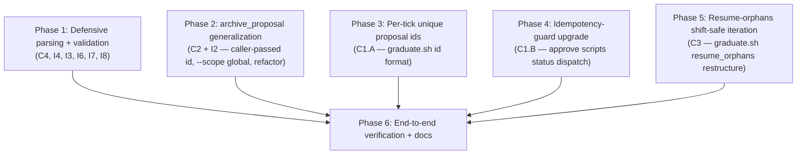

# PR #2 review fixes -- Implementation Plan

**Created:** 2026-05-07
**Depends on:** PR #2 branch `feat/memory-graduation` (committed at HEAD `7984947`); the prior `20260507_memory_auto_creation` work this PR is fixing.

---

## Context

PR #2 (memory graduation flow) passed its 7-phase implementation gates, but a fresh-eyes `code-reviewer` pass on the full diff caught four critical bugs and several important issues that the per-phase reviews missed. The bugs cluster on two seams: (a) same-day proposal-id collisions when auto-tier preempts a pending propose-tier proposal, and (b) duplicated archival logic across project and global scopes that drifted apart.

Validated findings (each confirmed by a research subagent against actual code):

- **C1.** Same-day auto-tier preempt produces identical `proposal_id`s for the propose-tier and auto-tier proposals. `archive_proposal()` writes the first as `superseded_by_auto`. Then `approve-proposal.sh`'s `ALREADY_ARCH` guard sees the existing entry and skips the archived-index append. `mv` clobbers the archived file. Final state: archived index says `superseded_by_auto`, archived file contents are the approved proposal — both wrong. Symmetric bug in the global path.
- **C2.** `archive_proposal()`'s filename-based fallback (when `.id` missing from yaml) yields the wrong id for cluster-created proposals (filename `{name}-{type}.yaml`, id `proposal-{name}-{date}`). Defense-in-depth concern but real.
- **C3.** `resume_orphans` in graduate.sh reads `pcount` once, iterates by index, releases lock, calls approve, reacquires — but the live index has shifted. Every other orphan is skipped per pass.
- **C4.** `parse_agent_yaml` in graduate.sh does not strip markdown code fences before `yq` parsing. `cluster.sh:222` does. Memory-writer LLM output drift would silently no-op graduation.
- **I2.** Archival logic is duplicated four times with three different schemas: `archive_proposal()` (project), `reject-global-proposal.sh` (inline, two type-discriminated branches), `approve-global-proposal.sh` (inline, two branches), graduate.sh global preempt (inline). Drift risk.
- **I4.** graduate.sh reads `domain` from instinct yamls without `validate_id` (cluster.sh:324 does). Corrupt domain flows into proposal yaml heredoc.

User decisions on ambiguous fixes:
- C1 fix approach: **defense-in-depth** — implement BOTH per-tick unique ids AND idempotency-guard upgrade.
- I2 scope: **include in this PR** alongside the bug fixes.

## Requirements

1. **C1.A — Per-tick unique proposal ids.** `graduate.sh` must produce `proposal_id`s that are unique across same-day same-instinct preempt cycles. The propose-tier proposal and an auto-tier proposal that supersedes it must end up at distinct file paths and distinct archived-index entries.
2. **C1.A.2 — PROP_NAME extraction must work with new id format.** `approve-proposal.sh:114` currently derives `PROP_NAME` via `sed 's/^proposal-//; s/-[0-9]\{4\}-[0-9]\{2\}-[0-9]\{2\}$//'`. With the new epoch suffix, the date-stripping sed no-ops, leaving `PROP_NAME=proposal-foo-1714895723` instead of `foo`. The memory artifact destination path (`approve-proposal.sh:141`, derived from `${PROP_NAME}.md`) would then be wrong. Replace the sed with a `yq '.name'` read on the proposal yaml (mirroring `approve-global-proposal.sh:174`). `approve-global-proposal.sh:120` is in the `promotion` branch only (fed by `promote.sh`, which still emits `-YYYY-MM-DD` ids), so it is intentionally left as-is.
3. **C1.B — Idempotency-guard upgrade.** `approve-proposal.sh` and `approve-global-proposal.sh` must handle the legacy collision case: when an archived-index entry with `status=superseded_by_auto` exists for the proposal_id being approved, the entry must be rewritten to `status=approved` rather than skipped. `status=approved` (true re-run) must remain a no-op. `status=rejected|permanently_rejected` must log WARN and **`exit 1` from approve-proposal.sh** (the artifact write at line 158 may have already executed; halting prevents further state mutation). This case should not be reachable in normal flow; the `exit 1` defends against manual re-invocation on a previously-rejected id.
4. **C2 — Caller-passed proposal_id.** `archive_proposal()` must take `proposal_id` as an explicit parameter. The yaml `.id`-read and filename-based fallback must be removed. All callers must pass the id explicitly.
5. **C3 — Resume-orphans shift-safe iteration.** `resume_orphans` in graduate.sh must collect orphan ids while holding the lock, then iterate by id (releasing/reacquiring per orphan). On reacquire, it must re-validate that the proposal still exists in the live index before calling approve. Approve calls must be wrapped in `if !` (matching the existing pattern at lines 218-224) to preserve loop continuation under `set -euo pipefail`. The `auto_approve_attempts` cap-then-bump ordering, content_file construction, and content_file cleanup must mirror the existing index-scan path (lines 197-226).
6. **C4 — Fence-strip in agent-output parsing.** `parse_agent_yaml` in graduate.sh must strip `^```yaml$` and `^```$` lines from agent output. The fence-strip must be applied **upstream of the `INSUFFICIENT_CONTEXT` first-line check** (graduate.sh:597-602), not just inside `parse_agent_yaml`, because the upstream check inspects the first non-empty line of `agent_output` BEFORE calling `parse_agent_yaml`. A fenced `INSUFFICIENT_CONTEXT` would otherwise have its first non-empty line be ` ```yaml ` and miss the check.
7. **I2 — `archive_proposal()` accepts `--scope global`.** When passed, it dispatches on the proposal yaml's `.type` (read before the file move so the dispatch can use it post-move) to write the correct archived-index schema:
   - `scope=project, type=memory|skill|rule` → `source_instincts: [<flat strings>]` + `source_instinct_count: <length>` (existing project schema)
   - `scope=global, type=memory` → `source_global_instincts: [<flat strings>]` + `source_global_instinct_count: <length>` (read from yaml's `.source_global_instincts` array)
   - `scope=global, type=promotion` → `source_project_instincts: [<{project, instinct} OBJECTS>]` + `source_project_count: <yaml scalar>` (read `.source_project_count` from the proposal yaml AS A SCALAR, NOT as array length; the count and array length may legitimately diverge per existing semantics in `reject-global-proposal.sh:145-153` and `approve-global-proposal.sh:388-397`)
   - `scope=global, type=<unknown>` → match the existing `approve-global-proposal.sh` *-branch (lines 399-409): write a 6-field entry with `id`, `file`, `type`, `domain`, `status`, `resolved_at` (6 fields, no `created_at` — matches existing approve-global-proposal.sh:399-409) BUT NO `source_*` field. Log WARN. (Different from the prior plan, which had a generic `source_instincts: []` fallback — that disagreed with existing approve behavior.)
   The new flag must be the LAST argument (positional, optional), preserving the existing 5-arg signature ordering for project callers. The helper must validate the new positional arg 6 (`new_status`) against the enum `approved|rejected|permanently_rejected|superseded_by_auto` to defend against accidental `--scope` passed in the status slot.
8. **I2 — Refactor inline archival.** `reject-global-proposal.sh` must call `archive_proposal --scope global` instead of inlined logic. graduate.sh's global auto-tier preempt path must call `archive_proposal --scope global`. `approve-proposal.sh` and `approve-global-proposal.sh` keep their current inline archival (they have richer outer logic — IS_RECOVERY/MID_ARCHIVAL/artifact-write/instinct-archival — that doesn't fit the helper). NOTE: this refactor is a deliberate semantics change in two places — `reject-global-proposal.sh` shifts from "ERROR exit 1 if live missing" to "INFO self-heal via recovery branch", and graduate.sh global preempt shifts from "skip if live missing AND archived present" to "self-heal indexes via recovery branch". Both shifts are improvements (the helper's recovery is the right answer), but they are behavior changes worth documenting.
9. **I4 — Validate `domain` in graduate.sh.** After reading `.domain` from each instinct yaml, fall back to `unknown` when `validate_id` rejects the value. WARN to evolve.log on fallback. Do not skip the candidate — domain is metadata, not load-bearing for graduation.
10. **Preserve `parse_agent_yaml` defense at graduate.sh:367.** The forbidden-pattern guard against name-format `-[0-9]{4}-[0-9]{2}-[0-9]{2}$` is a defense-in-depth check against the LEGACY id-collision class. It stays. We do NOT add an equivalent epoch-pattern guard because the agent prompt limits `name` to 45 chars and the LLM is unlikely to naturally produce `-1234567890`-style suffixes; if it does, validate_id still passes.
11. **Defensive cleanups bundled.** Remove dead `PARSE_OK` global (I3). Strip `\t\r` from agent-emitted title/description (I6). Add explicit `return 0` to graduate.sh helpers that fall off without a final return (I7). Change `-f` to `-e` in `approve-proposal.sh:153`'s recovery skip guard (I8).
12. **No regressions.** All 22 E2E scenarios from the prior verification (PLAN.md of `20260507_memory_auto_creation`) must still pass. `bash -n` and `/bin/bash -n` (macOS 3.2) must succeed on every modified script.
13. **Documentation.** `CLAUDE.md` must reflect the new `proposal_id` format produced by graduate.sh, the new `archive_proposal()` signature, and the new `--scope global` flag. The "Open questions and follow-ups" entries in the prior `SUMMARY.md` that this PR resolves (#1 and #2 partially, #3 fully) must be cross-referenced.

## Dependency Diagram



Phases 1-5 are independent at the file-system level **except** for graduate.sh, which Phases 1, 2, 3, and 5 all touch. To avoid merge conflicts, phases run sequentially in the listed order. Phase 2's graduate.sh changes are confined to the global preempt path; Phase 3's are confined to id construction; Phase 5's are confined to `resume_orphans`. Phase 1's are scattered (parse_agent_yaml, candidate loop, helpers).

---

## Phase 1: Defensive parsing + validation

**Goal:** Close the C4, I4, I3, I6, I7, I8 issues — small, mostly-mechanical defensive cleanups in graduate.sh, approve-proposal.sh, and write-artifact.sh.

**Recommended model — implement:** `sonnet` — multi-file edits are small but each has a specific subtle target (fence regex, validate_id integration, control-char stripping). Haiku context is fine but the judgment about WHERE to insert each fix benefits from sonnet.
**Recommended model — verify:** `sonnet` — checklist verification of small targeted changes; sonnet handles the cross-file matrix well.
**Recommended model — review:** `sonnet` — defensive cleanups, no architectural decisions.

### Steps

1. **C4 — Fence-strip BEFORE `INSUFFICIENT_CONTEXT` check, then again inside `parse_agent_yaml` (graduate.sh).** The `INSUFFICIENT_CONTEXT` first-line check at graduate.sh:597-602 inspects `agent_output` directly — a fenced `INSUFFICIENT_CONTEXT` response would miss the check because the first non-empty line is ` ```yaml `, not the sentinel. Strip fences from `agent_output` upstream of that check:
   ```bash
   # Immediately after agent_output is captured, before the INSUFFICIENT_CONTEXT check:
   agent_output=$(printf '%s\n' "$agent_output" | sed '/^```yaml$/d; /^```$/d')
   ```
   Apply the same strip inside `parse_agent_yaml` as a defense-in-depth (in case a future caller bypasses the upstream strip):
   ```bash
   out=$(printf '%s\n' "$out" | sed '/^```yaml$/d; /^```$/d')
   ```
   ~~Apply this BEFORE the `INSUFFICIENT_CONTEXT` first-line check (around line 597-602 — verify the actual location during implementation; if INSUFFICIENT_CONTEXT check is upstream of `parse_agent_yaml`, also strip there).~~
2. **I4 — Validate `cdomain` (graduate.sh).** Find the candidate-build loop where `domain=$(yq '.domain // "unknown"' "$inst_yaml" ...)` is read (~line 552). After the read, add:
   ```bash
   if ! validate_id "$domain"; then
     evolve_log "WARN graduate.sh: invalid domain='$domain' for instinct=$inst_id; using 'unknown'"
     domain="unknown"
   fi
   ```
   Mirror the same defense in any other location where `domain` is read from disk in graduate.sh.
3. **I3 — Remove dead `PARSE_OK` (graduate.sh).** Delete the `PARSE_OK=0`/`PARSE_OK=1` lines in `parse_agent_yaml`. Update the function's doc comment if it advertises PARSE_OK as a side-effect global.
4. **I6 — Strip control chars (graduate.sh).** In `parse_agent_yaml`, after extracting `t` (title) and `d` (description) but before assigning `PARSE_TITLE`/`PARSE_DESCRIPTION`, run:
   ```bash
   t=$(printf '%s' "$t" | tr -d '\t\r')
   d=$(printf '%s' "$d" | tr -d '\t\r')
   ```
5. **I7 — Explicit `return 0` (graduate.sh).** Audit `read_pending_memory_proposal_for_instinct`, `read_pending_memory_instinct_ids`, `read_archived_memory_block_ids`, `read_skipped_buffer`. Each must end with `return 0` — add where missing.
6. **I8 — `-f` → `-e` (approve-proposal.sh:153).** Replace `if [[ -f "$DEST" ]]` in the recovery skip guard with `if [[ -e "$DEST" ]]`. Verify symmetry with `write-artifact.sh:94`'s existing `-e` check.

### Files

| File | Action | Changes |
|------|--------|---------|
| `scripts/graduate.sh` | Modify | C4 fence-strip in parse_agent_yaml; I4 validate_id on domain; I3 remove PARSE_OK; I6 control-char strip; I7 explicit return 0 in 4 helpers |
| `scripts/approve-proposal.sh` | Modify | I8 `-f` → `-e` on line 153 |

### Verification

- `parse_agent_yaml` correctly parses fenced YAML output: feed input wrapped in ` ```yaml ... ``` ` and assert `$PARSE_NAME` / `$PARSE_TITLE` / `$PARSE_DESCRIPTION` populate correctly.
- `parse_agent_yaml` correctly parses input WITHOUT fences (regression check).
- `INSUFFICIENT_CONTEXT` detection still works when wrapped in fences (if applicable to that path).
- An instinct with `domain: "bad domain with spaces"` is processed by graduate.sh: domain falls back to `unknown`, candidate is NOT skipped, WARN line appears in evolve.log.
- An instinct with valid `domain: "shell"` continues to work unchanged.
- A title/description containing literal tabs is sanitized: tabs do not appear in the resulting proposal yaml, the field is preserved otherwise.
- `bash -n scripts/graduate.sh` and `/bin/bash -n scripts/graduate.sh` exit 0.
- `bash -n scripts/approve-proposal.sh` and `/bin/bash -n scripts/approve-proposal.sh` exit 0.

---

## Phase 2: archive_proposal generalization (C2 + I2)

**Goal:** Generalize `archive_proposal()` to (a) require an explicit `proposal_id` parameter and (b) accept an optional `--scope global` flag with type-dispatched archived-index schema. Refactor `reject-global-proposal.sh` and graduate.sh's global preempt to use the helper.

**Recommended model — implement:** `sonnet` — multi-file refactor with semantic surface change. Five callers, three schemas, careful diff.
**Recommended model — verify:** `sonnet` — checklist depth is moderate (4 callers + helper); verifier traces each call site.
**Recommended model — review:** `opus` — schema dispatch is the highest-risk surface in this plan; the reviewer needs breadth-of-judgment to catch subtle bugs in the global-promotion vs global-memory branch divergence.

### Steps

1. **Update `archive_proposal()` signature with status-enum validation.** New signature (lib.sh):
   ```bash
   # archive_proposal <proposal_file> <proposal_id> <archive_dir> <archived_index> <live_index> <new_status> [--scope global]
   archive_proposal() {
       local proposal_file="$1" proposal_id="$2" archive_dir="$3"
       local archived_index="$4" live_index="$5" new_status="$6"
       local scope="project"
       [[ "${7:-}" == "--scope" && "${8:-}" == "global" ]] && scope="global"

       # Validate new_status against the known enum to defend against accidental
       # arg shifts (e.g., a caller passing "--scope" in the status slot).
       case "$new_status" in
           approved|rejected|permanently_rejected|superseded_by_auto) ;;
           *)
               evolve_log "ERROR archive_proposal: invalid new_status='$new_status'"
               return 2
               ;;
       esac
       ...
   }
   ```
   Drop the `yq '.id' on archived copy` block and the filename-based fallback. Use `$proposal_id` directly.
2. **Read `.type` from the live or archived path BEFORE dispatching schema.** The archived-index entry needs `.type` (and `.domain`) for both project and global. Read order:
   - If `proposal_file` exists at the live path: read `.type` and `.domain` from there before the move.
   - Else if pre-positioned at the archive path (recovery branch): read from the archived path.
   - Else (missing-everywhere): return 1.
3. **Add scope-aware archived-index entry construction.** After the file-move step (or recovery skip-move), and before the live-index rewrite, compute archived-index entry fields based on `scope` and `.type`:
   - **`project` (any type)**: existing behavior preserved. Read `.source_instincts` array (flat strings), write `source_instincts: <array>` + `source_instinct_count: <length>`.
   - **`global` + `type=memory`**: read `.source_global_instincts` array (flat strings), write `source_global_instincts: <array>` + `source_global_instinct_count: <length>`.
   - **`global` + `type=promotion`**: read `.source_project_instincts` as an array of `{project: <id>, instinct: <id>}` OBJECTS — emit them with object structure preserved. Write `source_project_count: <SCALAR from .source_project_count, NOT array length>` because the count and array length may legitimately differ per existing semantics. yq idiom for object-preserving emission:
     ```yq
     # Construct nested entries explicitly
     yq eval-all '
       (select(filename == "ARCH_IDX") | .proposals) +=
         [{"id": env(ID), "file": env(FILE), "type": "promotion",
           "status": env(STATUS), ...
           "source_project_instincts": (select(filename == "PROP_FILE") | .source_project_instincts),
           "source_project_count": (select(filename == "PROP_FILE") | .source_project_count // 0)
          }] |
       select(filename == "ARCH_IDX")
     ' "$ARCH_IDX" "$PROP_FILE"
     ```
     (Implementer should choose the precise yq pattern that matches existing reject-global-proposal.sh:145-153 output byte-for-byte. The above is illustrative.)
   - **`global` + `type=<unknown>`**: emit a 6-field entry matching `approve-global-proposal.sh:399-409`: `id`, `file`, `type`, `domain`, `status`, `resolved_at` (6 fields, no `created_at` — matches existing approve-global-proposal.sh:399-409). NO `source_*` field. Log WARN.
4. **Update existing project callers.** In `reject-proposal.sh` and graduate.sh's project preempt path, pass `proposal_id` explicitly. Verify no caller relies on the dropped fallback.
5. **Refactor `reject-global-proposal.sh`.** Replace the inline archival block (lines 86-157) with a single call:
   ```bash
   if ! archive_proposal "$PROPOSAL_PATH" "$PROPOSAL_ID" "$ARCHIVE_DIR" "$ARCHIVED_INDEX" "$LIVE_INDEX" "$STATUS" --scope global; then
       evolve_log "reject-global-proposal.sh: archive_proposal failed for $PROPOSAL_ID"
       echo "ERROR: archive_proposal failed" >&2
       exit 1
   fi
   ```
   The pre-existing hard-error file-existence guard (lines 65-69) is removed. **NOTE the deliberate semantics change**: the prior code exited 1 when only the live path was missing; the helper's recovery branch instead self-heals by re-syncing indexes against the already-archived file. This is correct (recovery is the right answer for an interrupted prior run) but is a behavior change. Document in SUMMARY.md.
6. **Refactor graduate.sh global auto-tier preempt path.** Replace the ~60-line inline archival block (lines ~699-759) with a call to `archive_proposal --scope global`. **NOTE the deliberate semantics change**: the prior code at lines 712-715 silently `continue`d when live was missing AND archived was present (treating it as already-completed). The helper's recovery branch instead re-syncs the indexes (which may legitimately need repair if the prior crash was between the file move and the index rewrite). Document this in SUMMARY.md.
7. **Remove no-longer-needed yaml `.id` reads.** In `archive_proposal()`, drop the `proposal_id=$(yq '.id // "" ...)` block on archived copy. The id is now passed in.

### Files

| File | Action | Changes |
|------|--------|---------|
| `scripts/lib.sh` | Modify | New 6-arg signature for `archive_proposal()`; type+scope dispatch for archived-index entry; drop yaml-id-read fallback |
| `scripts/reject-proposal.sh` | Modify | Pass `proposal_id` to `archive_proposal()` (if not already explicit) |
| `scripts/reject-global-proposal.sh` | Modify | Replace inline archival with `archive_proposal --scope global` call; remove missing-file hard-error |
| `scripts/graduate.sh` | Modify | Project preempt: pass `proposal_id` explicitly. Global preempt: replace inline block with `archive_proposal --scope global` call |

### Verification

- Project archival path: feed an existing `reject-proposal.sh` invocation; verify proposal moves to archived dir, live index loses the entry, archived index gains an entry with the correct `source_instincts` schema. (Regression check.)
- Global memory archival path: feed `reject-global-proposal.sh` on a `type=memory` proposal; verify archived-index entry uses `source_global_instincts` + `source_global_instinct_count`.
- Global promotion archival path: same, on a `type=promotion` proposal; verify archived-index entry uses `source_project_instincts` + `source_project_count`.
- graduate.sh global preempt: simulate a pending global memory proposal being preempted by auto-tier; verify the archived entry has `status=superseded_by_auto` and the correct global schema.
- Crash recovery: pre-position the proposal yaml at the archive path AND a stale live-index entry; verify `archive_proposal --scope global` repairs both indexes idempotently.
- Missing-everywhere case: with proposal at neither path, `archive_proposal` returns non-zero; reject-global-proposal.sh must surface this as exit 1 (preserve existing contract).
- Type=unknown case: synthesize a global proposal yaml with `type: bogus`; verify `archive_proposal --scope global` writes a generic entry, logs WARN, and exits 0 (does not crash).
- `bash -n` and `/bin/bash -n` on all modified scripts.

---

## Phase 3: Per-tick unique proposal ids (C1.A)

**Goal:** Change graduate.sh's `proposal_id` format to use an epoch suffix, so propose-tier and auto-tier proposals always end up at distinct ids/files even on the same day.

**Recommended model — implement:** `sonnet` — id-format change is mechanical, but Phase 3 also includes the `approve-proposal.sh:114` yq replacement with error-handling and an asymmetry comment about `approve-global-proposal.sh:120`. Bumped from haiku to sonnet for the multi-file judgment.
**Recommended model — verify:** `sonnet` — verify char-budget math, format consistency across project + global, and that no other script consumes the old format.
**Recommended model — review:** `sonnet` — small surface; reviewer focuses on format correctness and budget.

### Steps

1. **Add `EPOCH_NOW` capture at graduate.sh script start.** Near the top of the script (before any proposal_id construction), add:
   ```bash
   EPOCH_NOW=$(date -u +%s)
   ```
   Use `EPOCH_NOW` per tick — same value for all proposals created in this run. This is structurally safe because the candidate loop dedupes by instinct id (each instinct produces at most one proposal per run); the verification below confirms.
2. **Update project proposal_id format.** Find every line that constructs `proposal_id="proposal-${f_name}-${date_str}"` (graduate.sh line ~767). Change to:
   ```bash
   proposal_id="proposal-${f_name}-${EPOCH_NOW}"
   ```
3. **Update global proposal_id format.** Find every line constructing `proposal_id="global-proposal-${f_name}-memory-${date_str}"` (graduate.sh line ~769). Change to:
   ```bash
   proposal_id="global-proposal-${f_name}-memory-${EPOCH_NOW}"
   ```
4. **Verify char budgets.** With `f_name` cap=45 and EPOCH=10 chars (10-digit epoch valid through 2286):
   - Project: `proposal-{45}-{10}` = `9 + 45 + 1 + 10` = 65 chars. Within 80-char `_EVOLVE_ID_REGEX` budget.
   - Global: `global-proposal-{45}-memory-{10}` = `16 + 45 + 8 + 10` = 79 chars (no separator before epoch — `-memory-` already ends with `-`). Within budget.
5. **Update `approve-proposal.sh:114` PROP_NAME extraction (CRITICAL — see Requirement #2).** The current sed-based derivation breaks with the epoch suffix. Replace:
   ```bash
   # Old (line 114):
   PROP_NAME=$(echo "$PROPOSAL_ID" | sed 's/^proposal-//; s/-[0-9]\{4\}-[0-9]\{2\}-[0-9]\{2\}$//')
   # New:
   PROP_NAME=$(yq '.name // ""' "$SOURCE_PROPOSAL_PATH" 2>/dev/null || echo "")
   if [[ -z "$PROP_NAME" ]]; then
       evolve_log "ERROR approve-proposal.sh: .name missing from $SOURCE_PROPOSAL_PATH"
       echo "ERROR: .name missing from proposal yaml" >&2
       exit 1
   fi
   ```
   This mirrors `approve-global-proposal.sh:174`. NOTE: `approve-global-proposal.sh:120`'s sed remains as-is because it is in the `promotion` branch only (fed by `promote.sh`, which still emits `-YYYY-MM-DD` ids). Document this asymmetry inline as a one-line comment.
6. **`date_str` audit.** Verify graduate.sh uses `date_str` ONLY in `proposal_id` construction (at lines ~767 and ~769). If used elsewhere (proposal yaml `created_at`?), it stays. The `created_at` field should remain ISO-8601 UTC, written separately. Also: keep the `parse_agent_yaml` forbidden-pattern guard at graduate.sh:367 (`-[0-9]{4}-[0-9]{2}-[0-9]{2}$` rejection) as-is — it remains a valid defense against the legacy id-collision class even after the format change. Add an inline comment noting why no equivalent epoch-pattern guard is needed (45-char name cap + agent prompt restrictions make it implausible).
7. **Update CLAUDE.md docs.** In the "Memory Graduation" section, document the new id format with examples. Note that the date is recoverable from `created_at` in the proposal yaml.

### Files

| File | Action | Changes |
|------|--------|---------|
| `scripts/graduate.sh` | Modify | Capture `EPOCH_NOW` once; replace `${date_str}` with `${EPOCH_NOW}` in proposal_id construction (project + global); preserve line ~367 forbidden-pattern guard with explanatory comment |
| `scripts/approve-proposal.sh` | Modify | Replace sed-based PROP_NAME extraction at line 114 with `yq '.name'` read from proposal yaml |
| `CLAUDE.md` | Modify | Document new proposal_id format in the "Memory Graduation" section |

### Verification

- A test run of graduate.sh produces project proposal_ids matching `^proposal-[a-z0-9_-]+-[0-9]{10}$`.
- A test run produces global proposal_ids matching `^global-proposal-[a-z0-9_-]+-memory-[0-9]{10}$`.
- Both ids pass `validate_id` (≤80 chars, regex match).
- **Within-run uniqueness check**: confirm by reading graduate.sh's candidate loop that the same instinct cannot produce two proposals in a single run (the candidate loop dedupes by instinct id). Document this structural property in SUMMARY.md.
- **Cross-run uniqueness check**: simulate two graduate.sh runs >=1 second apart for the same instinct (propose-tier then auto-tier); assert the two proposal_ids have different epoch suffixes.
- `approve-proposal.sh` correctly derives PROP_NAME from yaml `.name` for both new-format ids (epoch suffix) and legacy-format ids (date suffix). Memory artifact destination path is correct in both cases.
- The proposal yaml retains `created_at` in ISO-8601 UTC.
- `bash -n` and `/bin/bash -n` on `scripts/graduate.sh` and `scripts/approve-proposal.sh`.

---

## Phase 4: Idempotency-guard upgrade (C1.B)

**Goal:** In `approve-proposal.sh` and `approve-global-proposal.sh`, replace the `ALREADY_ARCH` boolean check with a status-aware dispatch so that legacy `superseded_by_auto` entries are upgraded to `approved` rather than silently skipped.

**Recommended model — implement:** `sonnet` — status-dispatch logic with edge cases (empty / superseded_by_auto / approved / rejected).
**Recommended model — verify:** `sonnet` — verifier traces each branch with concrete fixture proposals.
**Recommended model — review:** `sonnet` — small surface, but the reviewer must trace the interaction with MID_ARCHIVAL and IS_RECOVERY.

### Steps

1. **Update `approve-proposal.sh` archived-index append (lines ~204-226).** Replace:
   ```bash
   ALREADY_ARCH=$(yq "[.proposals[] | select(.id == \"${PROPOSAL_ID}\")] | length" "$PROPOSAL_ARCHIVED_INDEX" 2>/dev/null || echo "0")
   if [[ "$ALREADY_ARCH" -eq 0 ]]; then
     ... append ...
   fi
   ```
   With status-aware dispatch:
   ```bash
   EXISTING_STATUS=$(yq ".proposals[] | select(.id == \"${PROPOSAL_ID}\") | .status" "$PROPOSAL_ARCHIVED_INDEX" 2>/dev/null || echo "")
   case "$EXISTING_STATUS" in
     "")
       ... append new entry with status=approved ...
       ;;
     superseded_by_auto)
       ... atomic-rewrite that entry: set status=approved, update resolved_at to now ...
       evolve_log "INFO approve-proposal.sh: upgraded archived entry $PROPOSAL_ID from superseded_by_auto to approved"
       ;;
     approved)
       evolve_log "INFO approve-proposal.sh: idempotent re-run for $PROPOSAL_ID"
       # archive index unchanged
       ;;
     rejected|permanently_rejected)
       evolve_log "WARN approve-proposal.sh: cannot approve $PROPOSAL_ID with archived status=$EXISTING_STATUS; halting"
       echo "ERROR: cannot approve already-rejected proposal $PROPOSAL_ID" >&2
       # The artifact write at line 158 may have ALREADY executed before this gate.
       # We exit 1 to halt further state mutation. The downstream cleanup
       # (instinct archival) does NOT run, leaving the artifact orphaned —
       # this is acceptable because it requires manual user intervention to reach
       # this branch and the human investigating gets clear logging.
       exit 1
       ;;
     *)
       evolve_log "WARN approve-proposal.sh: unknown archived status='$EXISTING_STATUS' for $PROPOSAL_ID; halting"
       echo "ERROR: unknown archived status" >&2
       exit 1
       ;;
   esac
   ```
2. **Atomic-rewrite implementation for `superseded_by_auto → approved`.** Use a single yq invocation that updates BOTH `.status` and `.resolved_at` on the matched entry, then atomic temp+mv. Add `2>/dev/null` to suppress yq stderr noise but check the exit code:
   ```bash
   RESOLVED_AT_NOW=$(date -u +"%Y-%m-%dT%H:%M:%SZ")
   tmp_idx=$(mktemp "${PROPOSAL_ARCHIVED_INDEX}.XXXXXX")
   if yq "(.proposals[] | select(.id == \"${PROPOSAL_ID}\")) |=
          (.status = \"approved\" | .resolved_at = \"${RESOLVED_AT_NOW}\")" \
          "$PROPOSAL_ARCHIVED_INDEX" > "$tmp_idx" 2>/dev/null; then
       # Sanity: tmp_idx must be non-empty (yq could produce empty output on parse failure)
       if [[ ! -s "$tmp_idx" ]]; then
           rm -f "$tmp_idx"
           evolve_log "ERROR approve-proposal.sh: yq produced empty rewrite for archived index"
           exit 1
       fi
       mv "$tmp_idx" "$PROPOSAL_ARCHIVED_INDEX"
   else
       rm -f "$tmp_idx"
       evolve_log "ERROR approve-proposal.sh: yq rewrite failed for $PROPOSAL_ID"
       exit 1
   fi
   ```
   The `(... | select(...)) |= (... assignments ...)` form is mikefarah yq v4 idiom for "update matched element in place"; verified to produce a no-op when the selector matches nothing.
3. **Apply identical changes to `approve-global-proposal.sh`.** Same status-dispatch block, same atomic-rewrite pattern. The archived-index path is `$GLOBAL_DIR/proposals/archived/index.yaml`. The `exit 1` semantics on `rejected|permanently_rejected|unknown` apply identically.
4. **Important interaction with MID_ARCHIVAL/IS_RECOVERY.** When `MID_ARCHIVAL=1` or `IS_RECOVERY=1`, the existing flow already gates appropriately. Verify the new dispatch fires AFTER those flags are evaluated — the flow should be:
   - IS_RECOVERY=1 + MID_ARCHIVAL=0: skip archival entirely (R16 full-recovery semantics, unchanged).
   - IS_RECOVERY=0 + MID_ARCHIVAL=1: file-move skipped, but live-index rewrite + status-dispatch run.
   - IS_RECOVERY=0 + MID_ARCHIVAL=0: file-move runs, then live-index rewrite + status-dispatch run.

### Files

| File | Action | Changes |
|------|--------|---------|
| `scripts/approve-proposal.sh` | Modify | Replace `ALREADY_ARCH` boolean check with status-aware case dispatch around line 204-226 |
| `scripts/approve-global-proposal.sh` | Modify | Same pattern around line 351-413 |

### Verification

- Status=`""` (no existing entry): new entry appended, status=approved, resolved_at=now. (Regression check.)
- Status=`superseded_by_auto`: entry rewritten to status=approved, resolved_at updated; live index entry was already absent (preempt path) so unchanged; INFO log emitted.
- Status=`approved`: archive index unchanged; INFO log emitted; artifact write is upstream — verify it doesn't double-write (existing IS_RECOVERY skip should handle).
- Status=`rejected`: archive index unchanged; WARN log emitted; the approve flow as a whole is short-circuited (this case is "shouldn't happen" defense).
- MID_ARCHIVAL=1 path: file-move skipped, dispatch still runs.
- IS_RECOVERY=1 path: dispatch is skipped entirely (existing block-guard).
- Symmetric tests for `approve-global-proposal.sh` covering both `type=memory` and `type=promotion`.
- `bash -n` and `/bin/bash -n` on both scripts.

---

## Phase 5: Resume-orphans shift-safe iteration (C3)

**Goal:** Restructure `resume_orphans` in graduate.sh to collect orphan ids first while holding the lock, then iterate by id with release/reacquire per-orphan. Re-validate each orphan's existence in the live index after reacquire.

**Recommended model — implement:** `sonnet` — loop restructure with judgment about when to re-read state and how to handle approve failures.
**Recommended model — verify:** `sonnet` — verifier needs to reason about lock release windows and the shift behavior.
**Recommended model — review:** `sonnet` — small surface, but reviewer must catch subtle re-entry / infinite-loop / TOCTOU issues.

### Steps

1. **Replace the index-by-position loop with id-collection + per-id processing.** Find `resume_orphans` (graduate.sh ~lines 178-235). Restructure to the pseudocode below. **CRITICAL CONSTRAINTS** (each plug a real defect found in plan review):
   - Approve calls MUST be wrapped in `if !` to preserve loop continuation under `set -euo pipefail` (mirrors existing pattern at lines 218-224). A bare `"$approve_script" ...` would propagate non-zero exit through `set -e`, hit `evolve_trap`, and `exit 0` the entire script.
   - Bookkeeping order is fixed: (1) read `auto_approve_attempts` from yaml, (2) check `>= 3` and `continue` if true, (3) bump `+1` atomically, (4) build `content_file` tempfile, (5) release lock, (6) approve, (7) reacquire lock, (8) cleanup `content_file`. Mirrors lines 197-226 exactly.
   - `set -u` IS active in graduate.sh (line 2: `set -euo pipefail`); the `"${orphan_ids[@]+"${orphan_ids[@]}"}"` expansion idiom is MANDATORY for empty-array safety, not merely defensive. Existing code uses identical pattern at lines 575 and 624.

   ```bash
   resume_orphans() {
     local proposal_index="$1" approve_script="$2" lock_file="$3"
     local project_arg="$4"   # passed through to approve_script (PROJECT_ID for approve-proposal.sh; "" for global)
     local orphan_ids=() pcount prop_id is_auto i

     # ── Phase A: collect orphan ids while holding caller's lock ──
     pcount=$(yq '.proposals | length' "$proposal_index" 2>/dev/null || echo 0)
     for ((i=0; i<pcount; i++)); do
       is_auto=$(yq ".proposals[$i].auto_approve_target // false" "$proposal_index" 2>/dev/null || echo "false")
       if [[ "$is_auto" == "true" ]]; then
         prop_id=$(yq ".proposals[$i].id // \"\"" "$proposal_index" 2>/dev/null || echo "")
         [[ -n "$prop_id" ]] && orphan_ids+=( "$prop_id" )
       fi
     done

     # ── Phase B: process each id ──
     local id still_pending attempts content_file rc
     for id in "${orphan_ids[@]+"${orphan_ids[@]}"}"; do
       # B.1 Re-validate the orphan still exists in live index (caller still holds lock).
       still_pending=$(yq ".proposals[] | select(.id == \"$id\") | .id" "$proposal_index" 2>/dev/null || echo "")
       if [[ -z "$still_pending" ]]; then
         evolve_log "INFO graduate.sh: orphan $id no longer in live index, skipping"
         continue
       fi

       # B.2 Read attempts; check cap BEFORE bumping. Cap=3 from existing code.
       attempts=$(yq ".proposals[] | select(.id == \"$id\") | .auto_approve_attempts // 0" "$proposal_index" 2>/dev/null || echo 0)
       if [[ "$attempts" -ge 3 ]]; then
         evolve_log "WARN graduate.sh: orphan $id exceeded auto_approve_attempts cap (=$attempts); skipping"
         continue
       fi

       # B.3 Atomic bump of auto_approve_attempts on the PROPOSAL YAML FILE
       # (NOT on $proposal_index). Resolve prop_path via the `.file` index field.
       # Mirror the existing pattern at lines 203-206.
       prop_file=$(yq ".proposals[] | select(.id == \"$id\") | .file // \"\"" "$proposal_index" 2>/dev/null || echo "")
       if [[ -z "$prop_file" ]]; then
         evolve_log "ERROR graduate.sh: orphan $id missing .file field in index, skipping"
         continue
       fi
       prop_path="$proposals_dir/$prop_file"
       tmp_aa=$(mktemp "${prop_path}.XXXXXX")
       yq '.auto_approve_attempts = (.auto_approve_attempts // 0) + 1' "$prop_path" > "$tmp_aa"
       mv "$tmp_aa" "$prop_path"

       # B.4 Build content_file tempfile from the proposal yaml's .proposed_content.
       # The approve script reads ALL OTHER FIELDS from the proposal yaml directly
       # via PROPOSAL_ID — the content_file contains ONLY .proposed_content as the
       # raw artifact body. Mirror the existing pattern at lines 209-210.
       content_file=$(mktemp /tmp/graduate-orphan-content.XXXXXX)
       yq '.proposed_content // ""' "$prop_path" > "$content_file"

       # B.5 Release caller's lock around the approve invocation.
       release_lock "$lock_file"
       trap - EXIT

       # B.6 Approve under `if !` for loop continuation.
       if ! "$approve_script" "$project_arg" "$id" "" "$content_file"; then
         rc=$?
         evolve_log "WARN graduate.sh: approve failed for orphan $id (rc=$rc); continuing"
         # Falls through to cleanup; loop continues.
       fi

       # B.7 Reacquire lock; cleanup content_file regardless of approve outcome.
       if ! acquire_lock "$lock_file"; then
         rm -f "$content_file"
         evolve_log "ERROR graduate.sh: lock reacquire failed in resume_orphans; aborting remaining orphans"
         return 1
       fi
       trap "release_lock \"$lock_file\"" EXIT
       rm -f "$content_file"
     done
   }
   ```
2. **Bookkeeping order is the cap-then-bump invariant.** Read `auto_approve_attempts` first, check `>= 3` to skip, only THEN bump. The reverse (bump-then-check) would yield an off-by-one: a proposal at attempts=2 would be bumped to 3 then NOT skipped (cap is `>= 3`), giving one extra attempt before the cap actually engages.
3. **`content_file` lifecycle is part of the per-orphan flow.** Build before the release, cleanup after the reacquire (regardless of approve success/failure). The existing index-scan code at lines 209-226 does the same.
4. **TOCTOU safety relies on re-validation, not on lock exclusivity.** The plan's prior risk-table claim that "only graduate.sh writes orphans and only approve-proposal.sh removes them, both under the same lock" is partially wrong: `approve-proposal.sh` and `approve-global-proposal.sh` are standalone scripts invocable by `/evolve` and may hold the lock concurrently with graduate.sh. The actual safety guarantee is the B.1 re-validation step under the reacquired lock — it harmlessly skips orphans removed by ANY actor. The risk-table row will be corrected to reflect this.
5. **Bash 3.2 idiom.** The `"${orphan_ids[@]+"${orphan_ids[@]}"}"` expansion is required because `set -u` is active. Without it, an empty `orphan_ids` array triggers "unbound variable" and aborts the script. Existing graduate.sh uses identical pattern at lines 575 and 624.
6. **Trap management.** `trap - EXIT` before release, `trap "release_lock ..." EXIT` after reacquire, mirrors existing graduate.sh pattern at lines 213-214 and 229-234. If the process dies between release and reacquire, fd 9 closes on process exit and flock auto-releases — no lock leak.

### Files

| File | Action | Changes |
|------|--------|---------|
| `scripts/graduate.sh` | Modify | Restructure `resume_orphans` to collect ids first, then process by id with release/reacquire |

### Verification

- Two orphan proposals A, B in live index: both get approved in a single resume_orphans call. (The current bug skips B.)
- Three orphans A, B, C: all three get approved.
- One orphan + one non-auto proposal: the non-auto proposal is untouched (filter is correct).
- Empty index: function exits cleanly, no errors under `set -euo pipefail` (validates the empty-array idiom).
- Approve failure on one orphan: subsequent orphans still attempted under `set -euo pipefail` (the `if !` wrapper preserves loop continuation; `evolve_trap` is NOT triggered).
- Cap-then-bump ordering: a proposal at `auto_approve_attempts=2` is bumped to 3 and approved (this is its 3rd attempt; subsequent attempts blocked). A proposal at attempts=3 is skipped without bumping.
- `content_file` lifecycle: before approve call, content_file exists at a /tmp path. After reacquire, content_file is removed regardless of approve success/failure.
- Re-entry safety: if approve removes the orphan (success path), the id no longer appears in the live index on the next iteration — the B.1 re-validation skip fires harmlessly.
- TOCTOU safety: simulate concurrent `approve-proposal.sh` invocation from `/evolve` between Phase A and Phase B. The B.1 re-validation correctly skips orphans removed externally. Lock reacquire may briefly fail; the `return 1` path is exercised.
- Lock leak under crash: kill graduate.sh between B.5 (release) and B.7 (reacquire). Confirm fd 9 close releases the flock; next graduate.sh run successfully acquires.
- `bash -n` and `/bin/bash -n` on graduate.sh.

---

## Phase 6: End-to-end verification + docs

**Goal:** Verify all five fixes integrate correctly, regression-check the 22 prior E2E scenarios, update CLAUDE.md and SUMMARY.md, and run full bash -n sweep.

**Recommended model — implement:** N/A — this phase is verification-driven, not implementer-driven.
**Recommended model — verify:** `opus` — end-to-end verifier needs to cross-check 5 separate fixes for interaction effects + regression-check 22 prior scenarios. Many cross-cutting invariants.
**Recommended model — review:** `opus` — final code-reviewer pass on the integrated diff; this is the gate where any cross-phase smell surfaces.

### Steps

1. **Update CLAUDE.md.** READ the file first (Phase 3 has already added the new `proposal_id` format documentation in the "Memory Graduation" section). Append/update WITHOUT clobbering Phase 3's edits:
   - In the `lib.sh` helpers section: update `archive_proposal()` to the 6-arg signature with `--scope global` flag.
   - Note that the prior "Open questions" entries are now: #1 (`approve-proposal.sh inline could use archive_proposal`) — PARTIALLY resolved (reject-global-proposal.sh and graduate.sh global preempt now use the helper; the approve scripts intentionally retain inline outer logic). #2 (`approve-global-proposal.sh could use shared helper`) — PARTIALLY resolved (same as #1). #3 (same-day proposal-id collision) — FULLY resolved by this PR's defense-in-depth fix.
2. **Regression-test the 22 prior E2E scenarios.** Re-run each scenario from `20260507_memory_auto_creation/PLAN.md` (the prior plan). Verifier confirms all 22 still pass.
3. **Test harness specification.** Targeted tests live in `/tmp/pr2-fixes-tests/` as numbered bash scripts (e.g., `01-c1a-same-day-collision.sh`, `02-c1b-status-upgrade.sh`, `03-c2-explicit-id.sh`, etc.). Each test:
   - Constructs an isolated `EVOLVE_DIR` under `/tmp/pr2-fixes-tests/run-<test_id>/` to avoid touching the user's `~/.claude/evolve/` (HARD SAFETY).
   - Seeds fixtures (proposal yamls, instinct yamls, indexes) deterministically.
   - Invokes the relevant script (graduate.sh, approve-proposal.sh, etc.) via `EVOLVE_DIR=... PROJECT_ID=... <script>`.
   - Asserts file-system / yq output / log lines.
   - Cleans up the run directory on exit.
4. **Targeted tests for each new fix:**
   - C1.A: simulate same-day same-instinct propose→auto; verify two distinct proposal_ids (different epoch values) and two archived files.
   - C1.B: pre-position an archived `superseded_by_auto` entry; place a NEW pending proposal at id `proposal-X-Y`. Run approve. Verify status upgrades to approved with updated resolved_at.
   - C1.B negative: pre-position an archived `rejected` entry. Run approve. Verify it `exit 1`s with WARN log.
   - C2: call `archive_proposal "$file" "$EXPLICIT_ID" "$dir" "$arch_idx" "$live_idx" rejected` (project scope). Verify works without yaml `.id` reads.
   - C3: pre-position 3 orphan proposals (auto_approve_target=true); verify all 3 invoke approve-proposal.sh in one resume_orphans pass.
   - C3 cap test: pre-position one orphan with attempts=3; verify it's skipped without bump.
   - C3 cap test: one orphan with attempts=2; verify bump to 3 + approve.
   - C4: feed `\`\`\`yaml\nname: x\n...\n\`\`\`` to `parse_agent_yaml`; verify successful parse. Also: test fenced INSUFFICIENT_CONTEXT detection at the upstream check.
   - I4: write instinct yaml with `domain: "bad domain"`; verify graduate.sh logs WARN, falls back to `domain=unknown`, candidate is processed.
   - I2 schema-memory: invoke `archive_proposal --scope global` on a `type=memory` proposal; verify archived index entry has `source_global_instincts: [<flat strings>]` + `source_global_instinct_count: <length>`.
   - I2 schema-promotion: same on `type=promotion`. Verify entry has `source_project_instincts: [{project, instinct} OBJECTS]` + `source_project_count: <yaml scalar>`. Test with `count != length` to verify scalar wins.
   - I2 schema-unknown: feed proposal with `type: bogus`. Verify 6-field entry without `source_*`, WARN logged, exit 0.
   - I2 status-enum-defense: invoke `archive_proposal "$file" "$id" "$dir" "$arch" "$live" "--scope" --scope global` (deliberately wrong arg order); verify `return 2` with ERROR log.
   - I2 reject-global recovery semantics: pre-position proposal at archive path only (live missing); run reject-global-proposal.sh; verify it self-heals (exit 0) instead of erroring (legacy was exit 1). Document in test that this is the intended behavior change.
5. **Defensive cleanups verification:**
   - I3: `grep -n PARSE_OK scripts/graduate.sh` — should return zero hits.
   - I6: feed agent output with literal `\t` in title and `\r` in description; assert both are stripped from PARSE_TITLE / PARSE_DESCRIPTION.
   - I7: `bash -n scripts/graduate.sh` and `/bin/bash -n scripts/graduate.sh` exit 0; spot-check helper return codes via test invocation.
   - I8: `grep -n '\-f "$DEST"' scripts/approve-proposal.sh:153` — should NOT match (verify the `-f`→`-e` swap).
6. **`bash -n` sweep on every modified script:**
   ```bash
   for f in scripts/lib.sh scripts/graduate.sh scripts/approve-proposal.sh \
            scripts/approve-global-proposal.sh scripts/reject-proposal.sh \
            scripts/reject-global-proposal.sh; do
     bash -n "$f" && /bin/bash -n "$f" && echo "OK: $f"
   done
   ```
7. **File inventory cross-check.** Run `git diff --stat origin/main..HEAD -- scripts/ agents/ config.yaml CLAUDE.md install.sh` and verify the output matches the File Inventory below. Catches unintended edits.
8. **Update SUMMARY.md.** Document each phase's outcomes, deviations, reviewer suggestions accepted/deferred. Cross-reference the prior PR's `SUMMARY.md` open questions: #1 + #2 partially resolved (reject paths and graduate.sh global preempt now use helper; approve paths intentionally retain inline outer logic), #3 fully resolved (same-day collision via defense-in-depth).

### Files

| File | Action | Changes |
|------|--------|---------|
| `CLAUDE.md` | Modify | Document new id format, new `archive_proposal()` signature, partially-resolved follow-ups |
| `.claude/feature-implementation-workflow/20260507_pr2_review_fixes/SUMMARY.md` | New | Implementation summary, decisions, deviations, final inventory |

### Verification

- All 22 prior E2E scenarios PASS.
- All targeted-fix scenarios from step 4 PASS (~14 tests covering C1.A, C1.B, C2, C3, C4, I2, I4, plus defensive cleanups).
- `bash -n` and `/bin/bash -n` on every modified script.
- `git diff --stat` matches the file inventory below.
- CLAUDE.md sections accurately describe the new state.

---

## File Inventory

### New Files

| File | Purpose |
|------|---------|
| `.claude/feature-implementation-workflow/20260507_pr2_review_fixes/PLAN.md` | This plan |
| `.claude/feature-implementation-workflow/20260507_pr2_review_fixes/SUMMARY.md` | Implementation summary (written incrementally during Phase 5+, finalized in Phase 6) |

### Modified Files

| File | Key Changes |
|------|-------------|
| `scripts/lib.sh` | `archive_proposal()` new 6-arg signature with status-enum validation + `--scope global`; type-dispatched archived-index schema (project, global+memory, global+promotion with nested objects, global+unknown); drop yaml-id-read fallback |
| `scripts/graduate.sh` | Phase 1: parse_agent_yaml fence-strip + control-char strip + PARSE_OK removal; upstream agent_output fence-strip BEFORE INSUFFICIENT_CONTEXT check; cdomain validate_id; explicit return 0 in helpers. Phase 2: global preempt uses archive_proposal --scope global; project preempt passes id explicitly. Phase 3: EPOCH_NOW capture; proposal_id format change (project + global). Phase 5: resume_orphans restructured to Phase A id-collection + Phase B per-id processing with `if !` wrapper, cap-then-bump ordering, content_file lifecycle |
| `scripts/reject-proposal.sh` | Pass `proposal_id` explicitly to `archive_proposal()` |
| `scripts/reject-global-proposal.sh` | Replace inline archival with `archive_proposal --scope global` call; remove missing-file hard-error guard (DELIBERATE semantics shift to recovery — documented) |
| `scripts/approve-proposal.sh` | Phase 1: `-f` → `-e` on recovery skip guard. Phase 3: replace sed-based PROP_NAME extraction with `yq '.name'` read. Phase 4: ALREADY_ARCH boolean replaced with status-dispatch (empty/superseded_by_auto/approved/rejected/unknown — `rejected` and `unknown` `exit 1`) |
| `scripts/approve-global-proposal.sh` | Phase 4: ALREADY_ARCH boolean replaced with status-dispatch (same pattern as approve-proposal.sh) |
| `CLAUDE.md` | Phase 3: document new proposal_id format. Phase 6: document new `archive_proposal()` signature; cross-reference resolved follow-ups (#1+#2 partial, #3 full) |

### Files Created in Prior Plan (Untouched)

`scripts/unskip-instinct.sh`, `agents/memory-writer.md`, `agents/clusterer.md`, `scripts/cluster.sh`, `scripts/observe.sh`, `scripts/check-proposals.sh`, `scripts/write-artifact.sh`, `config.yaml`, `install.sh` — no changes in this PR.

## End-to-End Verification

1. **Prior 22 E2E scenarios re-run:** all pass.
2. **C1.A test:** create instinct at confidence 0.86, run graduate.sh → propose-tier proposal P1 with id `proposal-X-{e1}` created. Bump confidence to 0.96, run graduate.sh again → auto-tier path. Assert: P1 archived as `superseded_by_auto` with id `proposal-X-{e1}`; new auto-tier proposal P2 has id `proposal-X-{e2}` where `e2 > e1`; P2 approved with status `approved`. Both files exist in archived dir; archived index has both entries with correct statuses.
3. **C1.B test (legacy data simulation):** pre-position an archived index entry `proposal-X-Y` with status=`superseded_by_auto`. Place a NEW pending proposal also at id `proposal-X-Y`. Run approve-proposal.sh. Assert: archived entry now has status=`approved`, resolved_at updated; INFO log mentions the upgrade.
4. **C2 test:** call `archive_proposal "$PROP_FILE" "$EXPLICIT_ID" "$ARCH_DIR" "$ARCH_IDX" "$LIVE_IDX" rejected`. Assert: live index loses entry by `$EXPLICIT_ID`; archived index gains entry by `$EXPLICIT_ID`; no yaml `.id` read occurred.
5. **C3 test:** pre-position 3 orphan proposals A, B, C in live index with `auto_approve_target=true`. Run graduate.sh resume_orphans pass. Assert: all 3 invoke approve-proposal.sh in sequence; all 3 archived.
6. **C4 test:** memory-writer style output:
   ```
   ```yaml
   name: foo
   title: T
   description: D
   proposed_content: ...
   ```
   ```
   Feed to graduate.sh's parse path. Assert: parse_agent_yaml succeeds, PARSE_NAME=foo, etc.
7. **I2 schema test:** `archive_proposal --scope global` on a memory proposal: archived-index entry has `source_global_instincts` + `source_global_instinct_count`. Same for promotion: `source_project_instincts` + `source_project_count`.
8. **I4 test:** instinct yaml with `domain: "bad domain"`; graduate.sh logs WARN, candidate is processed with `domain=unknown` in the proposal yaml.
9. **bash -n sweep:** every modified script passes both `bash -n` and `/bin/bash -n`.
10. **Hook flow live test:** trigger SessionStart → observe.sh → graduate.sh; verify clean run with no errors.

## Risks and Mitigations

| Risk | Mitigation |
|------|------------|
| C1.A id format change breaks pre-existing pending proposals in active development repos | Old-format ids still pass `validate_id` (regex `^[a-z0-9][a-z0-9_-]{0,79}$` matches both formats — verified). Existing pending proposals are read by id from yaml, not pattern-matched. The `parse_agent_yaml` line-367 forbidden-pattern check (date suffix) is preserved as a defense against the legacy collision class. The `approve-proposal.sh:114` PROP_NAME extraction is updated to read `.name` from yaml directly (no longer date-pattern-dependent). |
| C1.A new format collides with names ending in `-{10-digit-number}` from the LLM | Agent prompt restricts names to 45 chars and the LLM is unlikely to naturally emit `-1234567890` suffixes. validate_id still passes regardless. No additional epoch-pattern guard needed. |
| C1.B status-dispatch could mis-handle MID_ARCHIVAL/IS_RECOVERY interaction | Phase 4 verification explicitly traces the three flag combinations. The dispatch is gated by the existing block-guard, not added to it. |
| C1.B `rejected\|permanently_rejected` exit-1 leaves an orphaned artifact | Acknowledged trade-off: artifact write at `approve-proposal.sh:158` may have already executed. Halting prevents further state mutation; user investigating gets clear logs and can manually clean up. The branch is unreachable in normal flow. |
| I2 refactor inadvertently changes archival semantics in `reject-global-proposal.sh` and graduate.sh global preempt | DELIBERATE behavior changes (documented in Plan + SUMMARY): reject-global-proposal.sh shifts from "ERROR exit 1 on missing live" to "INFO self-heal via recovery"; graduate.sh global preempt shifts from "skip silently when archived already exists" to "self-heal via recovery". Both are improvements (recovery is the right answer for an interrupted prior run). Verified by side-by-side comparison of old inline vs new helper output for identical fixtures during Phase 2. |
| I2 promotion-schema regression: `source_project_instincts` lose nested `{project, instinct}` object structure | Schema dispatch in `archive_proposal()` explicitly preserves nested object structure for `global+promotion`; reads `.source_project_count` as scalar. Verification fixture asserts byte-for-byte match against existing reject-global-proposal.sh output for type=promotion. |
| I2 status-enum-defense triggers false positives | Enum is exhaustive: `approved\|rejected\|permanently_rejected\|superseded_by_auto`. Adding new statuses requires updating the enum (catch-22 — caught by tests). |
| C2 explicit-id requirement breaks a caller we haven't found | Phase 2 implementer greps for all `archive_proposal` invocations before changing signature (`grep -rn "archive_proposal" scripts/`). Currently only 2 callers exist (reject-proposal.sh, graduate.sh project preempt). Verifier double-checks. |
| C3 restructure introduces a new race | TOCTOU safety guarantee: B.1 re-validation under reacquired lock harmlessly skips orphans removed by ANY actor. (NOT lock exclusivity — `approve-proposal.sh` is invocable from `/evolve` and may hold the lock concurrently with graduate.sh.) The re-validation is the actual safety mechanism. |
| C3 `set -euo pipefail` propagates approve failure through `evolve_trap` | `if !` wrapper around approve call (mirrors existing pattern at lines 218-224); failure logged WARN, loop continues. Verified by Phase 5 test. |
| Phase 1 control-char stripping over-aggressively removes characters from valid agent output | Strip is limited to `\t` and `\r` only. Newlines, normal whitespace, and unicode preserved. |
| graduate.sh changes touch many regions across phases | Phases ordered to minimize line-range overlap: Phase 1 (parse_agent_yaml ~329-388, candidate loop ~552, helper returns scattered), Phase 2 (global preempt ~699-759), Phase 3 (id construction ~767-769), Phase 5 (resume_orphans ~155-235). Sequential mode prevents merge conflicts. |
| Phase 3 and Phase 6 both edit CLAUDE.md | Phase 3 step 7 documents new id format; Phase 6 step 1 reads the post-Phase-3 CLAUDE.md state and appends/updates without clobbering. Sequential ordering naturally prevents conflicts. |
| Plan reviewer mis-identified yq syntax as broken | mikefarah yq v4 supports `(.proposals[] | select(...)) |= (.field = "value" | .other = "value")` for in-place update of matched element. Verified safe. |

## Design Decisions

- **C1: defense-in-depth (per-tick ids + idempotency upgrade) chosen over either alone.** Per-tick ids prevent the collision; the idempotency upgrade handles legacy data in active development repos. User-confirmed.
- **`EPOCH_NOW` captured once per graduate.sh run.** Simpler than per-proposal epoch (no in-second collisions possible since a single run processes candidates sequentially). Trades sub-second uniqueness for predictability.
- **`archive_proposal()` retains positional signature with optional flag-style scope arg.** New 6-arg positional signature + optional `--scope global` flag preserves the existing caller pattern while keeping the helper readable. Avoids reordering existing args.
- **Approve scripts retain inline archival.** They have richer outer logic (artifact write, instinct archival, IS_RECOVERY/MID_ARCHIVAL crash semantics specific to approve) that don't fit the helper's contract. Refactoring would push approval-specific concerns into a generic helper.
- **`reject-global-proposal.sh` loses its hard-error file-existence guard.** Replaced by `archive_proposal()`'s missing-everywhere branch return code, which preserves the same exit contract.
- **Phase 6 verifier model bumped to opus.** Five integrated fixes + 22 prior scenarios is broad enough that opus's larger context and judgment are warranted. Reviewer also opus for the same reason.
- **Don't fix S1-S6 suggestions.** They're cosmetic / pre-existing patterns / out-of-scope. Documented as deferred in SUMMARY.md.

## Changelog

- **2026-05-07 (v2):** Round-1 plan-reviewer feedback applied.
  - **Requirements**: split C1.A into C1.A (per-tick ids) + C1.A.2 (PROP_NAME extraction from yaml `.name`); strengthened C1.B `rejected|permanently_rejected` to `exit 1`; clarified C3 to require `if !` wrapper, cap-then-bump ordering, and content_file lifecycle; clarified C4 to apply fence-strip BEFORE INSUFFICIENT_CONTEXT check; tightened I2 promotion-schema requirement to nested `{project, instinct}` objects + scalar `source_project_count`; documented I2 deliberate semantics shift (reject-global recovery + graduate.sh global preempt self-heal); added I2 status-enum validation; added Requirement 10 (preserve parse_agent_yaml line-367 forbidden-pattern guard).
  - **Phase 1**: fence-strip is unconditional and applied to `agent_output` upstream of INSUFFICIENT_CONTEXT check (not gated on a "verify location" condition).
  - **Phase 2**: status-enum validation in archive_proposal; `.type` read order specified; nested-object schema for global+promotion explicitly documented; global+unknown branch aligned with existing approve-global-proposal.sh shape (no `source_*` fallback); deliberate semantics shifts documented.
  - **Phase 3**: added explicit `approve-proposal.sh:114` PROP_NAME yq fix; preserved parse_agent_yaml:367 forbidden-pattern guard with explanatory comment; added within-run uniqueness verification.
  - **Phase 4**: explicit `exit 1` on `rejected|permanently_rejected|unknown` branches with rationale; refined yq `(... | select(...)) |= (...)` syntax; added empty-output sanity check on rewrite.
  - **Phase 5**: complete rewrite of pseudocode addressing the REVISE AND RESUBMIT verdict — `if !` wrapper, cap-then-bump ordering, content_file lifecycle, corrected TOCTOU rationale (re-validation, not lock exclusivity), corrected bash 3.2 idiom rationale (set -u IS active).
  - **Phase 6**: explicit test harness specification (`/tmp/pr2-fixes-tests/` with isolated EVOLVE_DIR per test); CLAUDE.md sequencing note (Phase 6 reads post-Phase-3 state); file inventory cross-check via `git diff --stat`; added test scenarios for status-enum defense, recovery semantics shifts, cap-then-bump ordering, lock leak under crash.
  - **Risks table**: rebuilt with corrected mitigations (legacy id readability, set -e propagation, status-enum defense, deliberate semantics shifts in I2, CLAUDE.md sequencing).
- **2026-05-07 (v3, post-round-2):** Round-2 plan-reviewer feedback applied (small refinements only).
  - **Phase 2 / Requirement 7**: dropped `created_at` from the global+unknown 6-field list (it was incorrectly listed as 7 fields). Now matches existing `approve-global-proposal.sh:399-409` byte-for-byte.
  - **Phase 5 step 1**: replaced B.3 placeholder with concrete pseudocode (resolve `prop_path` from `.file` field via yq, then bump on `prop_path` not `proposal_index`); replaced B.4 placeholder with concrete construction `yq '.proposed_content // ""' "$prop_path" > "$content_file"` and clarified that content_file contains ONLY proposed_content (not "any other fields").
  - **Phase 3**: bumped implement model from `haiku` to `sonnet` (now includes approve-proposal.sh:114 yq replacement with judgment).
  - **Phase 6**: corrected "7 targeted-fix scenarios" to "~14" matching step 4's enumeration.
