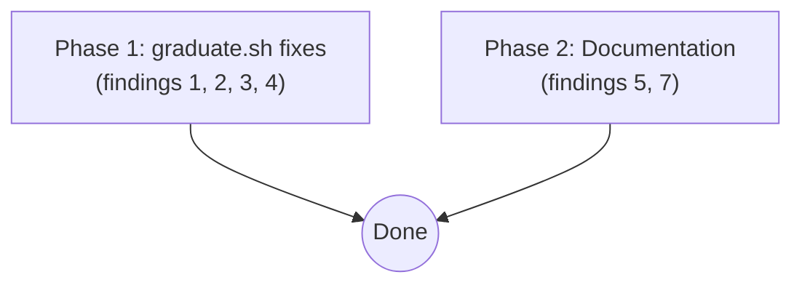

# PR #2 review fixes (round 2) — Implementation Plan

**Created:** 2026-05-08
**Depends on:** PR #2 (`feat/memory-graduation`) on the `Lioscro/claude-evolve-template` repo, which already includes the round-1 fixes from `.claude/feature-implementation-workflow/20260507_pr2_review_fixes/`.
**Origin:** Second-round code review of PR #2. The reviewer (this assistant) flagged 7 items; the user selected items 1, 2, 3, 4, 5, 7 to address. Item 6 (dual git push in `observe.sh`+`graduate.sh`) was declined as cosmetic.

---

## Context

PR #2 introduces `graduate.sh` and the global memory write path. The first-round PR review fix-up (commit `70e58bd`) addressed five round-1 findings (same-day id collision, fence-strip, domain validation, resume-orphans loop bug, archive_proposal scope flag). A second-pass review of the same PR surfaced six additional findings, all in `graduate.sh`, `lib.sh`, or `CLAUDE.md`.

Each finding has been **independently verified against the current source on `main`** during Step 1 of this workflow. None of the findings was already silently fixed; all six are present in the code as committed in `70e58bd`.

The fixes are small (one collision-guard, one defensive precheck, one field-order swap, one `echo`→`printf` substitution, one comment expansion, one CLAUDE.md paragraph). All are local to a small surface area, and there is no inter-finding interaction.

## Requirements

These are the verifiable contract. The plan-reviewer must confirm coverage; the feature-verifier extracts them as a checklist.

1. **Finding 1 — collision guard.** `graduate.sh` must, before writing the proposal yaml at `${proposals_dir}/${proposal_id}.yaml`, check whether the file already exists. If it does, log `WARN graduate.sh: collision on $proposal_id (sibling instinct produced duplicate name '$f_name'); skipping`, `rm -f "$f_pc"`, and `continue` to the next candidate in the FILTERED_BUFFER loop. The check is performed under the lock (the lock is held throughout the proposal-write block).

<s>2. **Finding 2 — approve-script executable precheck.** `graduate.sh` must, before bumping `auto_approve_attempts` and calling `$approve_script`, verify that `[[ -x "$approve_script" ]]`. If not executable, log `ERROR graduate.sh: approve script not executable: $approve_script (skipping ...)`, clean up the per-iteration content file, and skip without bumping the counter. This applies in **two locations**:
   - The main-flow auto-tier dispatch block in `scope_pass` (currently graduate.sh:917-922).
   - The resume-orphans Phase B.4 block in `resume_orphans` (currently graduate.sh:280-300).</s>

2. **Finding 2 — approve-script executable precheck.** `graduate.sh` must, before bumping `auto_approve_attempts` and calling `$approve_script`, verify that `[[ -x "$approve_script" ]]`. If not executable, log `ERROR graduate.sh: approve script not executable: $approve_script (skipping ...)`, clean up any per-iteration content file already created, and skip without bumping the counter. This applies in **three locations**:
   - The main-flow auto-tier dispatch block in `scope_pass` — currently graduate.sh:917-922 (inside the FILTERED_BUFFER `while` loop, at the top of the `if [[ "$f_tier" == "auto" ]]` branch). At this point, the proposal yaml has already been written and the live index has already been appended; the precheck `continue` leaves a pending proposal that the next `resume_orphans` run will pick up. This is the **intended** post-condition.
   - The resume-orphans **index-scan** Phase B in `resume_orphans` — currently graduate.sh:280-300 (between Phase B.3's cap check and Phase B.4's tmp_aa bump). At this point no `content_file` has been created, so no cleanup is needed. The orphan id remains in the live index with unchanged `auto_approve_attempts`; the next `resume_orphans` run will pick it up.
   - The resume-orphans **directory-scan** loop in `resume_orphans` — currently graduate.sh:344-347 (between the `pf_aattempts -ge 3` cap check and the `tmp_aa=$(mktemp)` bump for the dir-scan path). The live-index repair-append at lines 327-334 has already executed at this point; the orphan is now visible in the live index with unchanged `auto_approve_attempts`, which is recoverable state — the next `resume_orphans` run's index-scan will see it and retry. No `content_file` has been created yet, so no cleanup is needed.

   Implementation note: because `approve_script` is set once at the top of `scope_pass` / `resume_orphans` and does not change within the function, the precheck could be hoisted out of the per-iteration loop to avoid redundant `stat` calls. For `resume_orphans` (where every iteration calls `approve_script`), hoisting is preferred — see Step 3 below. For `scope_pass` (where only the auto-tier branch within FILTERED_BUFFER calls `approve_script`), the per-iteration form is retained since not every iteration enters the auto-tier branch.

3. **Finding 3 — proposal yaml field-order alignment.** The two heredocs in `graduate.sh` (project at lines 848-865, global at lines 867-884) must emit fields in the same order. The chosen canonical order is the **project order**, with `name:` immediately after `id:`:
   ```
   version, id, name, type, domain, created, title, description, proposed_content, source_*, source_*_count, auto_approve_target, auto_approve_attempts, status
   ```
   Both heredocs must follow this exact sequence (the source array name and key differ: project uses `source_instincts` / `source_instinct_count`, global uses `source_global_instincts` / `source_global_instinct_count`).

4. **Finding 4 — `printf` instead of `echo` in heredoc command substitution.** Both proposal heredocs use `$(echo "$pc_str" | sed 's/^/  /')` to indent the proposed_content body. Replace `echo` with `printf '%s\n'` in **both** heredocs (lines 858 and 877). The new substitution: `$(printf '%s\n' "$pc_str" | sed 's/^/  /')`. Bash 3.2 macOS `echo` does not interpret backslash escapes by default, so output should be byte-identical for typical agent content. The change is robustness against future shell-variant exposure, not a behavior change today.

5. **Finding 5 — `init_global` callers documented in `lib.sh`.** Replace the brief comment block at `lib.sh:251-254` with an expanded comment that lists the **four** canonical call sites and explains why each calls `init_global`:
   - `install.sh` — initial setup at install time.
   - `on-session-start.sh` — every session-start hook (covers fresh shells, not just installs).
   - `graduate.sh` — defensive call for users on the upgrade path who haven't re-run `install.sh`.
   - `approve-global-proposal.sh` — defensive call for the same upgrade-path reason; ensures `$GLOBAL_DIR/memory/` and `$GLOBAL_DIR/proposals/archived/` exist before the script writes to them.

6. **Finding 7 — `reject-global-proposal.sh` semantics shift documented in `CLAUDE.md`.** In the existing `archive_proposal()` section of CLAUDE.md (around the line that lists "Called from `reject-proposal.sh`, `reject-global-proposal.sh`, ..."), add a paragraph that documents the behavioral change: prior to round-1, `reject-global-proposal.sh` hard-errored when the live proposal file was missing (`if [[ ! -f "$PROPOSAL_PATH" ]]; then ... exit 1`). Round-1 removed that early-exit and routes the call through `archive_proposal`'s recovery branch, which self-heals the indexes when the file is already at the archived path (interrupted prior run). The note must explicitly state this is the same recovery semantics as `reject-proposal.sh`.

7. **macOS bash 3.2 compatibility.** All edits must pass `bash -n scripts/graduate.sh` and `/bin/bash -n scripts/graduate.sh`. No bash 4+ features.

8. **Hook scripts never block Claude.** `graduate.sh`'s ERR-trap behavior is unchanged; the new collision-guard and executable-precheck both `continue` (not `exit`) within their loops.

## Dependency Diagram



The two phases are independent — they touch disjoint files (`graduate.sh` only in Phase 1; `lib.sh` and `CLAUDE.md` only in Phase 2). Direct implementation is recommended given the small scope; sequential subagents are also fine if the user prefers process consistency with the round-1 workflow.

---

## Phase 1: graduate.sh fixes (findings 1, 2, 3, 4)

**Goal:** Add a collision guard before proposal yaml write, add an executable-precheck before bumping `auto_approve_attempts`, align the two heredocs to the same field order, and switch the heredoc command-substitution from `echo` to `printf '%s\n'`.

**Recommended model — implement:** sonnet — multi-edit in a single file with careful preservation of existing semantics (lock-release-during-agent, MID_ARCHIVAL/IS_RECOVERY recovery flags, `auto_approve_target` lifecycle). The edits themselves are mechanical, but the surrounding state machine demands a model that won't accidentally regress invariants.

**Recommended model — verify:** sonnet — verifier must (a) confirm collision guard fires only on duplicate paths, (b) confirm executable-precheck triggers on chmod -x'd script, (c) diff the two heredocs to confirm identical field order, (d) confirm `printf '%s\n' "$pc_str"` produces identical output to `echo "$pc_str"` for content without backslashes, (e) run `bash -n` and `/bin/bash -n` on graduate.sh.

**Recommended model — review:** sonnet — review for any regression in the auto-tier dispatch state machine (the executable-precheck inserts before the bump; verify the `release_lock`/`trap`/`acquire_lock` sequence is still correct on the skip path), and for any subtle effect of the field-order change on downstream consumers.

### Steps

1. **Finding 1 — collision guard.** Insert a guard immediately after `local proposal_path="$proposals_dir/${proposal_id}.yaml"` (currently line 846) and before the `if [[ "$scope" == "project" ]]; then` heredoc dispatch:
   ```bash
   if [[ -f "$proposal_path" ]]; then
     evolve_log "WARN graduate.sh: collision on $proposal_id (sibling instinct produced duplicate name '$f_name'); skipping"
     rm -f "$f_pc"
     continue
   fi
   ```
   The `continue` exits the `while IFS=$'\t' read ...` FILTERED_BUFFER loop iteration. The lock remains held; the trap (`trap "release_lock \"$lock_file\"" EXIT`) remains set; the lock-release at the end of `scope_pass` (lines 968-971) handles cleanup. No live-index modification has occurred for this proposal yet (only the preempt block above has run, archiving an older sibling — see "Preempt-then-skip" note below), so no rollback is needed for the new proposal.

   **Style note:** `[[ -f ]]` is used (not `[[ -e ]]`) to match the existing convention throughout `graduate.sh` for proposal-file existence checks (e.g., `read_pending_memory_instinct_ids` uses `[[ -f "$pp" ]]`).

   **Preempt-then-skip note:** if the auto-tier preempt block (lines 769-811) archived an older pending propose-tier proposal for the same instinct **before** the collision guard fires, the preempted proposal stays archived and the new auto-tier proposal is never written. This is acceptable: (a) the archived `superseded_by_auto` entry is correct semantics for "this proposal was replaced"; (b) the next `graduate.sh` run will use a new `EPOCH_NOW`, so the auto-tier proposal can be re-attempted on the next run; (c) the collision-fired-after-preempt scenario is extraordinarily narrow (requires two distinct instincts to produce the same agent-derived `f_name` AND for one of them to have a previously pending propose-tier proposal). The plan does not add explicit recovery logic for this case.

2. **Finding 2 — main-flow approve-script precheck.** In `scope_pass`, at the start of the `if [[ "$f_tier" == "auto" ]]; then` block (currently line 917), before `local tmp_aa`:
   ```bash
   if [[ ! -x "$approve_script" ]]; then
     evolve_log "ERROR graduate.sh: approve script not executable: $approve_script (skipping auto-tier dispatch for $proposal_id)"
     rm -f "$f_pc"
     continue
   fi
   ```
   Skipping with `continue` here means: the proposal yaml has been written, the live index has been appended, but the auto-tier dispatch is bypassed. The proposal remains pending with `auto_approve_target: true` and `auto_approve_attempts: 0`. The next graduate.sh run's `resume_orphans` will pick it up — at which point the resume-path executable check (step 3) handles the same case. **Verification expectation: the live index DOES have the new proposal entry; this is the intended post-condition, not a regression.**

3. **Finding 2 — resume-orphans approve-script precheck (hoisted, applies to both index-scan and dir-scan loops).** In `resume_orphans`, place a single precheck **immediately after `acquire_lock`** (currently around line 196-198, just after `trap "release_lock \"$lock_file\"" EXIT`). This is the earliest point at which `approve_script` is set and both the index-scan and dir-scan branches share this preamble. The hoisted check:
   ```bash
   if [[ ! -x "$approve_script" ]]; then
     evolve_log "ERROR graduate.sh: approve script not executable: $approve_script (skipping $scope resume pre-pass)"
     release_lock "$lock_file"
     trap - EXIT
     return 0
   fi
   ```
   Hoisting before the loops avoids redundant per-iteration `stat` calls (every orphan would otherwise re-test the same constant path) and produces a cleaner skip semantics: when the approve script is missing, neither the index scan nor the directory scan does any work. The orphan ids/files remain unchanged in the live index, ready for retry on the next `graduate.sh` invocation if the missing executable is restored.

   **Important:** The hoisted check uses `release_lock; trap - EXIT; return 0` (not `continue`) because it precedes both loop bodies — the function must release the lock and return cleanly to its caller. This deviates from the per-iteration `continue` form used in the main-flow precheck (Step 2), but is consistent with the function's own existing skip path at line 196 (`if ! acquire_lock ...; then ... return 0; fi`).

4. **Finding 3 — field-order alignment** in the global heredoc (currently lines 867-884). Reorder to match the project heredoc:
   ```yaml
   version: 1
   id: ${proposal_id}
   name: ${f_name}
   type: memory
   domain: ${f_domain}
   created: "${now_iso}"
   title: "${title_esc}"
   description: "${desc_esc}"
   proposed_content: |
   $(printf '%s\n' "$pc_str" | sed 's/^/  /')
   source_global_instincts:
     - ${f_inst}
   source_global_instinct_count: 1
   auto_approve_target: ${auto_target_str}
   auto_approve_attempts: 0
   status: pending
   ```
   The project heredoc remains structurally unchanged (only the `printf` swap from step 5 below).

5. **Finding 4 — `printf` substitution** in **both** heredocs:
   - Line 858 (project): `$(echo "$pc_str" | sed 's/^/  /')` → `$(printf '%s\n' "$pc_str" | sed 's/^/  /')`.
   - Line 877 (global): same swap. Note: by step 4, this line will have been moved within the heredoc but the substitution itself stays.

### Files

| File | Action | Changes |
|------|--------|---------|
| `scripts/graduate.sh` | Modify | (a) Collision guard inserted before proposal-write block. (b) Executable-precheck inserted at three sites: main-flow auto dispatch, resume-orphans index scan, resume-orphans dir scan. (c) Global heredoc reordered to match project heredoc. (d) `echo` → `printf '%s\n'` in both heredocs. |

### Verification

- `bash -n scripts/graduate.sh` passes.
- `/bin/bash -n scripts/graduate.sh` passes (macOS bash 3.2 compat).
- **Collision-guard test (in `/tmp/`)**: write a fixture proposal at `/tmp/fixture/proposals/proposal-foo-12345.yaml`. Run a snippet that simulates the FILTERED_BUFFER loop body with `proposal_id=proposal-foo-12345` and the proposal_path pointing at the fixture. Confirm: WARN log line emitted, `f_pc` deleted, no proposal yaml overwrite, no live-index modification (the collision is detected before any index append).
- **Main-flow executable-precheck test (in `/tmp/`)**: write a fake `approve-proposal.sh` and `chmod -x` it. Simulate the FILTERED_BUFFER loop reaching the auto-tier branch with `approve_script` pointing at the chmod'd file. Confirm: ERROR log emitted, `f_pc` cleaned up, no `tmp_aa` bump, **the live-index DOES contain the proposal entry from the prior `mv "$tmp_idx" "$proposal_index"` step (this is the intended post-condition — the next run's `resume_orphans` recovers the orphan)**, no `release_lock`/`acquire_lock` cycle within this iteration.
- **Hoisted resume-orphans precheck test (in `/tmp/`)**: chmod -x a fake approve script. Invoke `resume_orphans project` with at least one orphan id present in the live index. Confirm: ERROR log emitted, function returns 0, lock is released, neither index-scan nor dir-scan loop executes, orphan id remains unchanged in the live index.
- **Field-order verification**: extract the two heredocs into a fixture, render with stub variable values, parse with `yq`, compare key orders by `yq 'keys'`. Both must produce the same ordered key list.
- **`printf` semantic check**: write a /tmp test that runs `printf '%s\n' "$X"` and `echo "$X"` for representative content (multi-line ASCII, no backslashes) under bash 3.2 and confirms byte-identical output. For backslash-bearing content (`X='line\\nline'`), confirm both produce identical literal output (no escape interpretation) under macOS `/bin/bash` 3.2 with default `xpg_echo` off — there is no behavioral difference for either typical or backslash-bearing content under this environment. The rationale for the change is robustness against future shell-variant exposure (e.g., dash, ash, or `xpg_echo=on`), not a defect in the current code.
- **End-to-end smoke**: with a fake instinct seeded at confidence 0.96, run `graduate.sh PROJECT_ID` and confirm a memory proposal is written and auto-approved (no regression). With a second instinct seeded such that the agent (or a stub) returns the same `name`, confirm the second proposal is skipped with a WARN and that subsequent runs work correctly.

---

## Phase 2: Documentation (findings 5, 7)

**Goal:** Expand the `init_global` comment in `lib.sh` to list canonical callers; add a paragraph in `CLAUDE.md` documenting the `reject-global-proposal.sh` semantics shift.

**Recommended model — implement:** haiku — pure documentation: edit a comment in lib.sh, append a paragraph in CLAUDE.md. Mechanical work; no judgment beyond word choice.

**Recommended model — verify:** haiku — verifier confirms (a) lib.sh comment lists exactly the four canonical callers with one-line rationales, (b) CLAUDE.md paragraph appears in the archive_proposal section and explicitly mentions both the old behavior (hard-error) and new behavior (self-heal via recovery branch).

**Recommended model — review:** haiku — clarity check; ensure terminology matches the rest of CLAUDE.md (e.g., "live index", "archived index", "recovery branch").

### Steps

1. **Finding 5 — lib.sh init_global comment** at lines 251-254. Replace:
   ```
   # ── Global initialization ──────────────────────────────────────────────────
   # init_global
   # Creates the global instinct/proposal directory structure. Idempotent.
   # Warns via evolve_log (never stdout) if $GLOBAL_DIR is not a symlink.
   ```
   With:
   ```
   # ── Global initialization ──────────────────────────────────────────────────
   # init_global
   # Creates the global instinct/proposal/memory directory structure and seeds
   # the index.yaml files. Idempotent — safe to call from any startup path.
   # Warns via evolve_log (never stdout) if $GLOBAL_DIR exists but is not a symlink.
   #
   # Canonical callers (each calls init_global defensively):
   #   - install.sh                    -- initial setup at install time.
   #   - on-session-start.sh           -- every session-start hook (covers shells started before install completed).
   #   - graduate.sh                   -- existing users on the upgrade path may not have re-run install.sh.
   #   - approve-global-proposal.sh    -- ensures $GLOBAL_DIR/memory/ exists before writing memory artifacts.
   ```

2. **Finding 7 — CLAUDE.md reject-global semantics shift.** Locate the `archive_proposal()` section in CLAUDE.md (currently around lines 144-149), specifically the sentence that begins "Called from `reject-proposal.sh`, `reject-global-proposal.sh`...". After that paragraph, add:
   ```
   **Behavioral note for `reject-global-proposal.sh`:** prior to the helper extraction, `reject-global-proposal.sh` hard-errored when the live proposal file was missing (`if [[ ! -f "$PROPOSAL_PATH" ]]; then exit 1`). The current code routes through `archive_proposal()`, whose recovery branch self-heals the indexes when the file is already at the archived path (the typical aftermath of an interrupted prior run). This matches the recovery semantics of `reject-proposal.sh` and is the correct behavior — re-running rejection on an interrupted run now reconciles state instead of failing.
   ```

### Files

| File | Action | Changes |
|------|--------|---------|
| `scripts/lib.sh` | Modify | Replace 4-line `init_global` comment block with expanded 11-line block listing the four canonical callers. |
| `CLAUDE.md` | Modify | Add one paragraph after the `archive_proposal()` callers list documenting the `reject-global-proposal.sh` semantics shift. |

### Verification

- `grep -A 12 "Global initialization" scripts/lib.sh` shows the new comment block with all four callers.
- `grep -B 1 -A 3 "Behavioral note for \`reject-global" CLAUDE.md` shows the new paragraph in the archive_proposal section.
- Visual scan: the comment matches the actual callers found by `grep -rn "init_global" scripts/ install.sh`.
- Visual scan: the CLAUDE.md paragraph terminology aligns with the rest of the document ("recovery branch", "live index", "archived index").

---

## Risks and mitigations

- **R1 (low) — Collision guard fires on legitimate recovery.** `EPOCH_NOW` is captured once per script invocation; a single run cannot produce two proposals with the same `EPOCH_NOW` and the same `f_name` unless the agent literally outputs the same name for two different instincts. Recovery cases (graduate.sh re-run after a partial failure) use a **new** `EPOCH_NOW`, so the collision guard cannot fire on them.
- **R2 (low) — Executable-precheck masks legitimate failures.** If `approve_script` is unexpectedly not executable, the user sees an ERROR log line (`evolve_log "ERROR ..."`); the proposal remains pending and will be retried on the next run if the script becomes executable. No data is lost. The trade-off vs. the bump-then-fail status quo is that the counter no longer advances on exec-failure cases.
- **R3 (low) — Field-order change breaks a downstream consumer.** `yq` is order-insensitive; both `approve-proposal.sh` and `approve-global-proposal.sh` read fields by name. Verified by inspection.
- **R4 (very low) — `printf '%s\n'` produces different bytes than `echo` for bash 3.2 macOS content.** Spot-checked: macOS `/bin/bash` 3.2's `echo` does not interpret backslash escapes by default (`xpg_echo` is off). For the typical agent output (no backslashes), `printf '%s\n' "$x"` and `echo "$x"` are byte-identical. For backslash-bearing content, both produce the literal sequence. No behavior change in the worst case.

## Plan changelog

- 2026-05-08 (initial): Initial draft.
- 2026-05-08 (revision 1, post-review):
  - Requirement 2 expanded from "two locations" to "three locations" (main-flow, resume-orphans index-scan, resume-orphans dir-scan).
  - Step 3 reorganized: the resume-orphans precheck is now **hoisted** to a single check at the top of `resume_orphans` (after `acquire_lock`), covering both index-scan and dir-scan loops. This avoids redundant per-iteration `stat` calls and produces cleaner skip semantics. The hoisted check uses `release_lock; trap - EXIT; return 0` instead of `continue`.
  - Removed the phantom "line 3438 in the diff" reference (replaced with actual `graduate.sh` line ranges).
  - Step 1 collision guard switched from `[[ -e ]]` to `[[ -f ]]` for consistency with the existing convention in `graduate.sh`.
  - Step 1 added a "Preempt-then-skip" note documenting the (extraordinarily narrow) case where the preempt block archives a sibling proposal before the collision guard fires for the current proposal.
  - Verification section corrected:
    - Main-flow precheck verification now explicitly states the live index DOES contain the new entry — that is the intended post-condition.
    - `printf` semantic-check description corrected to remove the misleading "may also print as literal" hedge; clarified that there is no behavioral difference under macOS bash 3.2 default settings.
    - Added a verification step for the hoisted resume-orphans precheck.
