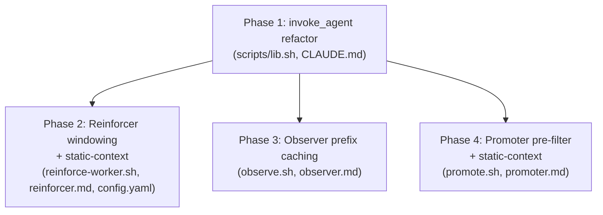

# Agent Cost Optimizations — Implementation Plan

**Created:** 2026-05-12
**Depends on:** None

---

## Context

The claude-evolve system invokes five LLM agents on a regular cadence via `invoke_agent` in `scripts/lib.sh`. Research (see "Research Findings" below) characterized the cost surface and identified three concrete optimizations:

1. **Reinforcer** fires on every Stop hook (per turn). Its input is **83–91% session-JSONL** (the dynamic suffix), which grows unbounded across a session. At a 20-turn session with ~1000 observation lines, this single agent burns ~6.6M input tokens.
2. **Observer** sends the full `## Existing Instincts` YAML blob (~22K tokens at 100-instinct scale) once per batch; multi-batch sessions retransmit the same prefix 4–5×.
3. **Promoter** sends **all instincts from all projects regardless of confidence**, scaling unboundedly with mature-project count.

Anthropic prompt caching is auto-applied by `claude -p`, but only the **system prompt** gets a guaranteed cache breakpoint. The static `## Existing Instincts` prefix today lives in stdin (user message) where breakpoint placement is uncontrolled — so the caching savings are unreliable. Fixing this requires a small refactor to `invoke_agent` so static prefixes ride the `--system-prompt-file` path.

User decisions (Step 2 resolve-ambiguities gate):
- **Drop observer→Haiku** — research showed false-create / missed-create asymmetry is silently damaging.
- **Window reinforcer at last N lines**, default 50, config key `reinforcement.recent_observations_window`.
- **Promoter pre-filter at `instincts.injection_threshold` (0.5)** — instincts below this aren't injected anyway.
- **Refactor `invoke_agent`** to accept an optional static-context arg; update all callers that benefit.

## Requirements

1. `invoke_agent` accepts an optional second argument `<static_context_file>`. When present, its contents are appended to the agent body in the temporary system-prompt file (under a clear `# Runtime Context` separator), so the static prefix benefits from the SDK's automatic system-prompt cache breakpoint.
2. `invoke_agent`'s existing single-argument call shape continues to work unchanged — all existing callers that do not opt into the new arg behave identically.
3. **Reinforcer** windows the session JSONL it sends to the agent to the last N lines (default 50), configurable via `reinforcement.recent_observations_window` in `config.yaml`. The window applies to the per-session observation file; instinct sections are unaffected.
4. **Reinforcer** restructures its agent call so the static `## Existing Instincts` and `## Global Instincts` blocks are passed as static-context (system prompt). Stdin contains only `## Recent Observations` (the windowed JSONL).
5. **Observer** restructures its agent call so the static `## Existing Instincts` block is passed as static-context. Stdin contains only `## New Observations` (the current batch).
6. **Promoter** filters project instincts by `confidence >= instincts.injection_threshold` (default 0.5) before assembling agent input. Filtered-out instincts do not appear in the agent payload.
7. **Promoter** restructures its agent call so all three static sections (`## Project Instincts`, `## Existing Global Instincts`, `## Archived Global Proposals`) are passed as static-context. Stdin contains a minimal user-message trigger (since the API requires a non-empty user message).
8. Agent prompt files (`agents/reinforcer.md`, `agents/observer.md`, `agents/promoter.md`) are updated to reflect that previously-stdin sections now arrive under `# Runtime Context` in the system prompt. Output contracts and format guidance are unchanged.
9. All modified bash scripts pass `bash -n` and `/bin/bash -n` (macOS bash 3.2 compat).
10. The default `reinforcement.recent_observations_window: 50` and the existing `instincts.injection_threshold: 0.5` are surfaced in `config.yaml`; CLAUDE.md is updated to document both the new config key and the `invoke_agent` static-context pattern.

## Dependency Diagram



Phases 2/3/4 are independent of each other (different scripts, different agents) — they can run in parallel after Phase 1 lands.

---

## Phase 1: `invoke_agent` static-context refactor

**Goal:** `invoke_agent` accepts an optional `static_context_file` argument; when present, its contents are appended to the system prompt (under a `# Runtime Context` separator) so the static prefix gets the SDK's automatic cache breakpoint. Single-argument calls behave exactly as before.

**Recommended model — implement:** sonnet — Small, well-scoped bash refactor touching one function and its callers' contract; not mechanical (need to design the separator format and ensure backward compatibility), but not architecturally complex.
**Recommended model — verify:** sonnet — Verification needs to confirm both new behavior AND no regression for unchanged callers (cluster.sh, graduate.sh). Edge-case detection (empty static_context file, missing file) matters; verifier benefits from sonnet-level judgment.
**Recommended model — review:** sonnet — Standard bash review surface: signature change, frontmatter preservation, temp-file handling, trap-RETURN cleanup.

### Steps

1. **Modify `invoke_agent` in `scripts/lib.sh:329-362`:**
   - Accept optional `$2` (`static_context_file` path).
   - After the existing frontmatter-strip block writes the agent body to `$tmp_system`, if `$2` is non-empty **and the file exists and is non-empty** (`[[ -n "${2:-}" && -s "$2" ]]`), append a separator and the file contents:
     ```
     {agent body — already written}

     <!-- evolve:runtime-context-begin -->
     # Runtime Context
     {contents of static_context_file}
     ```
     ~~Use `---` as the separator~~ → Use the HTML-comment sentinel `<!-- evolve:runtime-context-begin -->` (changelog C1.A): avoids collision with markdown `---` horizontal rules that future agent bodies may contain, and is invisible to the LLM.
   - The existing `trap 'rm -f "$tmp_system"' RETURN` already cleans up the combined system prompt; no new traps needed.
   - The caller owns the `static_context_file` lifecycle (mktemp + rm). `invoke_agent` does NOT delete the static-context file.
   - Update the function header comment to document the new signature and the cache-breakpoint rationale.
   - Note: `graduate.sh:677` calls `invoke_agent` with stdin via `< "$cyaml"` (file redirection rather than pipe). Phase 1 does NOT add a second arg there — graduate.sh's per-instinct calls have no static prefix to cache. Document this asymmetry in CLAUDE.md to prevent future maintainers from naively adding a static-context arg to graduate.sh.

2. **Update CLAUDE.md** under the `### Agent Definitions` (or a new `#### invoke_agent` subsection) to document:
   - New signature: `invoke_agent <agent_file> [static_context_file]`.
   - That static_context is appended to the system prompt for prompt-caching purposes.
   - That callers own the `static_context_file` lifecycle.
   - Example: how reinforce-worker.sh now uses it (forward reference is fine; implementer of phase 2 will land the real call site).

3. **No caller changes in Phase 1.** All five existing call sites (observe.sh, reinforce-worker.sh, promote.sh, cluster.sh, graduate.sh) continue to invoke with a single arg.

### Files

| File | Action | Changes |
|------|--------|---------|
| `scripts/lib.sh` | Modify | Update `invoke_agent` to accept optional `$2`; append static_context to `$tmp_system` under `# Runtime Context` separator. |
| `CLAUDE.md` | Modify | Document new signature, static-context pattern, caller-ownership convention. |

### Verification

- `bash -n scripts/lib.sh` and `/bin/bash -n scripts/lib.sh` pass.
- /tmp test script: dummy agent file + dummy static_context_file → invoke `invoke_agent` with both args, **with `claude` stubbed as a bash function that copies its `--system-prompt-file` argument to `/tmp/captured_system_prompt.txt` before returning a fixed stdout** (the existing `RETURN` trap deletes `$tmp_system` before the test can inspect it — this stub captures a snapshot). Assert `/tmp/captured_system_prompt.txt` contains the agent body, the sentinel `<!-- evolve:runtime-context-begin -->`, and the static-context contents in that order.
  ```bash
  # In the /tmp test script, after `source lib.sh`:
  claude() {
    # Find --system-prompt-file <path> in args
    while [[ $# -gt 0 ]]; do
      if [[ "$1" == "--system-prompt-file" ]]; then
        cp "$2" /tmp/captured_system_prompt.txt
        break
      fi
      shift
    done
    echo "stubbed"
  }
  export -f claude
  ```
- /tmp test script: invoke `invoke_agent` with only one arg → assert `/tmp/captured_system_prompt.txt` contains exactly the agent body (no sentinel, no Runtime Context section).
- /tmp test script: invoke `invoke_agent` with `$2` set to an empty string, with `$2` set to a non-existent path, **and with `$2` set to an existing empty file** — all three should fall back to no-static-context behavior (graceful, no error, no sentinel appended). The empty-file case is the reason for the `-s` check.
- Sanity: invoke an existing agent (e.g., observer) with one arg in dry-run mode — assert no behavior change.

---

## Phase 2: Reinforcer windowing + static-context

**Goal:** Reinforcer sends only the last N (default 50) observation lines to the agent, and moves the static instinct blocks into the system prompt for cache-friendly invocation.

**Recommended model — implement:** sonnet — Multi-file edit with clear specs (config key, tail logic, restructured agent input). Edge cases: empty observation file, fewer than N lines, malformed JSONL. Standard coding work, not architectural.
**Recommended model — verify:** sonnet — Verifier needs to confirm the window is actually applied (no off-by-one), the static section is in the system prompt and not stdin, and the agent's existing output contract still parses correctly downstream. Multi-surface check.
**Recommended model — review:** sonnet — Standard bash review; pay attention to config validation, default fallback, and the temp-file lifecycle for the static-context file (new in this script).

### Steps

1. **`config.yaml`:** Add `reinforcement.recent_observations_window: 50` near the top under a new `reinforcement:` section. Document inline.

2. **`scripts/reinforce-worker.sh`:**
   - Read `reinforcement.recent_observations_window` via `read_config` with default 50; validate via `validate_numeric` (`$_NUMERIC_NONNEG_INT`). ~~Place this read alongside the other config reads (around line 97-105).~~ → **Place this read BEFORE the `OBSERVATIONS=` line (currently line 35), because `tail` uses `$OBS_WINDOW` at that point. The existing config-reads block at lines 97-105 stays unchanged — those reads happen after the agent call (line 92).** (changelog C2.A)
   - **Guard against `OBS_WINDOW=0`:** `validate_numeric` with `$_NUMERIC_NONNEG_INT` accepts `0`, which would cause `tail -n 0` to silently produce empty output. Add explicit guard:
     ```bash
     if [[ "$OBS_WINDOW" -eq 0 ]]; then
       evolve_log "WARN reinforce-worker.sh: recent_observations_window=0 invalid, using default 50"
       OBS_WINDOW=50
     fi
     ```
   - Replace `OBSERVATIONS=$(cat "$OBS_FILE")` (line 35) with `OBSERVATIONS=$(tail -n "$OBS_WINDOW" "$OBS_FILE")`.
   - Log the line count actually sent. Compute `$line_count` as:
     ```bash
     line_count=$(printf '%s\n' "$OBSERVATIONS" | grep -c . || echo "0")
     evolve_log "reinforce-worker.sh: sending last $line_count observation lines (window=$OBS_WINDOW)"
     ```
     (Using `grep -c .` counts non-empty lines and is more reliable than `wc -l` on a trailing-newline-sensitive payload.)
   - **Restructure agent input:**
     - Build a static-context tempfile containing `## Existing Instincts\n${INSTINCT_YAML}\n\n## Global Instincts\n${GLOBAL_INSTINCT_YAML}`. Use `printf '%s\n'` (not `echo`) for portability.
     - Stdin (`$AGENT_INPUT`) becomes only `## Recent Observations\n${OBSERVATIONS}`.
     - Invoke as `invoke_agent "$EVOLVE_DIR/agents/reinforcer.md" "$static_ctx_file"`.
     - **`rm -f "$static_ctx_file"` MUST be in BOTH the success path AND the failure-branch:** the existing pattern at line 92 is `AGENT_OUTPUT=$(... | invoke_agent ...) || { evolve_log "..."; exit 0; }`. The `exit 0` in the failure branch means a single `rm -f` placed only after the success branch leaks the tempfile on agent failure. Concrete pattern:
       ```bash
       AGENT_OUTPUT=$(echo "$AGENT_INPUT" | invoke_agent "$EVOLVE_DIR/agents/reinforcer.md" "$static_ctx_file" 2>/dev/null) || {
         rm -f "$static_ctx_file"
         evolve_log "reinforce-worker.sh: agent invocation failed"
         exit 0
       }
       rm -f "$static_ctx_file"
       ```

3. **`agents/reinforcer.md`:** Update the "Input format" section to note that `## Existing Instincts` and `## Global Instincts` arrive in the system prompt under `# Runtime Context`, while `## Recent Observations` arrives on stdin. No change to output contract.

4. **bash 3.2 compat check:** `bash -n` and `/bin/bash -n` on `reinforce-worker.sh`.

### Files

| File | Action | Changes |
|------|--------|---------|
| `config.yaml` | Modify | Add `reinforcement.recent_observations_window: 50`. |
| `scripts/reinforce-worker.sh` | Modify | Tail-window the observation file; restructure agent input so instinct sections go to static-context. |
| `agents/reinforcer.md` | Modify | Update Input format section to note where each section arrives. |

### Verification

- `bash -n` and `/bin/bash -n` pass on `reinforce-worker.sh`.
- /tmp test script: fixture project with 100 instincts (mocked) and a 1000-line OBS_FILE; stub `invoke_agent` to capture both args and stdin → assert (a) stdin contains only the last 50 lines, (b) static-context file contains both instinct sections, (c) agent body in system prompt is unchanged.
- /tmp test script: fixture with 30-line OBS_FILE (< window) → assert all 30 lines are sent (no error from `tail`).
- /tmp test script: missing OBS_FILE → script exits 0 cleanly (existing behavior preserved).
- /tmp test script: config key absent → default 50 used.
- /tmp test script: config key set to "abc" (invalid) → `validate_numeric` defaults to 50; no crash.
- End-to-end: run a real Stop-hook simulation (set up a fixture session, run reinforce-worker.sh, observe logs) to confirm no regressions in instinct reinforcement.

---

## Phase 3: Observer prefix caching

**Goal:** Observer's batch loop sends the static `## Existing Instincts` block in the system prompt (cached across batches within one observe.sh run), with only `## New Observations` on stdin.

**Recommended model — implement:** sonnet — Batch-loop edit; need to build the static-context tempfile once outside the loop and pass to invoke_agent on each batch. Care needed: the cleanup must run on success and failure paths (existing ERR trap handles process exit; explicit rm at function/script end).
**Recommended model — verify:** sonnet — Verifier needs to confirm the static-context file is built once (not per batch), is removed at the end, and that all batches receive identical static-context. Also that the agent parser in `process_batch` still functions.
**Recommended model — review:** sonnet — Standard review. Watch for: static-context lifetime across the batch loop, trap interactions, observability via logs.

### Steps

1. **`scripts/observe.sh`:**
   - After the existing INSTINCT_YAML construction (lines 61-79) and before the batch loop (line 402), write `INSTINCT_YAML` (wrapped as `## Existing Instincts\n${INSTINCT_YAML}`) to a `STATIC_CTX` tempfile.
   - In `process_batch()` (line 134), change the `agent_input` construction to NO LONGER include the `## Existing Instincts` section; agent_input becomes only `## New Observations\n${batch_observations}`.
   - Change the `invoke_agent` call inside `process_batch` (line 151) to pass `"$STATIC_CTX"` as the second arg.
   - ~~Add `rm -f "$STATIC_CTX"` after the batch loop AND ensure the existing EXIT trap cleans it up on lock-release path (the existing `trap 'release_lock "$LOCK_FILE"' EXIT` should be extended to also `rm -f "$STATIC_CTX"`).~~ → **Use this exact sequence for cleanup (changelog C2.B):**
     - Bash 3.2 does not stack traps — setting a second `trap ... EXIT` REPLACES the first. So we must combine the two operations into one trap.
     - **Immediately after `STATIC_CTX=$(mktemp)` (after the instinct write), replace the existing trap with the combined version:**
       ```bash
       STATIC_CTX=$(mktemp)
       printf '## Existing Instincts\n%s\n' "$INSTINCT_YAML" > "$STATIC_CTX"
       # Replace the existing trap from line 25 — both lock release AND tempfile cleanup
       trap 'release_lock "$LOCK_FILE"; rm -f "$STATIC_CTX"' EXIT
       ```
     - This places the replacement immediately after `STATIC_CTX` is initialized, so `$STATIC_CTX` is always defined at trap-fire time. No `${STATIC_CTX:-}` guard needed.
     - **Why NOT modify the trap at line 25 with `${STATIC_CTX:-}`:** the lock is acquired AT line 21-24 and the trap at line 25 protects against any abnormal exit (including early ones like the `exit 0` at line 56 "no observation files to process"). If we move STATIC_CTX init before line 25, we'd have to acquire it before the lock — adding a tempfile to the failure path of `acquire_lock`. Keeping the line-25 trap as-is until STATIC_CTX is ready, then replacing it, is cleanest.
     - **Also add `rm -f "$STATIC_CTX"` explicitly at the natural cleanup point in the normal path** — just before line 499-500 where the script clears the EXIT trap via `trap - EXIT`. This ensures we don't rely solely on the EXIT trap firing.

2. **`agents/observer.md`:** Update the "Input format" section to note that `## Existing Instincts` arrives in the system prompt under `# Runtime Context`, while `## New Observations` arrives on stdin. No change to REINFORCE/CREATE/SKIP output contract.

3. **bash 3.2 compat check:** `bash -n` and `/bin/bash -n` on `observe.sh`.

### Files

| File | Action | Changes |
|------|--------|---------|
| `scripts/observe.sh` | Modify | Build STATIC_CTX tempfile once; restructure `process_batch` to put instincts in static-context and observations on stdin. |
| `agents/observer.md` | Modify | Update Input format to reflect new placement. |

### Verification

- `bash -n` and `/bin/bash -n` pass on `observe.sh`.
- /tmp test script: fixture with 5 instincts + a 500-line observation file (= 3 batches); stub `invoke_agent` to log args and stdin for each call → assert (a) all 3 calls received the same static-context file path, (b) the static-context content includes all 5 instincts, (c) each call's stdin contains only its batch, (d) the static-context file is removed after the loop.
- /tmp test script: fixture with no instincts → static-context file contains an empty `## Existing Instincts\n(none)` block (matches the existing fallback in process_batch line 142-144). Adjust the construction so empty INSTINCT_YAML still yields a valid static-context block.
- /tmp test script: simulate process_batch failure (stub invoke_agent to return non-zero) → confirm STATIC_CTX is still removed (the EXIT trap path).
- End-to-end: real observe.sh run (using `EVOLVE_AGENT_MODEL_OVERRIDE` if needed to keep cost down) with a tiny fixture; confirm CREATE/REINFORCE behavior unchanged.

---

## Phase 4: Promoter pre-filter + static-context

**Goal:** Promoter filters project instincts to `confidence >= instincts.injection_threshold` (0.5) before agent invocation, and moves the entirely-static input into the system prompt.

**Recommended model — implement:** sonnet — Multi-file edit with a filtering condition added inside the project-instinct-collection loop, plus the static-context refactor. The empty-stdin handling for promote.sh is new ground (we need a minimal user-message trigger).
**Recommended model — verify:** sonnet — Verifier needs to confirm: (a) the filter is applied per-project, (b) zero-instinct projects are still skipped, (c) the static-context contains exactly the filtered set, (d) the agent receives a valid non-empty user message. Multi-surface check.
**Recommended model — review:** sonnet — Standard review; pay attention to the filter applied at the right loop level (per-instinct, not per-project), threshold validation, and the user-message trigger string design.

### Steps

1. **`scripts/promote.sh`:**
   - Read `instincts.injection_threshold` via `read_config` with default 0.5; validate via `validate_numeric` (`$_NUMERIC_NONNEG_FLOAT`). Place alongside the other config reads (lines 51-66). Note: this is a NEW config read (promote.sh currently has no confidence filter at all).
   - In the per-project instinct-collection loop (lines 110-119), add a per-instinct confidence check.
     - **Efficient yq pattern:** read all confidences for a project in ONE yq call to avoid `O(N)` subprocess cost (changelog C3.B):
       ```bash
       conf_csv=$(yq '[.instincts[].confidence // 0] | join(",")' "$project_index" 2>/dev/null || echo "")
       IFS=',' read -ra inst_confs <<< "$conf_csv"
       ```
       Then `inst_confs[$i]` is the confidence for instinct `$i` without a subprocess per iteration. `read -ra` is bash 3.2-compatible.
     - Skip an instinct when `(( $(echo "${inst_confs[$i]} < $injection_threshold" | bc -l) ))`.
     - Log skipped count per project for observability.
   - **Project eligibility is naturally preserved** (changelog C3.C): `PROJECT_COUNT` is incremented at line 124 only when `project_yaml` is non-empty. The filter inside the inner loop controls whether anything is added to `project_yaml`. So a project with all instincts filtered out has empty `project_yaml` and does NOT increment `PROJECT_COUNT`. The existing `PROJECT_COUNT < 2` guard at line 128 fires correctly without any additional code. ~~Re-check the `PROJECT_COUNT < 2` guard at line 128~~ → kept for clarity; no new guard or counter needed.
   - **Restructure agent input:**
     - Build static-context tempfile containing `## Project Instincts\n${PROJECT_INSTINCTS_INPUT}\n\n## Existing Global Instincts\n${GLOBAL_INSTINCTS_YAML}\n\n## Archived Global Proposals\n${ARCHIVED_CONTEXT}`.
     - Stdin (`$AGENT_INPUT`) becomes a fixed minimal trigger: `"Identify cross-project promotion candidates from the runtime context."` (placed in a script variable for clarity).
     - Invoke as `ENABLE_PROMPT_CACHING_1H=1 invoke_agent "$EVOLVE_DIR/agents/promoter.md" "$static_ctx_file"`. **The env var enables Anthropic's 1-hour cache tier** (changelog C3.A); without it the 5-min default cache will always be cold (the promoter's frequency gate is ≥3600s). 1h cache writes cost more but reads are equally cheap — net positive for hourly invocations on a slowly-changing project-instinct payload.
     - **Add tempfile cleanup to the EXIT trap** (changelog C3.D): the existing EXIT trap at line 72 releases the global lock. Extend it after `$static_ctx_file=$(mktemp)`:
       ```bash
       static_ctx_file=$(mktemp)
       # Build static-context contents here...
       trap 'release_lock "$GLOBAL_LOCK"; rm -f "$static_ctx_file"' EXIT
       ```
     - The script's global lock is released/reacquired around the agent call (lines 210-232). The trap covers the case where any failure between init and `rm -f` would otherwise leak the tempfile. Explicit `rm -f "$static_ctx_file"` is still placed at the natural success point (after the agent returns and after the lock is re-acquired).

2. **`agents/promoter.md`:** Update "Input format" to note that all three sections arrive in the system prompt under `# Runtime Context`, while stdin contains only the trigger instruction. No change to YAML output format.

3. **bash 3.2 compat check:** `bash -n` and `/bin/bash -n` on `promote.sh`.

### Files

| File | Action | Changes |
|------|--------|---------|
| `scripts/promote.sh` | Modify | Confidence pre-filter per-instinct; static-context refactor; minimal trigger on stdin. |
| `agents/promoter.md` | Modify | Update Input format to reflect new placement. |

### Verification

- `bash -n` and `/bin/bash -n` pass on `promote.sh`.
- /tmp test script: fixture with 2 projects, each with 5 instincts at varying confidences (e.g., 0.3, 0.4, 0.5, 0.6, 0.9) → stub `invoke_agent` to log args/stdin → assert (a) only instincts with confidence ≥ 0.5 appear in static-context, (b) the lower-confidence instincts are excluded, (c) stdin contains only the trigger.
- /tmp test script: fixture where filtering reduces one project to zero instincts → that project is excluded from the agent input AND PROJECT_COUNT is recomputed against the post-filter count.
- /tmp test script: fixture where filtering reduces overall PROJECT_COUNT to 1 → promote.sh exits 0 with "only N project(s) with instincts" log message (existing guard fires).
- /tmp test script: `--force` mode runs even with the new filter (bypassing the hourly gate but still applying the filter).
- End-to-end: real promote.sh --force run with a small fixture; confirm proposals/promotions still created from above-threshold instincts.

---

## File Inventory

### New Files

| File | Purpose |
|------|---------|
| (none) | Optimizations are in-place edits; no new files. |

### Modified Files

| File | Key Changes |
|------|-------------|
| `scripts/lib.sh` | `invoke_agent` accepts optional `static_context_file`; appends to system prompt under `# Runtime Context`. |
| `scripts/reinforce-worker.sh` | Tail-windows session JSONL (default 50 lines, configurable); routes instinct sections to static-context. |
| `scripts/observe.sh` | Builds STATIC_CTX once outside batch loop; routes instinct section to static-context. |
| `scripts/promote.sh` | Pre-filters project instincts at `injection_threshold` (0.5); routes all static sections to static-context. |
| `agents/reinforcer.md` | Documents new static-context placement of instinct sections. |
| `agents/observer.md` | Documents new static-context placement of `## Existing Instincts`. |
| `agents/promoter.md` | Documents new static-context placement of all three context sections. |
| `config.yaml` | Adds `reinforcement.recent_observations_window: 50`. |
| `CLAUDE.md` | Documents new `invoke_agent` signature and static-context pattern. |

## End-to-End Verification

1. All modified scripts pass `bash -n` and `/bin/bash -n` (macOS 3.2 compat).
2. Run the four /tmp test scripts (one per phase) end-to-end; all PASS.
3. Spot-check a real session: invoke `reinforce.sh` against a fixture observation file with 200 lines and confirm only the last 50 are sent (via log grep + stubbed invoke_agent).
4. Spot-check a real observe.sh run: confirm static-context file is built once, all batches in a multi-batch run use it, and the file is removed at the end.
5. Spot-check a real promote.sh --force run: confirm filtered instincts are excluded from the agent payload.
6. Confirm Anthropic prompt-cache utilization improvement via `--output-format json` on one invoke_agent call (e.g., add a debug script that runs `invoke_agent` twice in a row and reads `cache_creation_input_tokens` / `cache_read_input_tokens` from the second response).
7. Verify no regression: `data/projects/*/instincts/index.yaml` integrity after a real reinforce/observe run.

## Risks and Mitigations

| Risk | Mitigation |
|------|------------|
| `claude -p` auto-cache breakpoint placement changes in a future CLI version, breaking the system-prompt-cache assumption. | Document the assumption in CLAUDE.md and reference the cost-tracking docs. Test scripts confirm placement at refactor time; future regressions surface as cost increases (visible via the standard log output and Anthropic billing). |
| ~~Windowing the reinforcer's session JSONL to last 50 lines causes the agent to miss multi-turn patterns. Default 50 is configurable per project. Users with longer attention requirements can raise it. The reinforcer's role is near-real-time match-against-existing-instincts; long-tail pattern detection is the observer's job (which sees the full JSONL via .processing snapshots).~~ → **Reinforcer windowing introduces a bounded behavioral regression: behaviors demonstrated only in the truncated prefix are missed for confidence bumping.** (changelog C4.A — Reviewer 2 caught this; the original mitigation was wrong since observer and reinforcer operate on different files: observer reads `.processing.*` snapshots, reinforcer reads the live `.jsonl`.) | The maximum loss is bounded: the reinforcer can bump each instinct at most once per session regardless of window size (source_sessions deduplication at reinforce-worker.sh:152-157). A missed reinforcement means the instinct's net session credit is `-decay_per_run` rather than `+reinforcement_increment - decay_per_run`. Impact on confidence over time is minor, not catastrophic. Users with long focused sessions can raise `reinforcement.recent_observations_window` in config. Verification includes a multi-turn fixture confirming this bound. |
| Promoter pre-filter at 0.5 hides borderline cross-project patterns. | 0.5 matches `injection_threshold` — instincts below it aren't injected into Claude's context, so they have less opportunity to be reinforced by user behavior. They are by definition not load-bearing for context-shaping. If this proves too aggressive in practice, the threshold is one config edit away. |
| `invoke_agent` signature change breaks an unaudited call site. | Phase 1 leaves all five existing callers untouched (single-arg call works as before). Phases 2/3/4 modify only the targeted callers. Verifier runs `bash -n` and a sanity invocation of the unchanged callers (cluster.sh, graduate.sh). |
| Promoter's new minimal trigger stdin (non-empty user message) is rejected by the API for being too short. | "Identify cross-project promotion candidates from the runtime context." is ~70 characters — well above any minimum. The /tmp test stubs invoke_agent so we can validate the structure without burning real API calls. |
| Batch-loop tempfile (`STATIC_CTX` in observe.sh) leaks on early-exit paths. | Combined EXIT trap (`release_lock + rm -f "$STATIC_CTX"`) set immediately after `STATIC_CTX=$(mktemp)`. Bash 3.2 replaces traps rather than stacking, so the combined trap supersedes the line-25 trap once STATIC_CTX is initialized. /tmp test simulates failure and confirms cleanup. |
| Promoter caching is structurally invalidated by the 5-min default cache TTL vs the 1-hour frequency gate. | Phase 4 sets `ENABLE_PROMPT_CACHING_1H=1` env var per-call to enable the 1-hour cache tier. 1h cache writes cost more than 5min writes but reads are similarly cheap, and the static project-instinct payload changes slowly between hourly runs. Net cost positive. (changelog C5.A) |
| Optimization fails to deliver expected savings, or windowing introduces a real quality regression. | **Rollback path**: each phase touches a small, contained set of files (1-3 scripts + 1 agent.md per phase). `git revert <commit>` per phase restores prior behavior cleanly. The `invoke_agent` signature is backward-compatible (single-arg still works), so reverting Phase 2/3/4 without reverting Phase 1 is safe. (changelog C5.B) |
| Promote.sh agent-failure path leaks `$static_ctx_file`. | Combined EXIT trap (`release_lock "$GLOBAL_LOCK"; rm -f "$static_ctx_file"`) set immediately after `static_ctx_file=$(mktemp)`. (changelog C5.C) |

## Design Decisions

- **Observer stays on `claude-sonnet-4-6`.** Research recommended against Haiku downgrade: false-create / missed-create asymmetry, with missed-creates being silent failures (no decay recovery). Sonnet's CREATE-pattern synthesis is the load-bearing feature.
- **Static context goes in `--system-prompt-file`, not in messages.** `claude -p` reliably caches the system prompt (auto-inserted breakpoint); message-level breakpoint placement is uncontrolled from the CLI. This is the only way to get reliable static-prefix caching.
- **Caller owns the static-context tempfile.** `invoke_agent` does not auto-delete it. This keeps `invoke_agent`'s contract clean: it doesn't claim ownership of caller-provided files. Callers use `mktemp` + explicit `rm -f` paired with their own trap.
- **Reinforcer window default = 50 lines, configurable.** 50 covers ~10-15 turns worth of post-denylist observations, sufficient for near-real-time pattern matching. Configurable so users can dial up or down.
- **Promoter threshold reuses `instincts.injection_threshold`** instead of introducing a new config key. The semantic ("instincts below this don't influence Claude's context") aligns naturally with promotion eligibility. Single source of truth.
- **No CI changes.** This repo has no test suite; the established norm is `/tmp/` test scripts for verification (see survey in research). We follow that norm.
- **No new agents and no model downgrades.** Clusterer and memory-writer are untouched — clusterer is gated to ≥5 eligible instincts (rare-fire) and memory-writer takes a single tiny instinct on stdin (already minimal).

- **Promoter uses `ENABLE_PROMPT_CACHING_1H=1` env var; reinforcer and observer keep the 5-min default cache.** (added in C3.A) The promoter's hourly frequency gate exceeds the 5-min default TTL by 12×, so without the 1-hour cache tier the caching refactor delivers no savings on the hourly path. Reinforcer fires within-session (seconds apart) and observer fires on session boundaries (typically minutes apart) — both compatible with the 5-min default. Cross-session/cross-batch cache hits beyond 5 min are unlikely to be byte-stable anyway (instincts change between sessions via decay+reinforce).

- **`injection_threshold` now load-bearing in two subsystems.** Originally controlled only which instincts are injected into Claude's context. After Phase 4, also gates promoter input. The CLAUDE.md update in Phase 1 must note this expanded semantic — operators tuning `injection_threshold` should know they're affecting two places.

## Research Findings (Summary)

From four parallel research subagents:

1. **`claude -p` caches automatically** but only the system prompt is guaranteed; stdin user-message breakpoint placement is uncontrolled from the CLI. Empirical: a one-shot test invocation reported `cache_creation_input_tokens: 8160` and `cache_read_input_tokens: 91588` — caching is server-side, cross-process, keyed on (org/API key, model, exact prefix bytes).
2. **Reinforcer cost: 83–91% session JSONL** at all project scales. At 20-turn/1000-line large scale: ~6.6M input tokens per session (reinforcer alone). Windowing to 50 lines reduces per-call cost ~7.5×.
3. **Observer prefix is 22K tokens** at 100-instinct scale, retransmitted per batch. Caching cuts multi-batch waste to one transmit.
4. **Promoter is prefix-dominated** (no dynamic suffix), scales with project count. 225K input tokens at 10-project/100-instinct scale. Filtering at ≥0.5 cuts to <100K.
5. **No formal test infrastructure.** No CI bash-syntax checks. Prior PRs validated via `/tmp/` test scripts and direct invocation. We follow that norm.

Full research outputs are in `RESEARCH.md` (see also).

## Changelog

- **2026-05-12 (initial draft):** Four-phase plan written based on research findings; reviewed by four parallel plan-reviewer subagents.

- **2026-05-12 (Step 3 revision after parallel reviewers' feedback):**
  - **C1.A (Phase 1):** Replaced separator `---` with HTML comment sentinel `<!-- evolve:runtime-context-begin -->` to avoid collision with future agent-body markdown horizontal rules (Reviewer 1, Warning 1).
  - **C1.B (Phase 1):** Use `[[ -n "${2:-}" && -s "$2" ]]` instead of `[[ -n "$2" && -f "$2" ]]` to handle the empty-file case (Reviewer 1, Suggestion 2).
  - **C1.C (Phase 1):** Documented graduate.sh's `< file` redirection asymmetry to prevent future maintainers from naively adding static-context to that call site (Reviewer 4, Warning 3).
  - **C1.D (Phase 1 Verification):** Specified the `claude` stub pattern that captures `$tmp_system` to `/tmp/captured_system_prompt.txt` before the RETURN trap deletes it; otherwise the `/tmp` test as originally written would be vacuous (Reviewer 3, Warning 3).
  - **C2.A (Phase 2):** Corrected `OBS_WINDOW` config read placement: must be BEFORE line 35 (where `tail` consumes it), NOT alongside the other config reads at lines 97-105 (which are after the agent call). Following the original guidance would produce an unbound-variable crash under `set -u` (Reviewer 1 Issue 2, Reviewer 4 Issue 2 — independent confirmation).
  - **C2.B (Phase 2):** Added explicit `OBS_WINDOW=0` guard. `validate_numeric` with `$_NUMERIC_NONNEG_INT` accepts 0, which would silently drop all observations via `tail -n 0` (Reviewer 3 Warning 1).
  - **C2.C (Phase 2):** Specified `$line_count` computation explicitly (`printf | grep -c .`); the original log line referenced an undefined variable (Reviewer 3 M2 / Reviewer 4 Warning 4).
  - **C2.D (Phase 2):** Required `rm -f "$static_ctx_file"` in BOTH the success path AND the agent-failure `|| { ... exit 0 }` branch; the original "rm -f after agent call" wording leaks the tempfile on failure (Reviewer 3 Critical Issue C1).
  - **C2.B (Phase 3):** Specified exact EXIT trap mechanism: combined trap (`release_lock + rm -f STATIC_CTX`) set immediately after `STATIC_CTX=$(mktemp)`, replacing the line-25 trap. Bash 3.2 replaces traps rather than stacking, so the original "extend the existing trap" guidance was underspecified and could silently break lock release under `set -u` (Reviewer 1 Issue 3, Reviewer 3 Critical Issue C2, Reviewer 4 Warning 1).
  - **C3.A (Phase 4):** Set `ENABLE_PROMPT_CACHING_1H=1` env var per-call in promote.sh to enable the 1-hour cache tier. The 5-min default cache TTL is structurally exceeded by promote.sh's 1-hour frequency gate; without 1h cache, the caching optimization is moot for the hourly path. (Reviewer 1 Issue 4).
  - **C3.B (Phase 4):** Specified efficient single-yq-call pattern for reading all instinct confidences (`yq '[.instincts[].confidence] | join(",")'` + `read -ra`) to avoid `O(N)` subprocess cost in nested loops (Reviewer 3 Warning 2).
  - **C3.C (Phase 4):** Clarified that `PROJECT_COUNT` accumulation is naturally correct after the per-instinct filter; no separate counter or new guard needed (Reviewer 2 / Reviewer 3 Suggestion 2 / Reviewer 4 Warning 2 — converging confirmation).
  - **C3.D (Phase 4):** Added explicit combined EXIT trap for `$static_ctx_file` in promote.sh, matching the observe.sh pattern. The script uses `set -euo pipefail` with a logging-only ERR trap, so a failure between agent call and `rm -f` terminates the script with tempfile uncollected (Reviewer 3 / Reviewer 4 Critical Issue 1).
  - **C4.A (Risks):** Rewrote the reinforcer-windowing risk entry. The original mitigation incorrectly attributed long-tail pattern detection to the observer; observer and reinforcer operate on different files (`.processing.*` vs live `.jsonl`). New wording describes the bounded regression honestly: maximum loss is one reinforcement event per session per instinct due to source_sessions deduplication, net confidence drift per session is minor (Reviewer 2 Issue 1).
  - **C5.A (Risks):** Added explicit risk entry for promoter cache TTL gap and the 1-hour-cache mitigation.
  - **C5.B (Risks):** Added rollback path: each phase touches a small file set; `git revert <commit>` per phase restores prior behavior cleanly (Reviewer 4 Missing Element 2).
  - **C5.C (Risks):** Added entry for promote.sh tempfile leak on agent-failure path.

- **2026-05-12 (Step 3 — design decision additions):**
  - Promoter explicitly uses `ENABLE_PROMPT_CACHING_1H=1` env var. Documented in Design Decisions section.
  - `injection_threshold` now load-bearing in two subsystems: instinct injection AND promoter pre-filter. CLAUDE.md update in Phase 1 Step 2 expanded to mention this.
